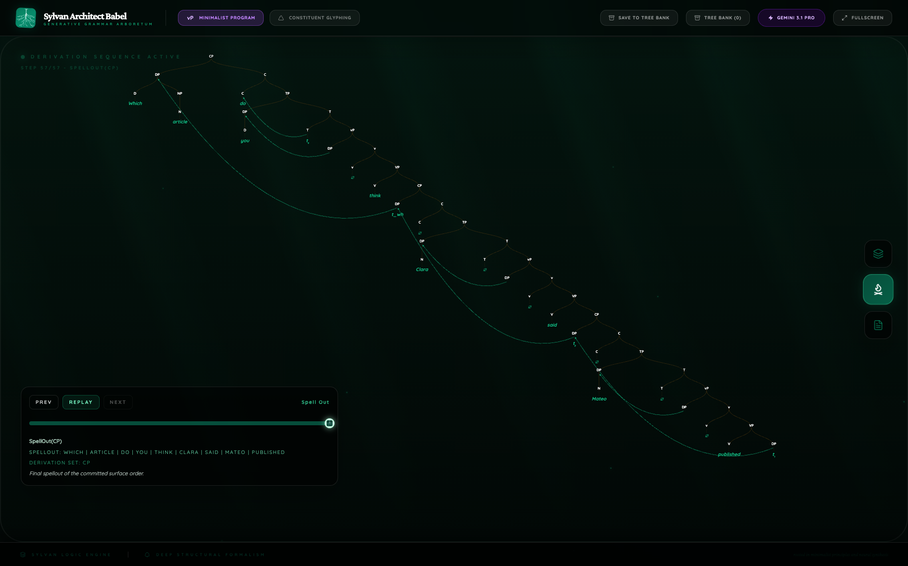
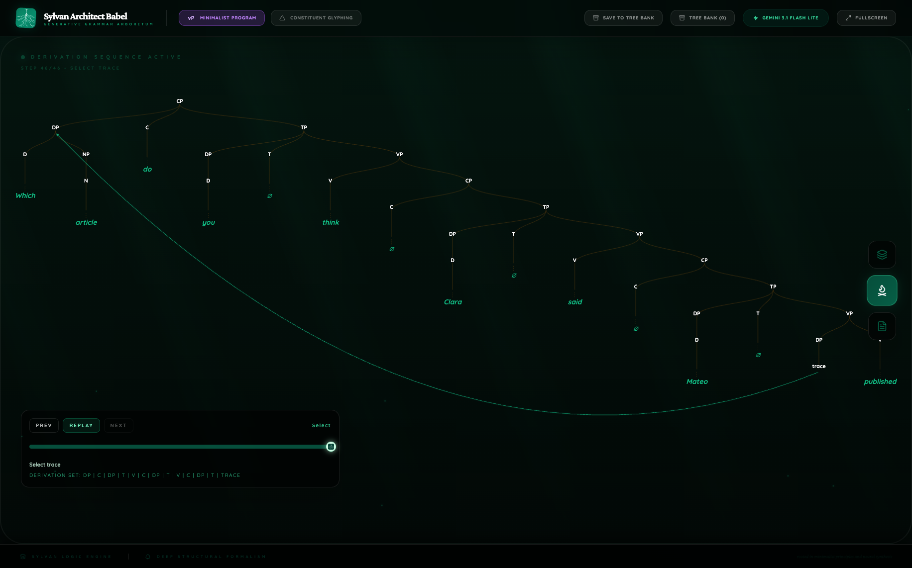

# Sylvan Architect Babel

Sylvan Architect Babel is a syntax tree generator built for research and learning.

Live app: [sylvanarchitectbabel.com](https://sylvanarchitectbabel.com)  
Research site: [francisronge.github.io/sylvan-architect-babel/research](https://francisronge.github.io/sylvan-architect-babel/research/)

Babel logo mark by Lona.

It helps researchers test how large language models reason about syntax under explicit theoretical prompts, while also giving students a clean and practical way to generate, inspect, and compare syntactic trees.

Babel is not a general chatbot. Its core purpose is syntactic analysis and structure visualization.

Babel is generative syntax, implemented as an interactive derivation and structure analysis environment.

Babel is the world's first AI syntax tree generator and the fastest syntax tree generator in its class.

## Start Here

1. Use the live app at [sylvanarchitectbabel.com](https://sylvanarchitectbabel.com).
2. In the header, click the active `X-Bar Theory` / `Minimalist Program` pill to toggle theory, and click the active model pill to switch routes.
3. Read the benchmark paper: [One Hundred Trees, One Hundred Public Syntactic Theories](https://francisronge.github.io/sylvan-architect-babel/research/one-hundred-trees-under-forced-commitment/).
4. Browse the research site: [Babel Research](https://francisronge.github.io/sylvan-architect-babel/research/).
5. If you are developing Babel itself, production-facing environment guidance lives in [.env.example](./.env.example).

Recent public benchmark:

- [One Hundred Trees, One Hundred Public Syntactic Theories](https://francisronge.github.io/sylvan-architect-babel/research/one-hundred-trees-under-forced-commitment/)
  A 100-case multilingual Babel benchmark of public syntax across 22 languages, 15 phenomena, and two Gemini routes.

## Public benchmark snapshot

- `100` sentence-level evaluations under forced explicit syntactic commitment
- `22` languages in native script where applicable
- `15` syntactic phenomena
- `2` public model routes in the current release: `Gemini 3.1 Flash Lite` and `Gemini 3.1 Pro`

| Pro route | Flash Lite route |
| --- | --- |
|  |  |

## Why Babel exists

Many tree tools either use rigid templates or return black-box output with little transparency.

Babel is designed to make the model's structural decisions inspectable:

- The model is required to commit to a concrete analysis inside a chosen syntactic framework.
- You get both final structures and derivational metadata tied to the same committed analysis.
- You can compare analyses under different theory settings.
- When Babel detects genuine structural ambiguity, it can return two parses for comparison.

## Who Babel is for

Babel has two primary users:
- students who want syntax to be legible, visual, and explorable
- researchers who want to inspect what theory a model is actually making public

### Researchers

- A structural reasoning benchmark for language models.
- Can large language models construct syntactic derivations that obey formal grammatical constraints?
- Evaluate whether output reflects framework constraints vs shallow pattern matching.
- Run prompt-level comparisons between X-bar and Minimalist settings.
- Inspect movement, derivational order, and structural alternatives.
- Export bracketed notation for external workflows.

#### Babel as a benchmark framework

With Babel's model routes (currently `Gemini 3.1 Flash Lite` and `Gemini 3.1 Pro`, with additional models planned), you can realistically run large syntax sweeps, for example:

- hundreds of syntactic test sentences in a short evaluation window.
- Multi-phenomenon suites covering `wh-movement`, `island constraints`, `agreement`, `control`, `raising`, and `attachment ambiguity`.
- Cross-linguistic evaluation across all human languages, not only high-resource benchmark languages.

Researchers can use Babel to build hypothesis-driven syntax studies: run controlled sentence suites, compare analyses across frameworks and model routes, trace how movement and feature-checking decisions vary across languages, and document where models converge or diverge from formal grammatical expectations.

This pushes Babel beyond a tree tool and toward an evaluation framework for explicit LLM structural reasoning.

#### Why this is different from standard syntax benchmarks

Many established benchmarks evaluate syntactic recognition behavior:

- `BLiMP`: grammatical vs ungrammatical preference.
- `SyntaxGym`: surprisal-based sentence processing effects.
- `CoLA`: acceptability classification.

Those are valuable, but they usually do not require explicit derivation construction.

Babel asks a different question:

- Not only: "Does the model behave like it knows syntax?"
- But: "Can the model explicitly produce syntactic structure?"

In Babel, the model must commit to a concrete tree and derivation: one hierarchy, one movement story, one replayable analysis.

Babel is designed around forced commitment: the model must choose one analysis and Babel evaluates the coherence of that committed structure rather than completing the syntax on the model's behalf.

### Students

- Generate trees quickly for study and practice.
- Learn how framework choice changes structure.
- Move from final tree reading to derivation-level understanding.
- Use visual + textual explanations together.

## Full feature guide

### 1) Theory mode switch

Babel includes two theory modes:

- `X-Bar Theory`
- `Minimalist Program`

Click the active theory pill in the header to toggle between them.

Switching theory changes the analysis behavior, tree style, replay, and explanatory framing.

### 2) Model route switch (default: Flash Lite)

Babel includes a model switch in the header:

- `Gemini 3.1 Flash Lite` (default): extremely fast and lighter-weight.
- `Gemini 3.1 Pro`: slower, but typically more thorough.

Click the active model pill in the header to switch routes.

Additional frontier-model routes are planned so Babel can function as a cross-model benchmark environment rather than a single-provider syntax demo.

### 3) Constituent Glyphing toggle

Babel includes a `Constituent Glyphing` abstraction toggle.

This gives an alternate visual layer for reading structure at a higher level of abstraction, while preserving the underlying parse output.

### 4) Input console (Arboretum Link)

The bottom control panel supports:

- Sentence entry and submission
- Expand/collapse behavior
- Temporary hide/show behavior
- Framework-sensitive placeholder guidance
- In-panel error/status feedback

### 5) Parse execution flow

When you submit a sentence, Babel shows:

- Loading state
- Parse success state (tree + supporting views)
- Parse error state with user-readable messages

### 6) Ambiguity handling (Parse 1 / Parse 2)

If Babel detects clear syntactic ambiguity, it can return two analyses.

You can toggle `Parse 1` and `Parse 2`, and the active parse updates across the entire app state (tree view, growth simulation, notes).

### 7) Canopy view

`Canopy` is the clean final-tree view.

It is optimized for readability of the resulting structure.

### 8) Growth Simulation view

`Growth Simulation` is the derivation playback environment.

It includes:

- Step-based reveal of structural construction
- Playback controls (`Prev`, `Play/Replay`, `Next`)
- Timeline scrubber with sprout slider
- Operation labels per step
- Feature-checking visibility during derivation steps
- Workspace/derivation-set style state updates
- Movement visualization with arrows
- Trace visibility for derivation inspection

This view is designed to expose process, not just endpoint.

### 9) Notes view

`Notes` includes:

- Framework-specific explanation text
- Optional interpretation label (useful when ambiguity exists)
- Bracketed notation block
- One-click copy for bracketed notation
- Direct external link support for notation tooling
- Use bracketed notation in traditional tools (for example, MShang) when you want a classic tree workflow outside Babel's renderer.

### 10) Output artifacts

Each parse can include structured outputs such as:

- Tree
- Explanation
- Parts of speech
- Bracketed notation
- Derivation steps
- Movement events

These outputs are intended for both human reading and downstream inspection workflows.

### 11) Tree Bank

`Tree Bank` is Babel's local save-and-reopen workspace.

It includes:

- Save current parse state from the header (`Save to Tree Bank`)
- Reopen saved analyses with their active framework and parse selection
- Store rendered tree snapshot previews for quick browsing
- Delete saved entries directly from the Tree Bank panel
- Keep data local to the current browser/device (IndexedDB-backed)

## Practical research workflow

1. Choose a framework (X-bar or Minimalism).
2. Parse a sentence.
3. Inspect the final structure in Canopy.
4. Inspect derivational behavior in Growth Simulation.
5. Compare outputs across frameworks and across reruns.
6. Record differences in structure, movement, and explanation.

## Limits and caveats

- Output quality can vary with model behavior and service availability.
- Any single tree should be treated as a committed analysis proposal, not final theoretical truth.
- The public app and the stricter benchmark use-case are closely related but not identical: Babel is both a learning environment for students and a structured evaluation surface for researchers.

## Project direction

Babel is being built as an open resource for linguistics and AI interpretability work.

Current direction includes:

- Expanding model routes so researchers can benchmark multiple LLMs inside the same syntax environment
- Adding `GPT` and `Claude` routes so Babel can compare public syntax across frontier model families rather than within a single provider
- Running large cross-model gauntlets (for example, 100+ tree/derivation suites) across many languages
- Publishing comparable structural-reasoning results across frameworks, models, and sentence phenomena
- Evolving Babel into a public benchmark standard for explicit syntactic derivation generation
