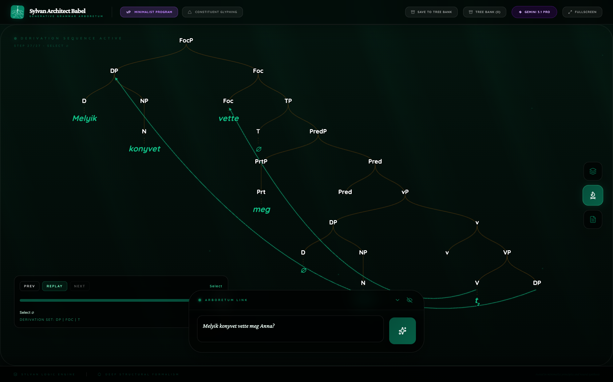
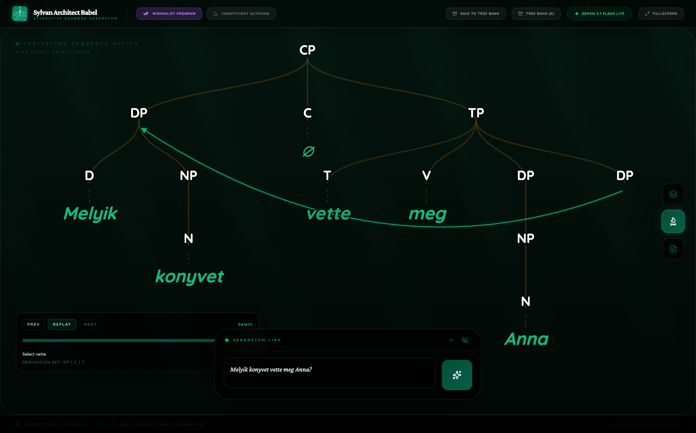
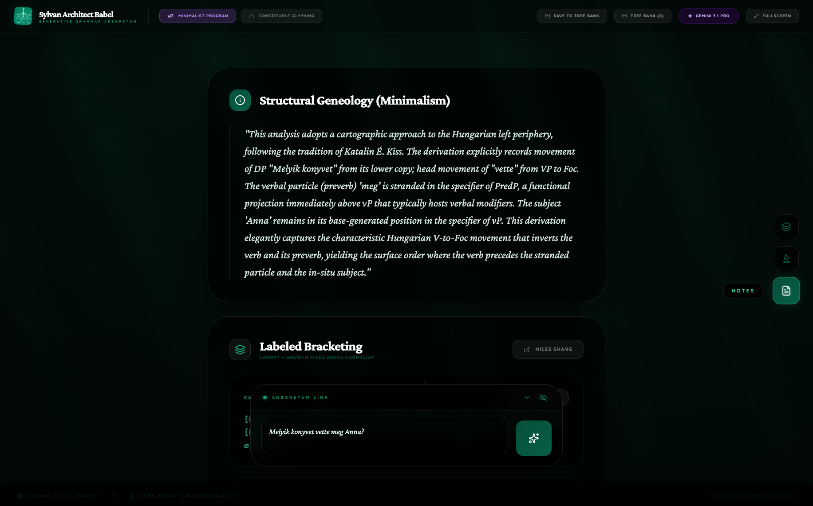
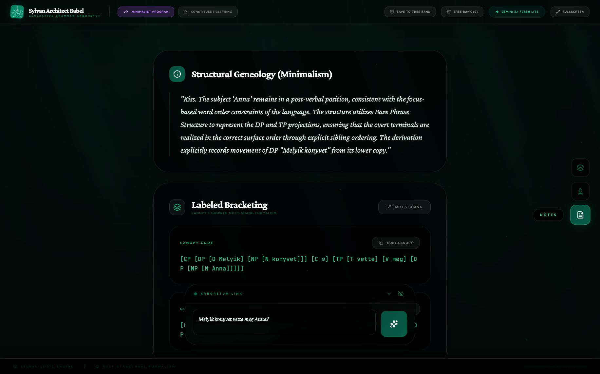
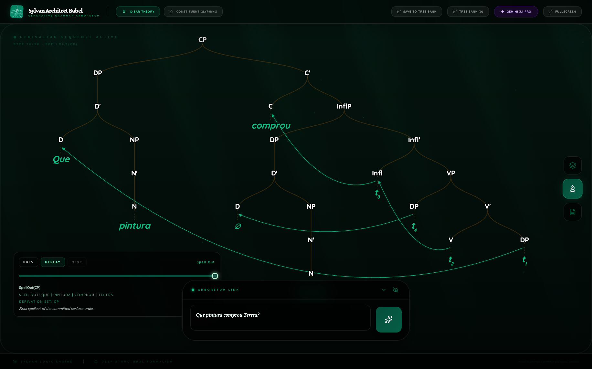
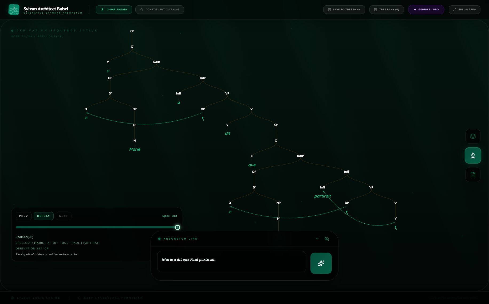
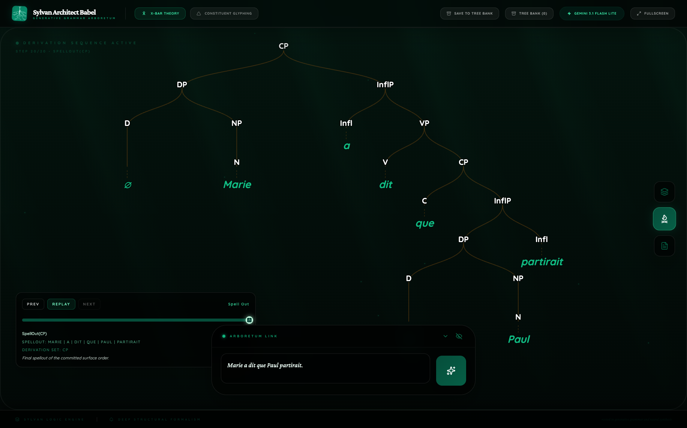
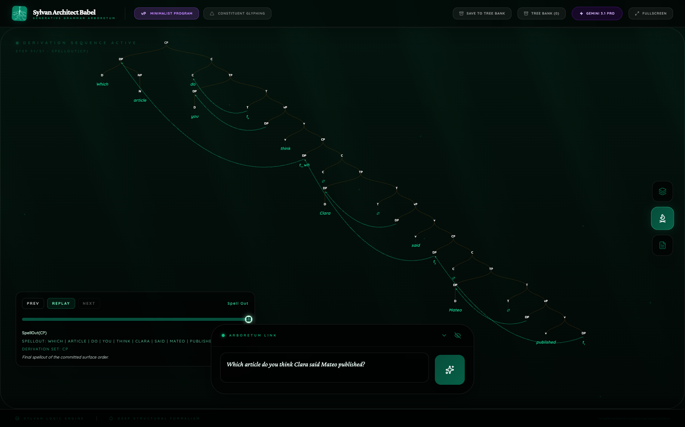
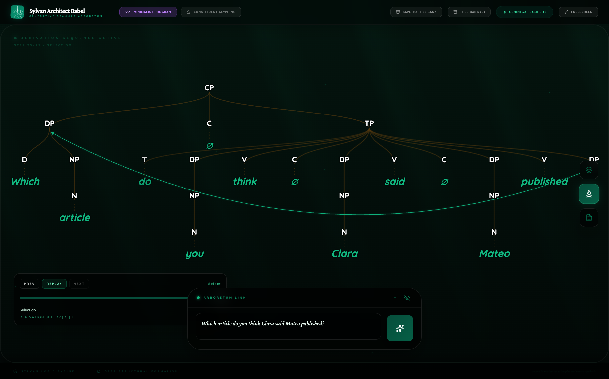

  
Mini Paper v1

  <h1 class="paper-title">Explicit Syntax Under Forced Commitment</h1>
  
A paired 20-case Sylvan Architect Babel benchmark comparing Gemini 3.1 Pro and Gemini 3.1 Flash Lite across multilingual X-bar and Minimalist analyses.

  

    

      Date
      
March 11, 2026

    

    

      Primary Report
      <a href="../data/random20-v1-report.json">random20-v1-report.json</a>
    

    

      Capture Script
      <a href="../data/random20_dual_showcase.cjs">random20_dual_showcase.cjs</a>
    

    

      Figure Assets
      <a href="../assets/random20-v1/">random20-v1 asset folder</a>
    

  

## Abstract

This paper reports a small but revealing syntax benchmark run inside Sylvan Architect Babel. Instead of evaluating language models only through sentence preferences or minimal-pair judgments, Babel requires each model to commit to a single syntactic analysis: a tree, a movement history, a replayable derivation, and a prose explanation. Using a seeded paired batch collected on March 11, 2026, I compare Gemini 3.1 Pro and Gemini 3.1 Flash Lite on the same 10 multilingual sentence types, with 5 X-bar cases and 5 Minimalist cases per route.

The main result is not simply that both routes can return usable trees. It is that the routes expose different theories of the same sentence. On this batch, Pro was markedly slower but more derivationally explicit, especially in Minimalist cases. Flash Lite was far faster and typically more conservative, often compressing multi-step derivations into a smaller number of overt commitments. The difference becomes especially visible in Hungarian focus inversion, French embedding, and English long-distance wh-movement. These results suggest that Babel is useful not merely as a parser front end but as a benchmark for explicit syntactic commitment: it makes visible what a model is willing to say the structure actually is.

## 1. Introduction

Most established syntax benchmarks for language models ask whether a model prefers one sentence over another. Classic examples include targeted syntactic evaluation, minimal-pair acceptability tasks, and controlled suites such as [Marvin and Linzen 2018](https://aclanthology.org/D18-1151/), [BLiMP](https://direct.mit.edu/tacl/article/doi/10.1162/tacl_a_00321/96452/BLiMP-The-Benchmark-of-Linguistic-Minimal-Pairs), [SyntaxGym](https://aclanthology.org/2020.acl-demos.10/), and the multilingual extension [MultiBLiMP 1.0](https://arxiv.org/abs/2504.02768). These are powerful benchmarks, but they remain string-first. They tell us whether a model scores one sentence above another, not what structure the model would commit to if forced to explain its choice.

Babel changes the object of evaluation. The model does not merely rank strings. It must produce:

1. one committed analysis rather than multiple alternatives;
2. an overt tree with visible category structure;
3. explicit movement events;
4. a replay sequence showing derivational growth;
5. Notes that describe the same analysis visible in the tree and replay.

That requirement makes Babel a different kind of benchmark. It tests explicit syntactic commitment rather than latent preference. The question is no longer only "does the model know the dependency?" but also "what tree does it think licenses the dependency, how many movements does it encode, and can it tell the same story in prose?"

## 2. Materials and Methods

### 2.1 Batch design

The experiment used the seeded paired sweep in [random20_dual_showcase.cjs](../data/random20_dual_showcase.cjs). The script samples:

- 5 sentences from a multilingual X-bar pool;
- 5 sentences from a multilingual Minimalist pool;
- then runs the same 10 cases through both `pro` and `flash-lite`.

The fixed rerun used seed `1773234618245`. The resulting report is [random20-v1-report.json](../data/random20-v1-report.json).

### 2.2 Sentence set

The paired cases were:

| Framework | Language | Phenomenon | Sentence |
| --- | --- | --- | --- |
| X-bar | Romanian | passive | `A fost inchisa usa de vant.` |
| X-bar | English | relative clause | `The editor that Naomi interviewed laughed.` |
| X-bar | German | yes-no question | `Hat Maria den Brief gelesen?` |
| X-bar | Portuguese | wh-question | `Que pintura comprou Teresa?` |
| X-bar | French | embedded clause | `Marie a dit que Paul partirait.` |
| Minimalism | Japanese (romanized) | simple transitive | `Naoki-ga keeki-o tabeta.` |
| Minimalism | Romanian | wh-question | `Ce profesor a laudat Andrei?` |
| Minimalism | Hindi (romanized) | yes-no question | `Kya Anu ne chai banayi?` |
| Minimalism | Hungarian | focus inversion | `Melyik konyvet vette meg Anna?` |
| Minimalism | English | long-distance wh | `Which article do you think Clara said Mateo published?` |

The design is not exhaustive. It is intentionally mixed: some cases are clause-typing or inversion problems, some are head-movement problems, some are long-distance dependency problems, and some are control cases where the interesting outcome is restraint rather than movement.

### 2.3 Data collected

For each run, the script stores:

- the returned JSON analysis bundle;
- a Canopy screenshot;
- a final Growth replay screenshot;
- a Notes screenshot;
- elapsed time, derivation step count, movement event count, and route metadata.

In this paper I use three classes of evidence:

1. quantitative metadata from the report;
2. direct reading of the returned analysis JSON;
3. qualitative analysis of the captured screenshots.

### 2.4 Comparison strategy

The goal was not to decide which route produced the one true syntactic theory. Instead, the comparison asks:

- How much derivational structure does each route expose?
- How often do the routes choose the same kind of movement story?
- Where does one route compress structure that the other route makes explicit?
- Where does the model's prose track the visible derivation, and where does it lag behind it?

This makes the benchmark closer to an interpretability study of syntactic reasoning than to a conventional accuracy leaderboard.

## 3. Results

### 3.1 Batch-level outcome

The seeded rerun produced the full paired set: 10 analyses for Gemini 3.1 Pro and 10 for Gemini 3.1 Flash Lite.

### 3.2 Route-level summary

**Table 1. Overall route comparison**

| Route | Cases | Avg. elapsed time | Avg. derivation steps | Avg. movement events | Cases with movement | Avg. Notes length |
| --- | --- | --- | --- | --- | --- | --- |
| Gemini 3.1 Pro | 10 | 97.5 s | 28.7 | 2.6 | 8 | 82.3 words |
| Gemini 3.1 Flash Lite | 10 | 10.1 s | 18.8 | 0.7 | 6 | 62.9 words |

Three things stand out immediately.

First, Pro is dramatically slower. On this batch, it took about ten times as long on average. Second, the extra time is not wasted on verbosity alone; it shows up as longer derivations and more overt movement commitments. Third, the Notes gap is real but not enormous. The main difference between the routes is not just essay length. It is derivational density.

### 3.3 Framework split

**Table 2. Route-by-framework comparison**

| Route + framework | Avg. steps | Avg. movement events | Cases with movement | Avg. Notes length | Avg. elapsed time |
| --- | --- | --- | --- | --- | --- |
| Pro X-bar | 29.4 | 1.6 | 3/5 | 70.8 words | 79.1 s |
| Pro Minimalism | 28.0 | 3.6 | 5/5 | 93.8 words | 116.0 s |
| Flash Lite X-bar | 22.4 | 0.8 | 3/5 | 71.2 words | 10.3 s |
| Flash Lite Minimalism | 15.2 | 0.6 | 3/5 | 54.6 words | 9.9 s |

The strongest route difference appears in Minimalism. Pro does not merely return a tree with different labels; it tends to expose much more of the derivation. Flash Lite, by contrast, compresses Minimalist outputs aggressively. That makes Pro the more revealing syntax model on this batch, especially when the sentence invites cartography, successive cyclicity, or multiple head movements.

### 3.4 Pairwise divergence

Across the 10 paired sentence types:

- the routes agreed on whether movement was present in `6/10` pairs;
- they matched the exact number of movement events in only `2/10` pairs;
- Pro used more movement events in `7/10` pairs;
- Flash Lite used more movement events in `1/10` pair;
- the remaining `2/10` pairs tied.

This is the central empirical point of the batch. The routes are not just two verbosity settings on the same analysis engine. They often choose different explicit derivations of the same sentence.

## 4. Screenshot-Based Case Studies

This section treats the screenshots as primary evidence. The goal is not aesthetic commentary. It is to read the visible syntactic commitments as one would read figures in a linguistics paper.

### 4.1 Hungarian focus inversion

**Figure 1. Hungarian Minimalist growth comparison**

| Pro | Flash Lite |
| --- | --- |
|  |  |

This is the most revealing pair in the batch. In the Pro figure, the tree visibly commits to a cartographic left periphery:

- `FocP` dominates the clause;
- `vette` is overtly realized as a `Foc` head;
- `meg` is stranded below in a `Prt/Pred` region;
- the lower copy of the head movement is visibly separated from the landing site;
- the wh-DP sits in the left periphery rather than merely at the top of a generic CP shell.

That is a real syntactic analysis, not decorative complexity. It is recognizably in the É. Kiss tradition: verb movement into focus, stranded preverb, and an overt distinction between the landing head and the lower verbal region.

Flash Lite tells a much smaller story. Its growth figure flattens the configuration into `CP/TP`, retains the fronted wh-DP, and keeps `vette` in `T`, with no overt `FocP`, no stranded-particle architecture, and no cartographic middle field. The sentence is still interpreted, but the analysis is less theoretically ambitious.

**Figure 2. Hungarian Notes comparison**

| Pro | Flash Lite |
| --- | --- |
|  |  |

The Notes confirm the visual reading. Pro explicitly invokes the Hungarian focus tradition and names V-to-Foc movement. Flash Lite instead describes a reduced `CP/TP` derivation. This pair shows Pro functioning as a model of explicit syntactic theorizing, while Flash Lite behaves more like a cautious structural summarizer.

### 4.2 Portuguese wh-question

**Figure 3. Portuguese X-bar growth comparison**

| Pro | Flash Lite |
| --- | --- |
|  |  |

The Portuguese pair is useful because both routes largely agree on the macro-analysis. Both figures support:

- a fronted wh-DP;
- head movement of the finite verb;
- a postverbal subject.

The difference is in granularity. Pro records `4` movement events and visibly stages the derivation through multiple lower copies. Flash Lite records `2` movement events and presents a more economical version of the same general story.

This is exactly the kind of contrast Babel is good at surfacing. Standard minimal-pair evaluation would likely tell us that both models know Portuguese wh-inversion. Babel shows that one model represents the inversion as a fuller derivational chain and the other as a shorter structural path.

### 4.3 French embedded clause

**Figure 4. French X-bar growth comparison**

| Pro | Flash Lite |
| --- | --- |
|  |  |

Here the routes do not merely differ in richness. They differ in derivational stance.

Pro encodes:

- raising of the matrix subject;
- raising of the embedded subject;
- V-to-Infl head movement for `partirait`.

Flash Lite encodes none of these and instead offers a flatter CP plus InflP decomposition. Neither output is unusable. What matters is that the same sentence elicits sharply different explicit commitments.

This is a particularly strong example of why Babel should not be reduced to a visualization tool. It is an instrument for comparing overt analyses. A conventional benchmark could show that both routes handle embedded clauses. Babel shows that they do not mean the same thing by "handle."

### 4.4 English long-distance wh

**Figure 5. English long-distance wh growth comparison**

| Pro | Flash Lite |
| --- | --- |
|  |  |

This is the hardest sentence in the batch, and it gives the sharpest contrast.

Pro encodes:

- `7` movement events;
- `51` derivation steps;
- successive-cyclic movement of the wh-DP through intermediate clause edges;
- T-to-C movement for `do`;
- subject movements in the embedded clauses.

Flash Lite gives a far more compact representation with a single overt wh-movement event and a shorter derivation. The contrast is striking in the screenshot: Pro draws a visibly layered clause spine with multiple traces and landings, while Flash Lite collapses the long-distance dependency into a single overt dependency plus support from the surface tree.

This case is the strongest example in the batch of Pro behaving like a genuinely derivational syntax model rather than a surface-only tree generator. Flash Lite still captures the visible dependency, but Pro makes the intermediate structure itself part of the benchmarkable object.

### 4.5 Conservative cases matter too

Not every valuable result in a syntax benchmark is a complex movement derivation. Romanian passive and the English relative clause serve as useful control cases.

In Romanian passive, both routes chose comparatively restrained analyses. In the English relative clause, both routes converged on a recognizable relative dependency but differed in how much surrounding structure they elaborated. These cases help show that the richer behavior of Pro elsewhere is not simply universal over-analysis. The route differences are selective.

## 5. Discussion

### 5.1 What Pro is doing

On this batch, Gemini 3.1 Pro behaved like the better model for syntax research inside Babel.

Its distinctive properties were:

- more overt derivational structure;
- more movement events;
- more interesting Minimalist analyses;
- greater willingness to represent intermediate positions rather than only final configurations.

The Hungarian and long-distance English cases make this especially clear. Pro is not only producing larger objects; it is producing objects that are more revealing about the syntactic theory being chosen.

### 5.2 What Flash Lite is doing

Flash Lite behaved differently, not merely worse.

Its characteristic profile was:

- much lower latency;
- shorter derivations;
- fewer overt movement commitments;
- a tendency to compress complex dependencies into smaller visible analyses.

That makes Flash Lite attractive for product contexts where responsiveness matters and where a smaller, stable explicit structure may be preferable to a long derivational story. But it also means Lite is less informative when the goal is to study the model's preferred syntactic theory in detail.

### 5.3 Why explicit commitment matters

The most important payoff of Babel is methodological. The system forces the model to stop hiding behind a score over strings. Once the model must return a tree and a movement history, several new forms of comparison become possible:

- different theories of the same sentence become directly comparable;
- left-peripheral and clause-internal structure become visible rather than implicit;
- Notes can be evaluated against the actual derivation rather than treated as free commentary.

This is where Babel adds something that BLiMP-style benchmarks do not. It does not replace minimal-pair evaluation. It supplements it by probing whether the model can sustain a visible syntactic story.

### 5.4 One reverse case is healthy

The German yes-no question is worth flagging because it resists a simplistic "Pro richer, therefore better" narrative. In that pair, Flash Lite overtly chose V-to-C movement while Pro did not. Since this batch did not use expert adjudication against a gold treebank, the right interpretation is not that one route "won German." The right interpretation is that Babel makes different theoretical preferences legible. That is a desirable property in a benchmark of explicit commitment.

## 6. Relation to the Broader Benchmark Landscape

The present batch sits in the same research neighborhood as targeted syntactic evaluation, BLiMP, SyntaxGym, and multilingual minimal-pair benchmarking, but it studies a different representational level.

Compared with those benchmarks, Babel adds:

1. **Tree commitment:** the model must expose its phrase structure;
2. **Derivational commitment:** the model must expose movement rather than imply it;
3. **Cross-modal alignment:** tree, replay, and prose can be inspected as parts of one analysis.

That allows evaluation of phenomena that traditional benchmarks usually leave implicit:

- how much intermediate structure a model posits;
- whether long-distance dependencies are compressed or staged cyclically;
- whether Notes rise to the level of the tree or collapse into shallow paraphrase;
- whether two models that both "know" a dependency actually choose the same analysis.

For syntax research on LLMs, that is a meaningful gain.

## 7. Limitations

This is a mini paper, not a final benchmark paper.

Its limits are straightforward:

- only 10 paired sentence types;
- random sampling from curated phenomenon pools rather than a balanced corpus;
- no external gold-tree adjudication;
- theory-laden prompts that shape the hypothesis space;
- one platform-specific interface for visualization and replay.

The main substantive limitations are scale and adjudication rather than a single catastrophic failure mode inside this batch. A larger run will be needed before strong claims can be made about route-level preferences across language families.

## 8. Conclusion

This batch shows that Babel is now useful as a benchmark for explicit syntactic commitment, not only as an interface for displaying trees.

On the paired March 11, 2026 rerun:

- Pro was slower but much more derivationally explicit;
- Flash Lite was faster and more conservative;
- the gap was strongest in Minimalist cases;
- several paired sentences revealed genuinely different syntactic analyses rather than mere stylistic paraphrases.

The broader significance is methodological. When an LLM is forced to publish a tree, a movement history, and a prose analysis, evaluation changes. The result is no longer only a judgment about string preference. It becomes a comparison of overt syntactic theories.

The next obvious step is a larger gauntlet, ideally 100 paired trees, followed by an explicit error taxonomy and a modest expert-adjudicated subset. If the profile reported here survives that expansion, Babel will have become a serious environment for studying the syntax that LLMs are willing to commit to in public.

## Appendix A. Per-case movement summary

| Case | Pro movement events | Flash Lite movement events | Main contrast |
| --- | --- | --- | --- |
| Romanian passive | 0 | 0 | Both routes remain restrained. |
| English relative clause | 1 | 1 | Same core dependency, different level of elaboration. |
| German yes-no question | 0 | 1 | Lite chooses overt V-to-C where Pro stays flatter. |
| Portuguese wh-question | 4 | 2 | Same macro-analysis, different derivational granularity. |
| French embedded clause | 3 | 0 | Pro stages subject/head movement; Lite compresses. |
| Japanese simple transitive | 3 | 0 | Pro derives a richer clause spine; Lite keeps SOV simpler. |
| Romanian wh-question | 3 | 1 | Pro exposes auxiliary/participle structure more clearly. |
| Hindi yes-no question | 3 | 0 | Pro treats the clause as actively derivational; Lite does not. |
| Hungarian focus inversion | 2 | 1 | Pro gives the most theory-rich cartographic analysis in the batch. |
| English long-distance wh | 7 | 1 | Pro stages full cyclic dependency; Lite compresses to the visible top dependency. |

## References

- Marvin, Rebecca, and Tal Linzen. 2018. [Targeted Syntactic Evaluation of Language Models](https://aclanthology.org/D18-1151/).
- Warstadt, Alex, Amanpreet Singh, and Samuel R. Bowman. 2020. [BLiMP: The Benchmark of Linguistic Minimal Pairs](https://direct.mit.edu/tacl/article/doi/10.1162/tacl_a_00321/96452/BLiMP-The-Benchmark-of-Linguistic-Minimal-Pairs).
- Gauthier, Jon, et al. 2020. [SyntaxGym: An Online Platform for Targeted Evaluation of Language Models](https://aclanthology.org/2020.acl-demos.10/).
- Cianflone, Andrea, et al. 2025. [MultiBLiMP 1.0: A Massively Multilingual Benchmark of Linguistic Minimal Pairs](https://arxiv.org/abs/2504.02768).
- Local artifact. 2026. [Babel paired random20 report](../data/random20-v1-report.json).
