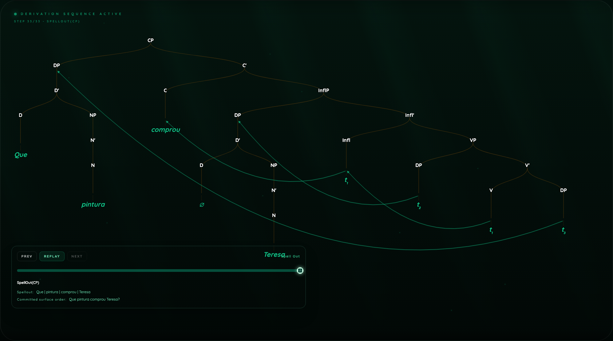
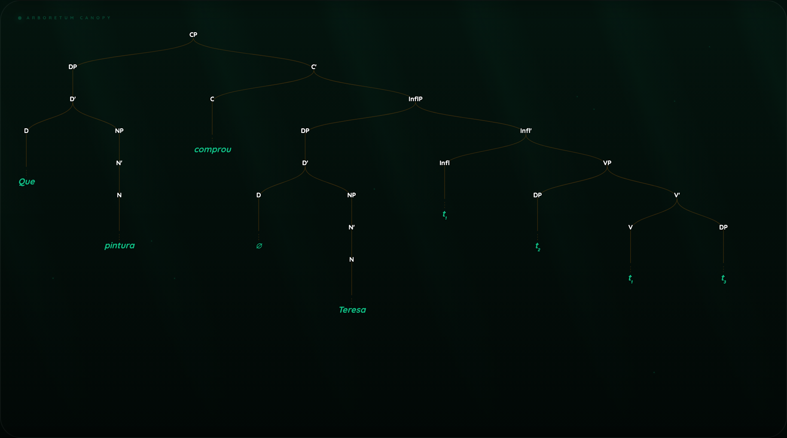
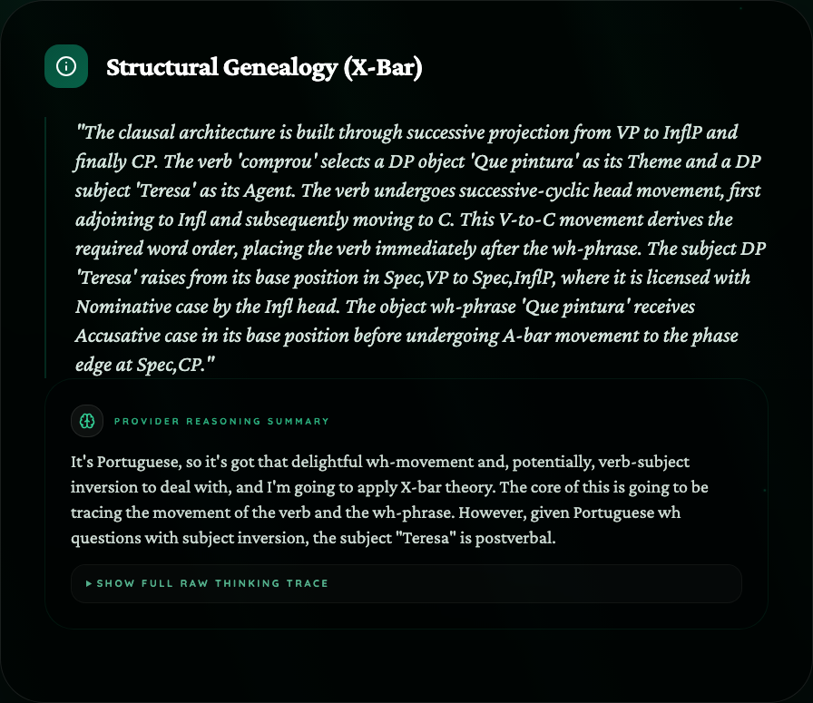
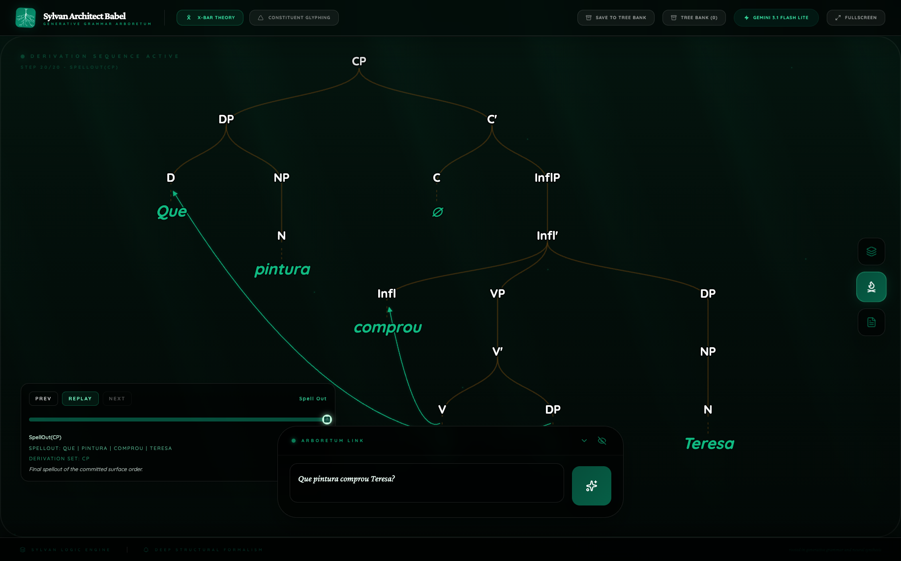
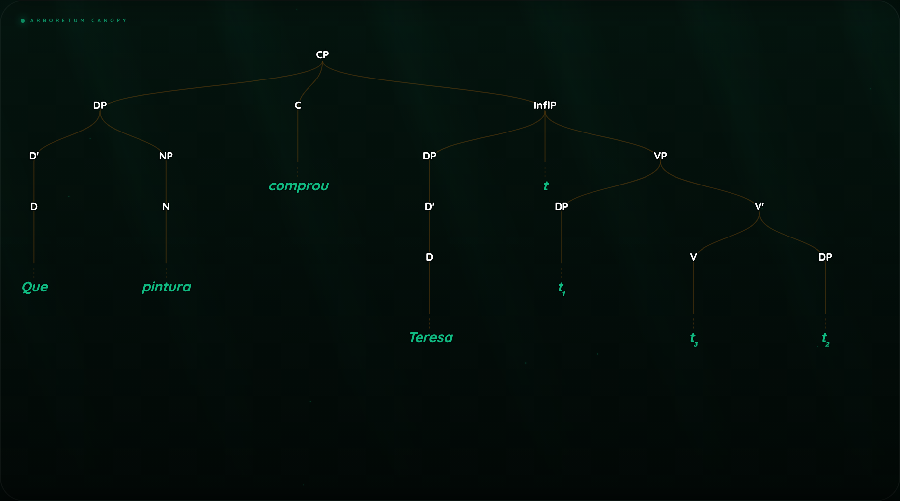
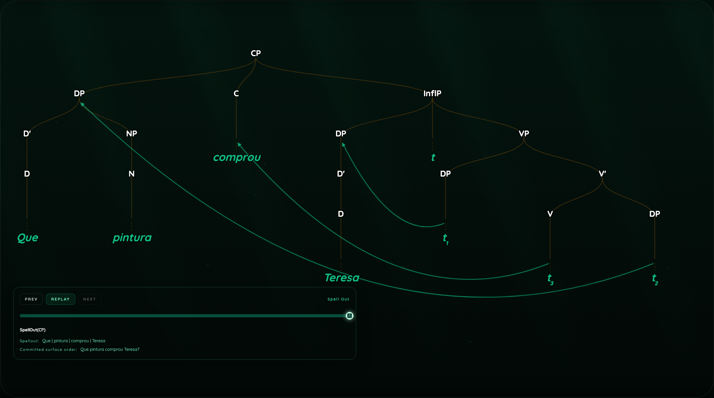
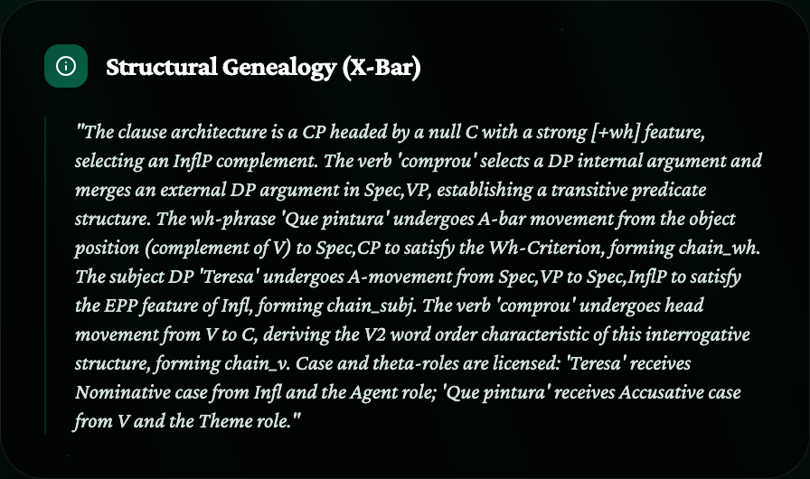

  
Research Journal v1

  <h1 class="paper-title">From Tree-First to Derivation-First</h1>
  
Why Babel had to be refactored, what the new architecture made possible, and why smaller models now fail the stronger standard.

  

    

      Date
      
April 10, 2026

    

    

      Status
      
Published note. Ongoing work continues on the refactor and cost side.

    

    

      Primary Case
      
Portuguese wh-question: <em>Que pintura comprou Teresa?</em>

    

    

      Figure Assets
      <a href="../assets/derivation-first-refactor-v1/">derivation-first-refactor-v1 asset folder</a>
    

  

## Abstract

This note is about why Babel had to be refactored at all. The old architecture was tree-first, and over time that became harder to justify. Babel could still produce impressive trees, but the derivation was not carrying enough of the real syntactic burden. Growth could end up feeling decorative. Replay could look like a derivation while actually tracing over a structure that had already been decided somewhere else. In practice, Babel could show a finished canopy and animate pieces inside it, but it could not cleanly show a tree being base-generated and then reaching surface order through a derivation that genuinely meant something. For a system meant to externalize syntax, that was a serious limitation.

The refactor pushed Babel toward a derivation-first architecture. Growth frames became the structural source of truth, and replay, canopy, and notes now have to stay anchored to that same committed sequence. The result is a stronger Babel, but also a heavier one. Smaller routes that could survive a simpler tree-first harness now compress, distort, or fail under the stronger standard. Flash Lite no longer feels like full Babel at a smaller scale. Local and free models have struggled even more directly. One large open model, Qwen 3.5 397B A17B, completed the full Pro route and satisfied strict JSON parsing, but still failed the syntax benchmark itself: its final tree violated binary branching, placed a bare trace directly under `InflP`, and leaked chain ids into human-facing notes. That is useful evidence. It suggests that full Babel has become a research-grade instrument before it has become a cheap public product.

The refactor is not finished. I still want to make Babel faster and cheaper without weakening the real system. I also have not yet stress-tested the refactored architecture on Gemini 3.1 Pro in full suites, because those runs started to cost serious money. Provider reasoning trace and the growing ledger layer are likely part of why Babel became heavier, alongside the usual cost of longer prompts and richer structured output. I will keep testing. At this point, the clearest product direction may be a split: a lighter Babel for students, and a stronger Babel for researchers.

## 1. Why the Refactor Was Necessary

The old problem was simple enough once it became visible.

- Tree-first Babel treated the final tree as the main object.
- Growth was downstream.
- Replay could show movement inside a tree that was already structurally settled.
- That made the derivation look more meaningful than it really was.
- It also meant Babel did not have a clean way to show base generation first and surface order later, because Growth was being inferred from the finished canopy tree instead of being the source of truth itself.

This was not only a UI problem. It was an architectural one. Once the tree becomes primary, the derivation starts to read like commentary on the tree rather than the syntax itself. Babel is supposed to do the opposite. It is supposed to force the model to commit not only to what the structure is, but to how that structure comes into existence.

The refactor changed that order of commitment.

- Growth frames became the main structural object.
- Canopy is now derived from committed growth.
- Replay is now driven by committed growth snapshots instead of inferred final-tree state.
- Notes are expected to describe the same committed derivation rather than floating free as prose.

That is the real reason for the refactor. It was not a visual cleanup. It was a correction of what Babel is trying to measure.

## 2. What Changed in Practice

The easiest way to see the difference is a single clean Portuguese case.

**Figure 1. Clean Portuguese growth under the refactored architecture**

What matters here is not only that the replay looks better. The deeper change is that replay now has to respect the derivation as a real structural sequence.

- lexical selection happens before projection
- movement is tracked as movement
- replay steps are tied to committed growth states
- the final tree is no longer allowed to silently override the derivation

That is the difference the old tree-first architecture could not show clearly enough. The replay is no longer acting out a structure that already existed somewhere else. It is following the committed derivation itself.

**Figure 2. Final replay state after a real bottom-up derivation**

The same case now also yields a clean canopy and a notes view that belong to the same parse rather than orbiting around it loosely.

**Figure 3. Clean Portuguese canopy and notes**

| Canopy | Notes |
| --- | --- |
|  |  |

This is the version of Babel the refactor was trying to create: one committed syntax object expressed across multiple views, rather than a tree followed by an after-the-fact explanation.

## 3. What the Refactor Exposed

The refactor improved Babel, but it also raised the burden on the model quite sharply.

A smaller route or weaker model now has to do all of the following at once:

- return strict JSON with no wrapper text
- commit to one usable structure
- preserve derivational detail across growth frames
- keep movement explicit
- keep notes human-readable
- keep the final tree structurally disciplined

That is a demanding ask.

### 3.1 Flash Lite no longer feels like full Babel

Flash Lite still matters. It remains useful as a comparison route. But under the stronger derivation-first architecture, it no longer feels like the same system at a smaller scale. It feels more like a compressed route with a different ceiling.

**Figure 4. Portuguese growth comparison: Gemini Pro versus Flash Lite**

| Gemini 3.1 Pro | Gemini 3.1 Flash Lite |
| --- | --- |
|  |  |

The point is not that Flash Lite always crashes. The point is that it now falls short in a more revealing way. It tends to compress overt derivation. Under the old tree-first harness that could be easier to miss. Under the new derivation-first harness it becomes visible immediately.

### 3.2 Local and free models failed more directly

The local and free-model testing so far has been harsher.

- `gemma3:4b` answered, but the full Babel parse failed structural normalization.
- `qwen3:8b` was too slow on this machine for true Babel Pro.
- `moonshotai/kimi-k2.5` on free NVIDIA completed probes, but true Babel Pro either burned the budget in reasoning or timed out at the provider layer.
- `qwen/qwen3.5-397b-a17b` was the first non-Gemini provider to complete true Babel Pro cleanly enough for strict parsing, but it still failed the syntax benchmark.

That last case is the most informative one, because it draws the new line very clearly: transport success is not the same thing as syntactic adequacy.

## 4. Qwen as a Stress Test

Qwen 3.5 397B A17B is the first non-Gemini route in this testing phase that cleared the full Pro transport path.

It succeeded on:

- strict JSON output
- one committed analysis object
- normalization
- full artifact rendering

Its Portuguese run also gives a concrete cost number for the current weight of Babel:

- first pass: `13,211` tokens
- notes pass: `5,199` tokens
- full parse total: `18,410` tokens

This is not a toy parse. It is the footprint of a heavy research instrument.

Even so, Qwen still failed the actual syntax standard.

**Figure 5. Qwen Portuguese canopy and growth**

| Canopy | Growth |
| --- | --- |
|  |  |

The failures were not renderer bugs. They were in the saved analysis itself.

- final `CP` had three children instead of binary branching
- final `InflP` had three children instead of binary branching
- a bare `t` appeared directly under `InflP`

So Qwen did not commit to the same X-bar analysis as Gemini. It returned something parseable, but not something benchmark-equivalent.

The notes were weaker too.

**Figure 6. Qwen notes**

The notes leaked internal chain names such as `chain_wh` and `chain_subj` into human-facing prose. That is not the kind of prose Babel should present as finished notes. It shows the model still struggling to keep internal bookkeeping separate from the final explanatory layer.

The Qwen result is therefore mixed in a very specific way.

- It is a real success for Babel as a strict, provider-agnostic parser contract.
- It is a real failure for Qwen as a benchmark-quality Babel syntax model.

That distinction matters.

## 5. What This Means

The refactor improved Babel. It did not finish the job.

The renderer problems were fixed. The parser was cleaned up. The architecture now makes more syntactic sense than the old tree-first design. At the same time, the refactor exposed a harder truth: full Babel has become expensive because it is doing something genuinely strong.

It is not just drawing a tree. It is asking a model to:

- commit to one explicit syntactic theory
- maintain a meaningful derivation
- preserve structural discipline
- narrate that same analysis coherently

That is part of why smaller models fall behind first.

No smaller or cheaper route tested so far has matched full Babel.

- Flash Lite still returns interesting structure, but it compresses the derivation too aggressively to stand in for the full system.
- Local models tested so far have failed either on speed, structural validity, or syntax quality.
- The strongest non-Gemini model tested so far completed the transport path but still failed the syntax benchmark.

Taken together, this suggests that full Babel may not be the right public free product in its current form.

One important limit on the current evidence should be stated plainly. I have not yet re-run large Gemini 3.1 Pro stress suites on the new architecture. The reason is cost. Once Babel became derivation-first and started carrying richer structure, repeated benchmark runs became expensive enough that I stopped treating Gemini Pro sweeps as casual tests.

The strongest explanation for the new weight is not mysterious.

- Growth-first structure makes the syntax object itself larger.
- Provider reasoning trace adds more model-authored material.
- The ledger layer adds more explicit commitments.
- The notes layer still has to stay aligned with the same syntax object.

That does not make those features a mistake. It just means they are part of what made full Babel stronger and more expensive at the same time.

## 6. Next Direction

I am not treating this as the end of the story. I will keep testing.

The refactor is still open on one front: efficiency. I still want to find ways to make Babel faster and cheaper on my side without weakening the real system or slipping back into a tree-first architecture.

The most plausible next direction now looks like a split.

- **Student Babel**: lighter, cheaper, still explicit, but less derivationally extreme.
- **Research Babel**: the stronger full system, kept for serious syntax work and stronger models.

That would preserve what the refactor achieved instead of forcing Babel backward.

The goal would not be to make Babel weaker everywhere. It would be to protect the stronger version by admitting that it may now be a research instrument first.

## Conclusion

The refactor was necessary because tree-first Babel was the wrong architecture. It could produce trees, but not a derivation strong enough to fully deserve the name.

The new derivation-first Babel is better. It is also heavier. That is not an accident. It is the cost of asking for real explicit syntactic commitment.

The current evidence points in a clear direction:

- the stronger architecture is worth keeping
- smaller models now fall below the standard more visibly
- a lighter student version may be necessary
- the stronger version should remain the real Babel

I do not see that as a defeat. I see it as a clearer understanding of what Babel has turned into.
