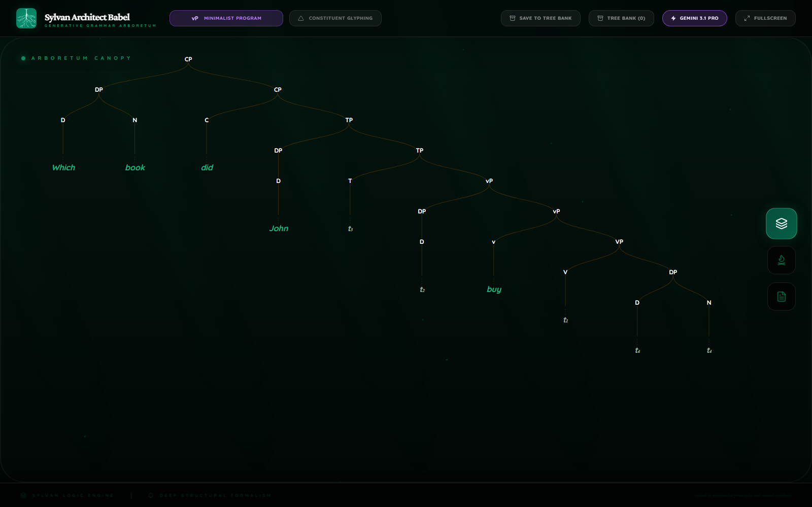
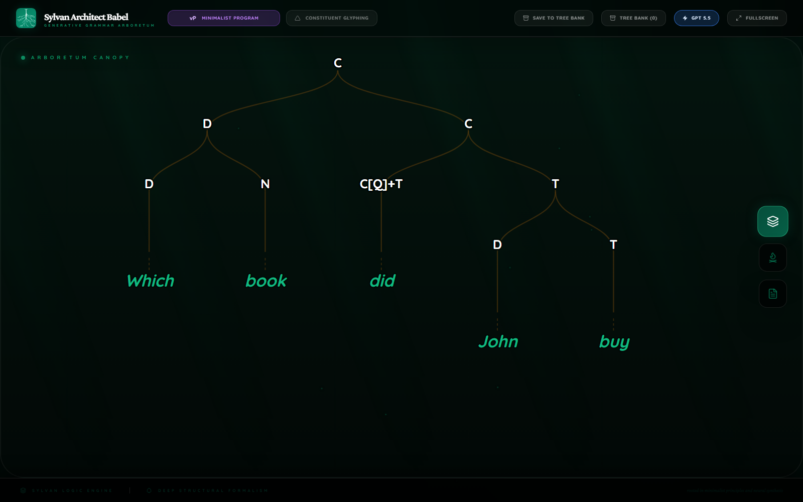

  
Mini Research Devlog

  <h1 class="paper-title">Three Frontier Models Under One Babel Prompt</h1>
  
A small Babel comparison of Gemini 3.1 Pro, GPT-5.5, and Claude Opus 4.7 on one Minimalist wh-question.

  

    

      Date
      
May 16, 2026

    

    

      Sentence
      
<code>Which book did John buy?</code>

    

    

      Framework
      
Minimalist Program

    

    

      Assets
      <a href="../assets/frontier-provider-wh-question-2026-05/">frontier-provider-wh-question-2026-05</a>
    

  

## Abstract

This is a deliberately small comparison. The same neutral Babel contract was used to ask three frontier models for a derivational Minimalist analysis of the same wh-question. All three models converged on the core analysis: the wh-object is built in object position, the subject is introduced in the verbal domain, finite T and interrogative C create the English auxiliary pattern, and the wh-DP moves to the left periphery. The interesting result is not convergence alone. The interesting result is that the models made different public syntactic commitments under the same prompt.

On this run, Claude Opus 4.7 produced the strongest analysis. It was also the fastest stored successful run and the cheapest estimated run. GPT-5.5 produced the most expansive prose and the most segmented derivational staging. Gemini 3.1 Pro produced a compact usable analysis, but it made one extra theoretical commitment: lexical V-to-v movement for English `buy`.

## Method

The benchmark asked for a single Babel derivation, not a list of possible theories. The model had to return a committed tree, derivation stages, visual relations, and notes. The prompt did not tell the models which syntactic phenomena to use. That matters because this is not only a parsing test. It is a test of public syntactic theory: what the model chooses to expose when it has to make its analysis inspectable.

The cost estimates below use the persisted token counts in the local artifacts and public provider pricing checked on May 16, 2026. Gemini output cost counts both visible output tokens and thinking tokens, because the Gemini artifact records 11,999 provider thinking tokens in addition to 2,629 visible output tokens.

| Route | Model | Stored elapsed time | Input tokens | Visible output tokens | Thinking tokens | Estimated cost |
| --- | --- | ---: | ---: | ---: | ---: | ---: |
| Claude | Claude Opus 4.7 | 27.0s | 6,121 | 2,435 | 0 | $0.0915 |
| Gemini | Gemini 3.1 Pro Preview | Successful rerun time not persisted; earlier attempt timed out at 89.8s | 3,779 | 2,629 | 11,999 | $0.1831 |
| GPT | GPT-5.5 | 158.9s | 3,732 | 7,586 | 0 | $0.2462 |

Pricing references: [OpenAI API pricing](https://openai.com/api/pricing/), [Anthropic pricing](https://www.anthropic.com/pricing#api), and [Gemini API pricing](https://ai.google.dev/gemini-api/docs/pricing).

## Shared Syntactic Core

All three models saw the sentence as a standard matrix wh-question with object extraction:

1. `which book` is built as the internal argument of `buy`;
2. `John` is introduced as the external argument;
3. finite T supplies the English auxiliary pattern through `did`;
4. the subject occupies the finite-clause subject position;
5. interrogative C attracts the wh-DP;
6. the lower wh-object position remains silent.

That is the correct broad family of analyses for this sentence. The important differences are in how much of the derivation the model makes explicit, and which theory-specific machinery it chooses.

## Claude Opus 4.7

Claude gave the cleanest linguistic analysis. It built the wh-DP first, merged it as the complement of `buy`, introduced the light-verbal layer, raised the subject to satisfy finite T, and then formed the interrogative left edge. Its strongest choice was restraint: it explicitly said that the lexical verb does not need to raise overtly in English finite clauses, so `buy` remains low. That avoids an unnecessary V-to-v commitment for this simple English clause.

The analysis also handled the core grammatical dependencies well. The wh-DP receives the internal theta role in complement position. `John` receives the agent role in the light-verbal domain. T values nominative on the raised subject. Interrogative C hosts the do-supported T-to-C complex and attracts the wh-DP. The result is a compact derivation that still names the important syntactic relations.

Claude's five stages were not underdeveloped. They were well-sized: DP construction, VP construction, vP introduction, T/subject movement, and CP/wh movement. That is exactly the right granularity for this sentence.

## GPT-5.5

GPT produced the most expansive analysis. It leaned into Bare Phrase Structure language, saying that the wh determiner supplies the D-headed label and that `book` supplies the restrictor. It separated the derivation into six stages: wh nominal, VP, little-v domain, finite T and subject movement, interrogative C and T-to-C, then final wh movement.

The good part is that GPT made the formal logic very explicit. It treated the wh-DP as satisfying the internal argument requirement of `buy`, treated `John` as the external argument, represented subject movement to the T edge, and kept the wh dependency as a later C-edge operation. Its final derivation was coherent and readable.

The tradeoff was verbosity. GPT spent far more output tokens than the others. It also treated `did` as the support form for finite T before the C-stage, then raised the finite head to C in the next stage. That is still a coherent analysis, but Claude's version stated the do-support logic more economically.

## Gemini 3.1 Pro

Gemini returned the most compact analysis. It built the wh-object and lexical VP, introduced little-v and the subject, raised the subject to TP, then built the CP phase with T-to-C and wh movement. The analysis captured the surface string and the main dependencies.

The main linguistic weakness is the V-to-v movement commitment. Gemini said that `buy` undergoes head movement to little-v to check affixal features. That is not impossible in a Minimalist grammar, but for this English wh-question it is a heavier commitment than the sentence demands. Claude avoided that extra machinery, and GPT kept the lexical verb low.

Gemini also gave less explicit case and theta-role prose than Claude. It did mention selection, the internal argument, the external argument, EPP subject raising, T-to-C movement, and wh movement. But it read more like a compressed derivation than a full syntactician's explanation.

## Result

Claude won this micro-benchmark. It was cheapest, fastest among the stored successful timings, and strongest linguistically. The reason is not that it wrote the longest answer. It did the opposite: it chose the right amount of structure.

GPT was very strong but expensive and verbose. Gemini was usable and compact, but its V-to-v movement commitment made the analysis less clean. The broader result is the interesting one: under a neutral Babel prompt, three frontier models converged on the same core wh-question structure while exposing different theoretical instincts.

That is what makes Babel useful as a benchmark. It does not only ask whether a model knows that `which book` is connected to `buy`. It asks what derivation the model is willing to make public.

## Replay Figures

| Gemini 3.1 Pro | GPT-5.5 | Claude Opus 4.7 |
| --- | --- | --- |
|  |  |  |

## Canopy

| Gemini 3.1 Pro | GPT-5.5 | Claude Opus 4.7 |
| --- | --- | --- |
|  |  |  |

## Notes

| Gemini 3.1 Pro | GPT-5.5 | Claude Opus 4.7 |
| --- | --- | --- |
|  |  |  |
