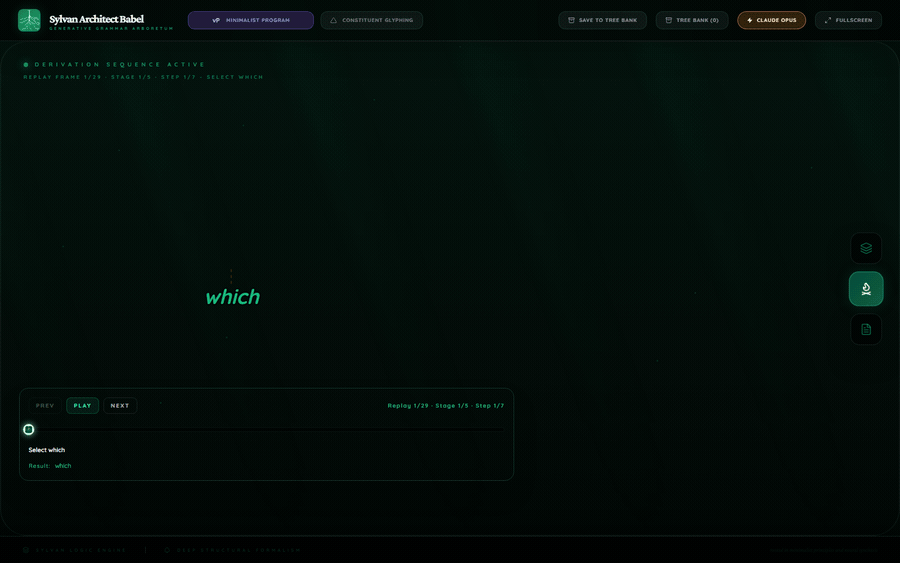
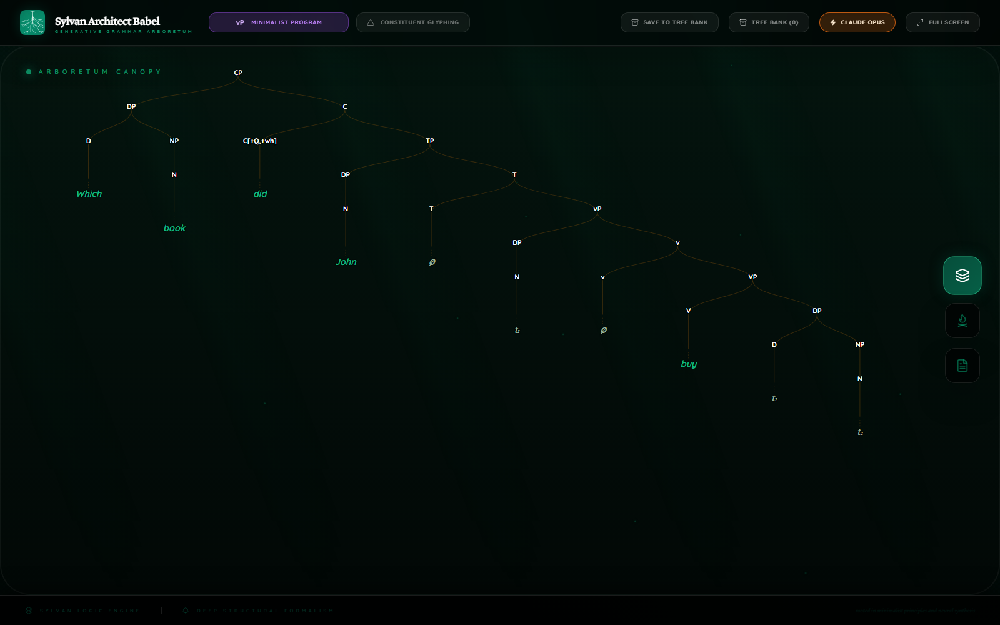
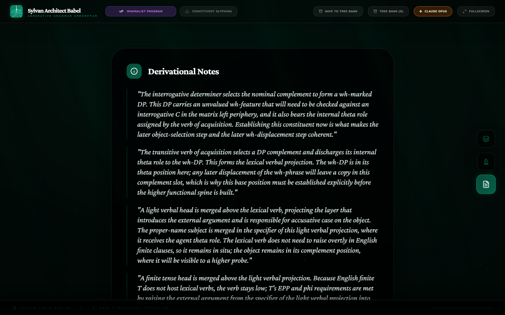
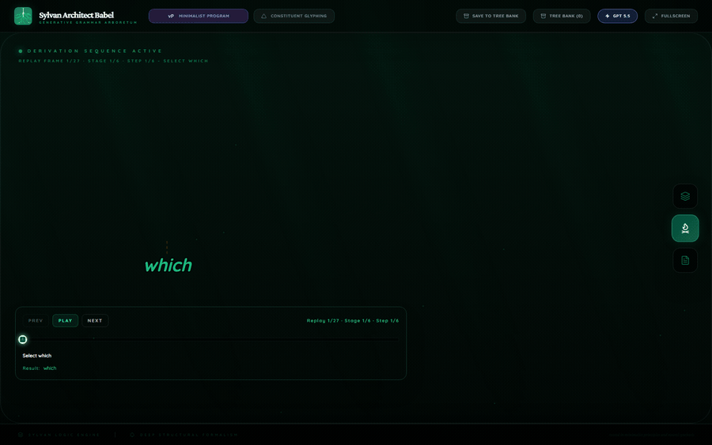
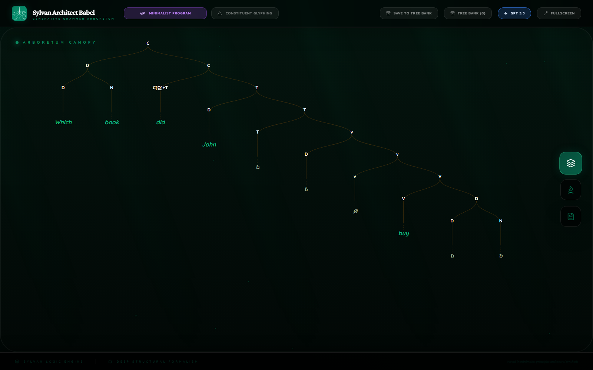
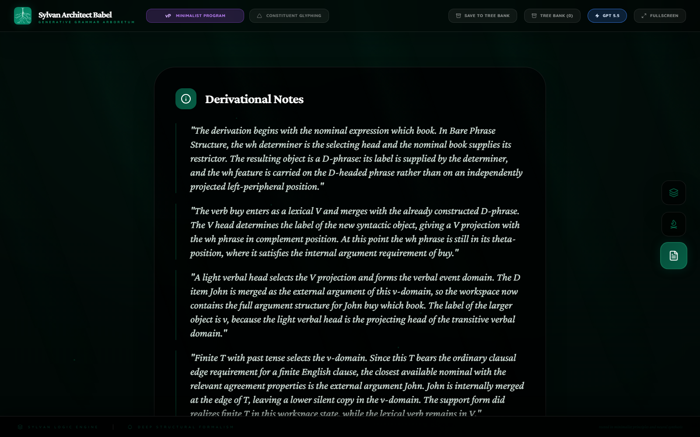
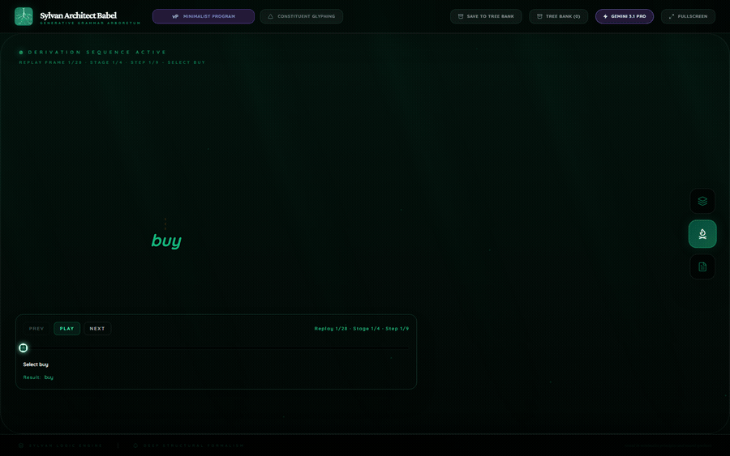
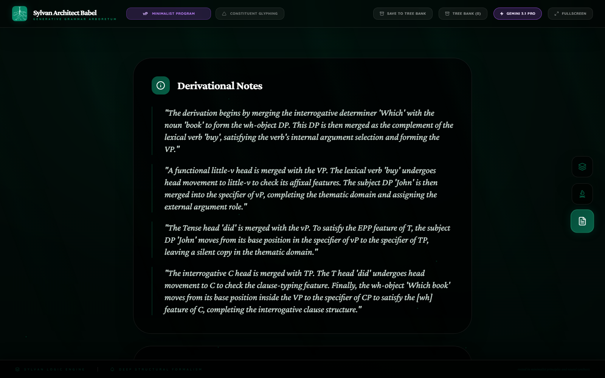

<div class="paper-hero">
  <p class="paper-kicker">Mini Research Devlog</p>
  <h1 class="paper-title">Three Frontier Models Under One Babel Prompt</h1>
  <p class="paper-subtitle">A Babel comparison of Gemini 3.1 Pro, GPT-5.5, and Claude Opus 4.7 on one Minimalist wh-question.</p>
  <div class="paper-meta-grid">
    <div class="paper-meta-item">
      <span class="paper-meta-label">Date</span>
      <p>May 17, 2026</p>
    </div>
    <div class="paper-meta-item">
      <span class="paper-meta-label">Sentence</span>
      <p><code>Which book did John buy?</code></p>
    </div>
    <div class="paper-meta-item">
      <span class="paper-meta-label">Framework</span>
      <p>Minimalist Program</p>
    </div>
    <div class="paper-meta-item">
      <span class="paper-meta-label">Main Site</span>
      <a href="https://francisronge.github.io/sylvan-architect-babel/">Back to Sylvan Architect Babel</a>
    </div>
    <div class="paper-meta-item">
      <span class="paper-meta-label">Asset Source</span>
      <a href="https://github.com/francisronge/sylvan-architect-babel/tree/main/docs/research/assets/frontier-provider-wh-question-2026-05">GitHub asset folder</a>
    </div>
  </div>
</div>

## Abstract

This is a deliberately small comparison. The same neutral Babel contract was used to ask three frontier models for a derivational Minimalist analysis of the same wh-question. All three models converged on the core analysis: the wh-object is built in object position, the subject is introduced in the verbal domain, finite T and interrogative C create the English auxiliary pattern, and the wh-DP moves to the left periphery.

The interesting result is not convergence alone. The interesting result is that the models made different public syntactic commitments under the same prompt. Claude Opus 4.7 produced the strongest analysis in this run. It was also the fastest stored successful run and the cheapest estimated run. GPT-5.5 produced the most expansive prose and the most segmented derivational staging. Gemini 3.1 Pro produced a compact usable analysis, but it made one extra theoretical commitment: lexical V-to-v movement for English `buy`.

## Method

The benchmark asked for a single Babel derivation, not a list of possible theories. The model had to return a committed tree, derivation stages, visual relations, and notes. The prompt did not tell the models which syntactic phenomena to use. That matters because this is not only a parsing test. It is a test of public syntactic theory: what the model chooses to expose when it has to make its analysis inspectable.

The cost estimates below use the persisted token counts in the local artifacts and public provider pricing checked on May 16, 2026. Gemini output cost counts both visible output tokens and thinking tokens, because the Gemini artifact records 11,999 provider thinking tokens in addition to 2,629 visible output tokens.

| Route | Model | Stored elapsed time | Input tokens | Visible output tokens | Thinking tokens | Estimated cost |
| --- | --- | ---: | ---: | ---: | ---: | ---: |
| Claude | Claude Opus 4.7 | 27.0s | 6,121 | 2,435 | 0 | $0.0915 |
| Gemini | Gemini 3.1 Pro Preview | Successful rerun time not persisted; earlier attempt timed out at 89.8s | 3,779 | 2,629 | 11,999 | $0.1831 |
| GPT | GPT-5.5 | 158.9s | 3,732 | 7,586 | 0 | $0.2462 |

Pricing references: [OpenAI API pricing](https://openai.com/api/pricing/), [Anthropic pricing](https://www.anthropic.com/pricing#api), and [Gemini API pricing](https://ai.google.dev/gemini-api/docs/pricing).

## Shared Syntactic Core

All three models saw the sentence as a standard matrix wh-question with object extraction:

1. `which book` is built as the internal argument of `buy`;
2. `John` is introduced as the external argument;
3. finite T supplies the English auxiliary pattern through `did`;
4. the subject occupies the finite-clause subject position;
5. interrogative C attracts the wh-DP;
6. the lower wh-object position remains silent.

That is the correct broad family of analyses for this sentence. The decisive differences are not about whether the models can identify wh-movement. They are about theory choice, granularity, economy, and whether the model exposes enough derivational reasoning without adding unnecessary machinery.

## Claude Opus 4.7

Claude gave the cleanest linguistic analysis. It built the wh-DP first, merged it as the complement of `buy`, introduced the light-verbal layer, raised the subject to satisfy finite T, and then formed the interrogative left edge. Its strongest choice was restraint: it explicitly said that the lexical verb does not need to raise overtly in English finite clauses, so `buy` remains low. That avoids an unnecessary V-to-v commitment for this simple English clause.

<div style="display:grid;grid-template-columns:repeat(auto-fit,minmax(260px,1fr));gap:1rem;margin:1.25rem 0 1.75rem;">
  <figure>
    
    <figcaption>Claude Opus 4.7 derivation replay.</figcaption>
  </figure>
  <figure>
    
    <figcaption>Claude Opus 4.7 Canopy.</figcaption>
  </figure>
  <figure>
    
    <figcaption>Claude Opus 4.7 Notes.</figcaption>
  </figure>
</div>

### Linguistic Audit

Claude's derivation is economical without being shallow. It separates the wh-object from the verbal predicate, then treats the later wh dependency as a dependency over an already established theta position. That is the right order: the object must be an argument before it can become an operator.

The best part is its treatment of English finite verb placement. Claude does not move lexical `buy` to a higher functional head. It keeps the lexical verb low and lets the finite auxiliary pattern come from the T/C system. That is a strong English-specific choice. The model is not merely naming "movement"; it is choosing which movement is actually motivated.

Claude also gives a good division of labor between theta role, case, and clause typing. `Which book` receives the internal role from `buy`; `John` receives the agent role in the light-verbal domain; finite T values nominative on the subject; interrogative C hosts the do-supported finite head and attracts the wh-DP. That makes the analysis more than a surface-order derivation.

The main limitation is that Claude compresses do-support into the final CP stage. That is acceptable for this sentence, because do-support belongs to the C/T interaction. But a larger benchmark should test whether Claude can keep the same elegance in sentences where negation, aspect, auxiliaries, and head movement interact more tightly.

### Full Stage Record

<details open>
<summary>Claude Opus 4.7 stageRecord</summary>

#### Stage 1: Build the wh-DP object Which book.

```text
The interrogative determiner selects the nominal complement to form a wh-marked DP. This DP carries an unvalued wh-feature that will need to be checked against an interrogative C in the matrix left periphery, and it also bears the internal theta role assigned by the verb of acquisition. Establishing this constituent now is what makes the later object-selection step and the later wh-displacement step coherent.
```

#### Stage 2: Merge the verb with its internal argument to form VP.

```text
The transitive verb of acquisition selects a DP complement and discharges its internal theta role to the wh-DP. This forms the lexical verbal projection. The wh-DP is in its theta position here; any later displacement of the wh-phrase will leave a copy in this complement slot, which is why this base position must be established explicitly before the higher functional spine is built.
```

#### Stage 3: Introduce v and merge the external argument in its specifier.

```text
A light verbal head is merged above the lexical verb, projecting the layer that introduces the external argument and is responsible for accusative case on the object. The proper-name subject is merged in the specifier of this light verbal projection, where it receives the agent theta role. The lexical verb does not need to raise overtly in English finite clauses, so it remains in situ; the object remains in its complement position, where it will be visible to a higher probe.
```

#### Stage 4: Merge finite T, raise the subject, and value nominative.

```text
A finite tense head is merged above the light verbal projection. Because English finite T does not host lexical verbs, the verb stays low; T's EPP and phi requirements are met by raising the external argument from the specifier of the light verbal projection into the specifier of the tense projection, leaving a copy in its theta position. T values nominative on the raised subject. Tense itself is unpronounced at this point and will only become audible after it associates with the supporting auxiliary at the C layer.
```

#### Stage 5: Merge interrogative C, raise T-to-C as do-support, and front the wh-phrase.

```text
An interrogative complementizer is merged above the tense projection. This C bears a feature that probes for a matching wh-element and an Aux/EPP feature that triggers subject-auxiliary inversion. Since the lexical verb cannot raise to C in English, the stranded finite tense feature is supported by do, which spells out the T-to-C complex in the head position of the complementizer projection. The wh-DP, which received its theta role and case in the lower clause, is then attracted to the specifier of the complementizer projection to check the interrogative feature, leaving a copy in its original complement position. The result is a single rooted clause whose overt terminals, read left-to-right, spell the input string exactly.
```

</details>

## GPT-5.5

GPT produced the most expansive analysis. It leaned into Bare Phrase Structure language, saying that the wh determiner supplies the D-headed label and that `book` supplies the restrictor. It separated the derivation into six stages: wh nominal, VP, little-v domain, finite T and subject movement, interrogative C and T-to-C, then final wh movement.

<div style="display:grid;grid-template-columns:repeat(auto-fit,minmax(260px,1fr));gap:1rem;margin:1.25rem 0 1.75rem;">
  <figure>
    
    <figcaption>GPT-5.5 derivation replay.</figcaption>
  </figure>
  <figure>
    
    <figcaption>GPT-5.5 Canopy.</figcaption>
  </figure>
  <figure>
    
    <figcaption>GPT-5.5 Notes.</figcaption>
  </figure>
</div>

### Linguistic Audit

GPT is the most theory-explicit model in this run. It makes the wh-DP's internal architecture part of the analysis instead of treating `which book` as a flat chunk. It also explains the final operator position through an edge requirement on interrogative C, not through a generic surface-fronting rule. That is a strong public derivational commitment.

GPT's strongest virtue is traceability. Every major dependency has a prose reason: internal argument selection, external argument introduction, finite T, subject movement, T-to-C movement, and wh movement. It also says why `did buy` is not a single lexical verb. That matters, because English do-support is a functional-head effect, not lexical selection by `did`.

The weakness is output economy. GPT writes a rich analysis, but it spends more tokens than the other two models and sometimes phrases ordinary operations in heavier theoretical language than the sentence requires. It also makes the derivation feel more segmented than Claude's, because it separates C-merge/T-to-C and wh movement into adjacent final stages. That split is not wrong. It is useful if the benchmark values explicitness, but less elegant if the benchmark values compact derivational sufficiency.

GPT's Canopy is the most visibly abstract. It labels projections through bare heads rather than always using familiar phrasal labels. That matches its Bare Phrase Structure prose, but it is less pedagogically transparent than Claude's version. Linguistically, that is not a failure. It is a theoretical signature.

### Full Stage Record

<details open>
<summary>GPT-5.5 stageRecord</summary>

#### Stage 1: The wh nominal is built as a D-headed phrase.

```text
The derivation begins with the nominal expression which book. In Bare Phrase Structure, the wh determiner is the selecting head and the nominal book supplies its restrictor. The resulting object is a D-phrase: its label is supplied by the determiner, and the wh feature is carried on the D-headed phrase rather than on an independently projected left-peripheral position.
```

#### Stage 2: The lexical verb selects the wh D-phrase as its internal argument.

```text
The verb buy enters as a lexical V and merges with the already constructed D-phrase. The V head determines the label of the new syntactic object, giving a V projection with the wh phrase in complement position. At this point the wh phrase is still in its theta-position, where it satisfies the internal argument requirement of buy.
```

#### Stage 3: Little v introduces the external argument John above the verbal predicate.

```text
A light verbal head selects the V projection and forms the verbal event domain. The D item John is merged as the external argument of this v-domain, so the workspace now contains the full argument structure for John buy which book. The label of the larger object is v, because the light verbal head is the projecting head of the transitive verbal domain.
```

#### Stage 4: Finite T is introduced and the subject satisfies the T-edge requirement.

```text
Finite T with past tense selects the v-domain. Since this T bears the ordinary clausal edge requirement for a finite English clause, the closest available nominal with the relevant agreement properties is the external argument John. John is internally merged at the edge of T, leaving a lower silent copy in the v-domain. The support form did realizes finite T in this workspace state, while the lexical verb remains in V.
```

#### Stage 5: Interrogative C is merged and finite T raises to C.

```text
An interrogative C selects the finite T projection. The C head bears the finite-clause requirement responsible for subject-auxiliary inversion in the matrix question. The finite T head is therefore internally merged with C: the higher C-headed occurrence is pronounced as did, and the lower T occurrence remains as a silent copy. This keeps the functional head responsible for tense explicit while also deriving the surface auxiliary position without treating did buy as a single lexical verb.
```

#### Stage 6: The wh D-phrase moves to the C edge and the question converges.

```text
The interrogative C head also has an edge requirement tied to the wh feature. It probes its complement domain and finds the wh D-phrase in the complement of V; no closer wh phrase intervenes. The wh D-phrase is internally merged at the edge of C, producing the operator position for the matrix wh question. The lower object occurrence is retained as a silent copy in the verbal complement position, preserving the argument relation with buy. The resulting single rooted structure spells the pronounced terminals in the order Which book did John buy.
```

</details>

## Gemini 3.1 Pro

Gemini returned the most compact analysis. It built the wh-object and lexical VP, introduced little-v and the subject, raised the subject to TP, then built the CP phase with T-to-C and wh movement. The analysis captured the surface string and the main dependencies.

<div style="display:grid;grid-template-columns:repeat(auto-fit,minmax(260px,1fr));gap:1rem;margin:1.25rem 0 1.75rem;">
  <figure>
    
    <figcaption>Gemini 3.1 Pro derivation replay.</figcaption>
  </figure>
  <figure>
    
    <figcaption>Gemini 3.1 Pro Canopy.</figcaption>
  </figure>
  <figure>
    
    <figcaption>Gemini 3.1 Pro Notes.</figcaption>
  </figure>
</div>

### Linguistic Audit

Gemini's answer is successful at the level of core dependencies. It builds the wh-object as the complement of `buy`, introduces `John` in the verbal domain, raises the subject to TP, moves T to C, and moves the wh-object to Spec-CP. That is the right derivational skeleton.

The main linguistic weakness is the V-to-v movement commitment. Gemini says that `buy` undergoes head movement to little-v to check affixal features. This is not impossible in a Minimalist grammar, but the English sentence does not force that commitment. Since `buy` surfaces after the subject and after `did`, the cleaner English analysis keeps the lexical verb low and lets the auxiliary behavior come from T/C. Claude does that. GPT also keeps the lexical verb low.

Gemini is also less explicit about case and theta-role separation. It says the wh-DP satisfies internal selection and that `John` receives the external role, but it does not unpack nominative, accusative, do-support, and C-edge probing with the same precision as Claude or GPT. The result is correct and compact, but less useful as a research artifact.

The positive lesson is that Gemini still converges on the main derivational architecture under the same neutral contract. It does not merely output a final tree. It outputs a staged derivation with the right major dependencies. The negative lesson is that compactness can hide theory choices. V-to-v movement is one small clause in the prose, but it changes the analysis.

### Full Stage Record

<details open>
<summary>Gemini 3.1 Pro stageRecord</summary>

#### Stage 1: Formation of the object DP and lexical VP

```text
The derivation begins by merging the interrogative determiner 'Which' with the noun 'book' to form the wh-object DP. This DP is then merged as the complement of the lexical verb 'buy', satisfying the verb's internal argument selection and forming the VP.
```

#### Stage 2: Introduction of the little-v phase and the external argument

```text
A functional little-v head is merged with the VP. The lexical verb 'buy' undergoes head movement to little-v to check its affixal features. The subject DP 'John' is then merged into the specifier of vP, completing the thematic domain and assigning the external argument role.
```

#### Stage 3: Tense projection and subject raising

```text
The Tense head 'did' is merged with the vP. To satisfy the EPP feature of T, the subject DP 'John' moves from its base position in the specifier of vP to the specifier of TP, leaving a silent copy in the thematic domain.
```

#### Stage 4: CP phase, T-to-C movement, and wh-movement

```text
The interrogative C head is merged with TP. The T head 'did' undergoes head movement to C to check the clause-typing feature. Finally, the wh-object 'Which book' moves from its base position inside the VP to the specifier of CP to satisfy the [wh] feature of C, completing the interrogative clause structure.
```

</details>

## Cross-Model Comparison

### Derivational Economy

Claude is the most economical. It gives exactly the operations needed for the sentence: object construction, VP formation, vP/external argument, finite T/subject movement, CP/do-support/wh movement. GPT is more explicit and more expensive. Gemini is compact, but it adds V-to-v movement, which makes the analysis less economical even though the prose is shorter.

### English Auxiliary Syntax

Claude handles the English auxiliary system best. It states that the lexical verb cannot raise to C and that do-support spells out the stranded finite tense feature in the C/T complex. GPT also gets the logic right and explicitly rejects treating `did buy` as a single lexical verb. Gemini captures T-to-C movement but does not explain do-support as fully.

### Object Wh-Movement

All three models place `which book` in the complement position of `buy` before moving it to the C edge. GPT gives the most formal account of probing: C searches its complement domain and finds the wh D-phrase with no closer intervener. Claude gives the best balance: it ties the lower copy to theta/case and the higher copy to interrogative checking. Gemini states the operation correctly but gives less locality detail.

### Subject Position

All three models introduce `John` low and raise it to the finite subject position. Claude gives the strongest syntactic motivation by connecting this to EPP, phi, and nominative valuation. GPT connects it to a T-edge requirement and agreement properties. Gemini names EPP but gives the least detail.

### Labeling Theory

GPT is the most theoretically marked. Its Bare Phrase Structure vocabulary makes the final tree more abstract and less familiar, but it also shows a real theoretical stance. Claude and Gemini use more conventional phrase-structure language. This is important for Babel as a benchmark: the same prompt does not erase theoretical personality. It exposes it.

### Case And Theta Roles

Claude is strongest here. It distinguishes internal theta role, agent theta role, accusative responsibility in the light-verbal layer, and nominative valuation by finite T. GPT is also strong on argument structure, but less explicit about case than Claude in the stageRecord. Gemini mentions selection and thematic completion, but case is thinner.

### Benchmark Takeaway

Claude wins this micro-benchmark because it combines correctness, economy, and linguistic restraint. GPT is the best if the goal is maximal explicitness and formal public reasoning. Gemini is strong enough to be useful, but it reveals a tendency to add an extra head-movement analysis when a leaner English analysis is available.

The broader result is the important one: under one neutral Babel prompt, three frontier models converged on the same syntactic core while exposing different theoretical instincts. That is what makes Babel useful as a benchmark. It does not only ask whether a model knows that `which book` is connected to `buy`. It asks what derivation the model is willing to make public.
