

  
Research Note v1

  <h1 class="paper-title">One Hundred Trees, One Hundred Public Syntactic Theories</h1>
  
A 100-case multilingual test of what language models are willing to say syntax is.

  

    

      Date
      
March 13, 2026

    

    

      Primary Report
      <a href="../data/gauntlet100-v1-report.json">gauntlet100-v1-report.json</a>
    

    

      Capture Script
      <a href="../data/gauntlet100_dual.cjs">gauntlet100_dual.cjs</a>
    

    

      Figure Assets
      <a href="../assets/gauntlet100-v1/">gauntlet100-v1 asset folder</a>
    

    

      Atlas Route
      <a href="./atlas/">standalone all-100 tree browser</a>
    

  

  

    Jump To
    
<a href="#abstract">Abstract</a> · <a href="#results">Results</a> · <a href="#case-studies">Case studies</a> · <a href="#full-benchmark-atlas">All 100 trees</a> · <a href="#interpretability">Interpretability</a> · <a href="#conclusion">Conclusion</a>

  

## Abstract

This paper introduces a new benchmark object for language models: not sentence preference, but public syntactic theory. Inside Sylvan Architect Babel, 100 multilingual sentences are evaluated under forced commitment: each model must return one visible tree, one movement record, one replayable derivation, and one explanation that describes the same analysis. The benchmark spans 22 languages, 15 phenomena, two theoretical frameworks, and two Gemini routes: 50 runs with Gemini 3.1 Pro and 50 runs with Gemini 3.1 Flash Lite.

The headline result is unusually strong. On this 100-case batch, both routes completed all items, but they did not behave like the same syntactic system at different verbosity settings. Pro averaged 31.5 derivation steps and 3.10 movement events per item, while Flash Lite averaged 20.4 steps and 0.74 movement events. Across the 50 paired sentence-types, the routes matched the exact number of movement events in only 4 cases; Pro encoded more movement than Flash Lite in 46. This gap persists even though the smaller route receives more structural help from Babel, because the benchmark is aimed at the analysis the model chooses rather than at whether a smaller model can serialize a tree perfectly on its own. The effect is especially visible in English long-distance wh-dependencies, Dutch embedding, Hungarian focus inversion, and Bengali wh-questions in native script. This is the first public benchmark at this scale that evaluates frontier language models through forced explicit syntactic commitment rather than sentence preference alone.

## 1. Introduction

Most well-known syntactic evaluations for language models are string-first. They ask whether a model prefers one sentence over another or whether it distinguishes a grammatical minimal pair from an ungrammatical one. Important work in that tradition includes targeted syntactic evaluation, [Marvin and Linzen 2018](https://aclanthology.org/D18-1151/), [BLiMP](https://direct.mit.edu/tacl/article/doi/10.1162/tacl_a_00321/96452/BLiMP-The-Benchmark-of-Linguistic-Minimal-Pairs), and [SyntaxGym](https://aclanthology.org/2020.acl-demos.10/). These resources are valuable because they test whether a model is sensitive to structure. But they do not require the model to externalize the structure itself.

That missing externalization matters because the contemporary argument about AI language ability is no longer only about benchmark scorecards. [Bender and Koller 2020](https://aclanthology.org/2020.acl-main.463/) argued that systems trained on linguistic form alone should not be casually credited with meaning or understanding. More recent work pulls in the other direction: [Piantadosi 2024](https://zenodo.org/records/12665933) argues that modern language models implement substantive theories of language, while [Katzir 2024](https://spacefrontiers.org/r/10.5964/bioling.13153) argues that they remain poor theories of human linguistic cognition. At the same time, newer empirical work has become much more optimistic about the amount of syntax these systems may encode, including work explicitly titled [Evidence of Generative Syntax in LLMs](https://aclanthology.org/2025.conll-1.25/). Babel makes that debate concrete at sentence scale: if Piantadosi is right that LLMs can function as scientific theories, then every Babel parse is literally one local syntactic theory made public.

Classical annotated corpora do externalize structure, but usually only as end-state annotation. Treebanks such as the [Penn Treebank](https://catalog.ldc.upenn.edu/LDC99T42), the [Prague Dependency Treebank](https://aclanthology.org/L04-1291/), and [Universal Dependencies](https://aclanthology.org/W17-2501/) store syntactic analyses; they do not typically store replayable derivations, explicit movement chains, or sentence-by-sentence prose accounts of why one derivation rather than another was chosen. Recent surveys of multilingual LLMs likewise emphasize the growth of cross-lingual capacity while also noting persistent evaluation gaps across languages and tasks ([Jin et al. 2025](https://link.springer.com/article/10.1007/s11704-024-40579-4)). Babel is aimed directly at one of those gaps: public, inspectable syntax.

Sylvan Architect Babel changes the benchmark object. The model is not asked merely to score a sentence or label a completed tree. It is required to produce:

1. one committed analysis rather than multiple alternatives;
2. one visible phrase marker;
3. explicit movement events;
4. a replayable derivational sequence in Growth;
5. Notes that describe the same analysis.

That shift matters for both linguistics and interpretability. Once a model has to say what the structure is, not merely whether the sentence is good, we can compare models as theory-generators rather than as opaque scorers.

## 2. Why This Benchmark Is Different

The central claim of this paper is not simply that Babel can draw syntax trees. It is that Babel exposes a category of model behavior that most current benchmarks leave hidden.

Standard syntactic evaluations ask:

- does the model prefer the grammatical string?
- does the model track a dependency in probability space?

Babel asks:

- what tree does the model commit to?
- where does it put the copies and landing sites?
- how much of the derivation does it make explicit?
- can it tell the same story in tree, replay, and prose?

This is a qualitatively different interpretability object. A model that scores the right sentence higher may still remain theoretically silent. A model that succeeds in Babel is forced to make its syntactic theory publicly inspectable.

No widely used public multilingual benchmark at this scale simultaneously requires:

- overt phrase structure;
- explicit movement encoding;
- replayable derivation;
- explanatory prose grounded in the same committed analysis.

That does not make Babel a replacement for BLiMP, SyntaxGym, or treebanks. It makes it a different instrument.

## 3. Materials and Methods

### 3.1 Batch design

The benchmark uses the 100-case dual-route showcase script in [gauntlet100_dual.cjs](../data/gauntlet100_dual.cjs). The run contains:

- 25 X-bar cases for Gemini 3.1 Pro;
- 25 Minimalist cases for Gemini 3.1 Pro;
- 25 X-bar cases for Gemini 3.1 Flash Lite;
- 25 Minimalist cases for Gemini 3.1 Flash Lite.

Each case produces:

- the returned analysis JSON;
- a Canopy screenshot;
- a final Growth screenshot;
- a Notes screenshot;
- route/framework metadata and derivation statistics.

The full run report is [gauntlet100-v1-report.json](../data/gauntlet100-v1-report.json).

The paper package also includes [a standalone atlas route for all 100 trees](./atlas/), with paired canopy figures and a short syntactic and interpretability reading for every sentence-type in the batch. The complete sentence inventory is therefore part of the publication itself, not a hidden auxiliary artifact.

### 3.2 Coverage

The batch spans 22 languages:

Arabic, Bengali, Bulgarian, Czech, Dutch, English, Finnish, French, German, Greek, Hebrew, Hindi, Hungarian, Irish, Italian, Polish, Portuguese, Romanian, Russian, Serbian, Spanish, and Turkish.

It spans 15 phenomena, including:

- wh-questions
- long-distance wh
- focus inversion
- embedded clauses
- embedded questions
- embedded subjunctives
- passives
- yes-no questions
- VSO clauses
- relative clauses

Crucially, the gauntlet was not restricted to romanized text. It includes native-script items in Arabic, Bengali, Bulgarian, Greek, Hebrew, Hindi, Russian, and Serbian, among others.

### 3.3 Comparison strategy

The point of the benchmark is not to declare one route universally correct. The comparison instead asks:

- how much derivational structure each route makes overt;
- whether the two routes encode the same movement story for the same sentence;
- where one route exposes a richer theory than the other;
- whether multilingual native-script analysis remains possible under the same forced-commitment regime.

One methodological caveat should be made explicit because it strengthens, rather than weakens, the central result: the smaller model receives more help. Gemini 3.1 Flash Lite runs on Babel's assisted structure path, which gives it extra serialization support so that the benchmark remains focused on the analysis the model chooses rather than collapsing into a test of whether the smaller route can serialize perfect structure unaided. Gemini 3.1 Pro is closer to a raw benchmark route. If Pro still externalizes a richer syntactic theory under those conditions, that gap is not an artifact of Flash Lite being abandoned to fail. It is a difference in public syntactic commitment.

## 4. Results

### 4.1 Batch-level outcome

The full 100-case run completed successfully:

- 100/100 analyses returned a full artifact set;
- 100/100 produced visible Canopy, Growth, and Notes pages;
- 100/100 yielded a usable committed analysis object for comparison.

The more interesting result, however, is not the completion count. It is the shape of the analyses.

### 4.2 Route-level summary

**Table 1. Overall route comparison**

| Route | Cases | Avg. elapsed time | Avg. derivation steps | Avg. movement events | Avg. Notes length |
| --- | --- | --- | --- | --- | --- |
| Gemini 3.1 Pro | 50 | 120.4 s | 31.5 | 3.10 | 135.1 words |
| Gemini 3.1 Flash Lite | 50 | 12.7 s | 20.4 | 0.74 | 79.2 words |

This gap is not merely stylistic. Pro is not just writing longer paragraphs. It is committing to more derivational content: more steps, more movement events, and more overt intermediate structure.

### 4.3 Framework split

**Table 2. Route-by-framework comparison**

| Route + framework | Avg. elapsed time | Avg. derivation steps | Avg. movement events | Avg. Notes length |
| --- | --- | --- | --- | --- |
| Pro X-bar | 125.2 s | 37.48 | 2.84 | 143.0 words |
| Pro Minimalism | 115.5 s | 25.52 | 3.36 | 127.2 words |
| Flash Lite X-bar | 15.5 s | 23.24 | 0.32 | 71.8 words |
| Flash Lite Minimalism | 10.0 s | 17.56 | 1.16 | 86.5 words |

Two things stand out.

First, Pro is richer in both frameworks, not only in Minimalism. Second, Flash Lite compresses X-bar even more aggressively than Minimalism in movement terms: on average just 0.32 movement events per X-bar case.

### 4.4 Pairwise divergence

The strongest evidence that these are not simply two verbosity settings comes from the 50 paired sentence comparisons.

- The routes matched the exact number of movement events in only 4/50 pairs.
- They matched movement presence versus absence in 25/50 pairs.
- Pro encoded more movement than Flash Lite in 46/50 pairs.
- Flash Lite encoded more movement than Pro in 0/50 pairs.

So the routes are often not externalizing the same syntactic theory of the same sentence.

### 4.5 Phenomenon profile

**Table 3. Phenomenon-level comparison**

| Phenomenon | Cases | Pro avg. movement | Flash Lite avg. movement | Pro avg. steps | Flash Lite avg. steps |
| --- | --- | --- | --- | --- | --- |
| Long-distance wh | 2 | 7.00 | 1.00 | 57.00 | 46.00 |
| Embedded declarative | 2 | 7.00 | 0.00 | 48.00 | 17.00 |
| Embedded perfect | 2 | 5.00 | 0.00 | 51.00 | 27.00 |
| Focus inversion | 2 | 5.00 | 1.00 | 31.00 | 16.00 |
| Embedded question | 2 | 4.00 | 0.00 | 41.00 | 22.00 |
| Complement clause | 2 | 4.00 | 0.00 | 38.00 | 26.00 |
| Embedded subjunctive | 2 | 2.00 | 0.00 | 37.00 | 21.00 |
| Relative clause | 4 | 2.50 | 0.00 | 41.50 | 30.50 |
| Embedded clause | 18 | 3.00 | 0.00 | 40.67 | 23.44 |
| Wh-question | 46 | 3.26 | 1.39 | 25.09 | 17.83 |
| Passive | 6 | 1.33 | 0.00 | 27.00 | 16.67 |
| Yes-no question | 6 | 2.00 | 0.67 | 24.67 | 15.00 |
| Raising-like clause | 2 | 1.00 | 0.00 | 32.00 | 23.00 |
| VSO declarative | 2 | 1.00 | 1.00 | 23.00 | 23.00 |

This table sharpens the qualitative story. The biggest route gaps are not random. They cluster exactly where syntacticians would expect public derivational richness to matter most: long-distance wh, embedding, focus-sensitive clause structure, and relative dependencies. By contrast, genuinely low-gap items such as Irish VSO declaratives and some ordinary wh-questions are cases where the surface grammar already strongly constrains the analysis or where both routes settle on the same relatively compact public theory.

### 4.6 Language-family profile

**Table 4. Language-family comparison**

| Family | Cases | Pro avg. movement | Flash Lite avg. movement | Pro avg. steps | Flash Lite avg. steps |
| --- | --- | --- | --- | --- | --- |
| Germanic | 22 | 3.27 | 0.64 | 35.09 | 23.45 |
| Romance | 26 | 3.00 | 0.46 | 31.46 | 19.54 |
| Semitic | 8 | 3.75 | 0.75 | 34.75 | 20.00 |
| Indo-Aryan | 10 | 3.40 | 0.20 | 31.00 | 17.80 |
| Slavic | 16 | 2.88 | 1.25 | 30.12 | 19.62 |
| Celtic | 6 | 2.00 | 1.00 | 26.67 | 20.67 |
| Uralic | 4 | 4.50 | 1.00 | 27.50 | 17.00 |
| Hellenic | 4 | 3.00 | 2.00 | 26.00 | 23.50 |
| Turkic | 4 | 2.00 | 0.50 | 29.00 | 19.50 |

The family profile makes two further points. First, the Pro-versus-Flash gap is not confined to one friendly corner of the language space; it persists across Germanic, Romance, Slavic, Semitic, Indo-Aryan, Celtic, Uralic, Hellenic, and Turkic material. Second, the smallest gaps tend to occur in language/phenomenon combinations where surface order itself heavily constrains the theory, while the largest gaps appear in families where clause-embedding, operator movement, or focus-sensitive structure reward a model willing to externalize more hidden syntax.

## 5. Screenshot-Based Case Studies

The figures below are treated as primary syntactic evidence. The point is not aesthetics. The point is what the models are visibly willing to claim.

### 5.1 English long-distance wh: explicit successive cyclicity versus compressed dependency

**Figure 1. English long-distance wh in Minimalism**

| Pro | Flash Lite |
| --- | --- |
|  |  |

This is the clearest single contrast in the batch. In the Pro figure, the wh-DP is not simply linked to the matrix clause edge. It is threaded through the clause stack with overt intermediate positions, while `do` is separately raised to `C`. The result is a visibly successive-cyclic derivation rather than a single top-level dependency.

Flash Lite does capture the dependency, but the analysis is much more compact. The clause spine is there, yet the derivation has the feel of a compressed dependency representation rather than a full movement history. In other words, both routes know what the sentence is doing, but Pro is much more willing to expose how.

For interpretability research, that distinction matters. The question is not merely whether the model “knows” long-distance wh-movement. The question is whether the model will publicize a multi-step derivational theory of it.

### 5.2 Dutch embedding: a full X-bar movement story versus a shallow clause shell

**Figure 2. Dutch embedded declarative in X-bar Theory**

| Pro | Flash Lite |
| --- | --- |
| 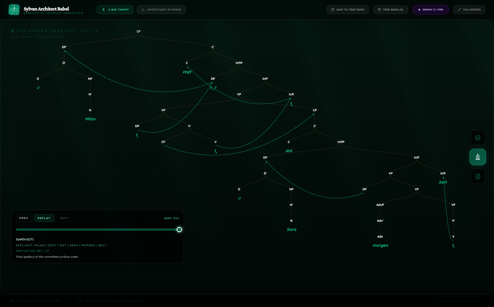 | 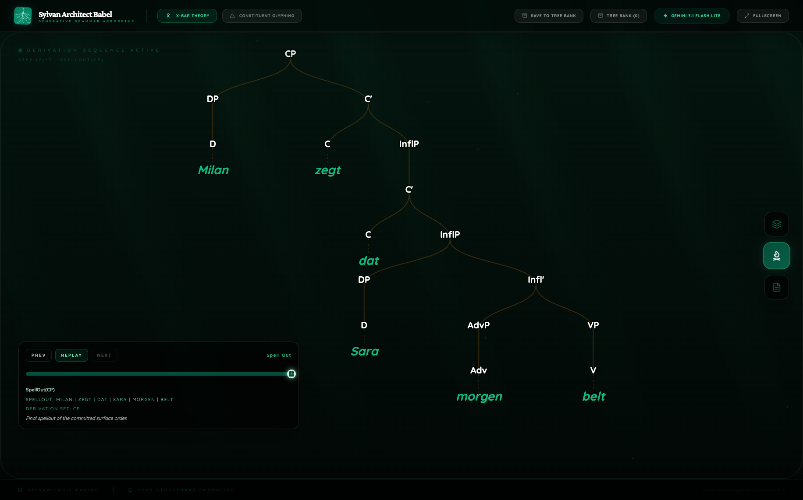 |

The Dutch pair is even more dramatic numerically. Pro encodes 7 movement events; Flash Lite encodes 0.

In the Pro figure, the matrix verb `zegt`, the complementizer `dat`, the embedded finite head `belt`, and both subject positions are all integrated into a visibly articulated clause architecture. This is not just a CP stacked on top of a sentence. It is an explicit theory of how matrix and embedded clausal domains are related.

Flash Lite returns a much flatter shell. The broad clause order is there, but the derivational argument has been compressed away. That makes this pair a particularly strong example of Babel’s value: ordinary benchmarks would say both routes handled Dutch embedding. Babel shows that they handled it in radically different theoretical ways.

### 5.3 Hungarian focus inversion: overt cartography versus reduced TP structure

**Figure 3. Hungarian focus inversion in Minimalism**

| Pro | Flash Lite |
| --- | --- |
| 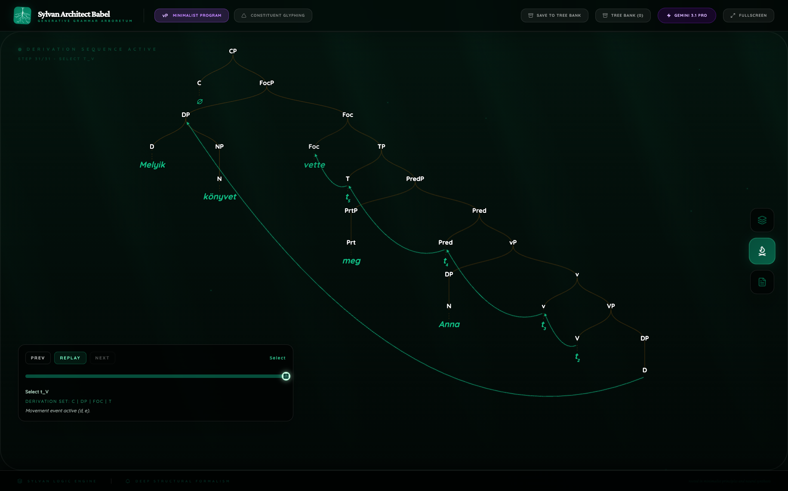 | 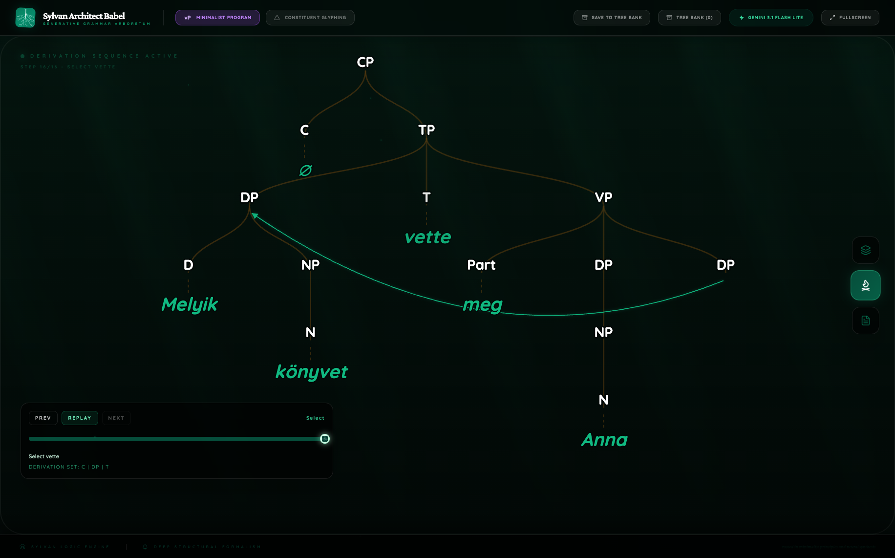 |

The Pro tree is unmistakably theory-rich. It introduces `FocP`, `PredP`, and `PrtP`, strands the preverb `meg`, and derives the order through V-to-Foc movement rather than through a generic fronting story. This is recognizably in the É. Kiss tradition of Hungarian clause structure.

Flash Lite instead gives a much leaner `CP/TP/VP` representation. The sentence is still analyzed as involving fronting, but the higher cartographic commitment is gone. That difference is not cosmetic. It is a difference in what theory the model is willing to endorse.

**Figure 4. Hungarian Notes comparison**

| Pro | Flash Lite |
| --- | --- |
| 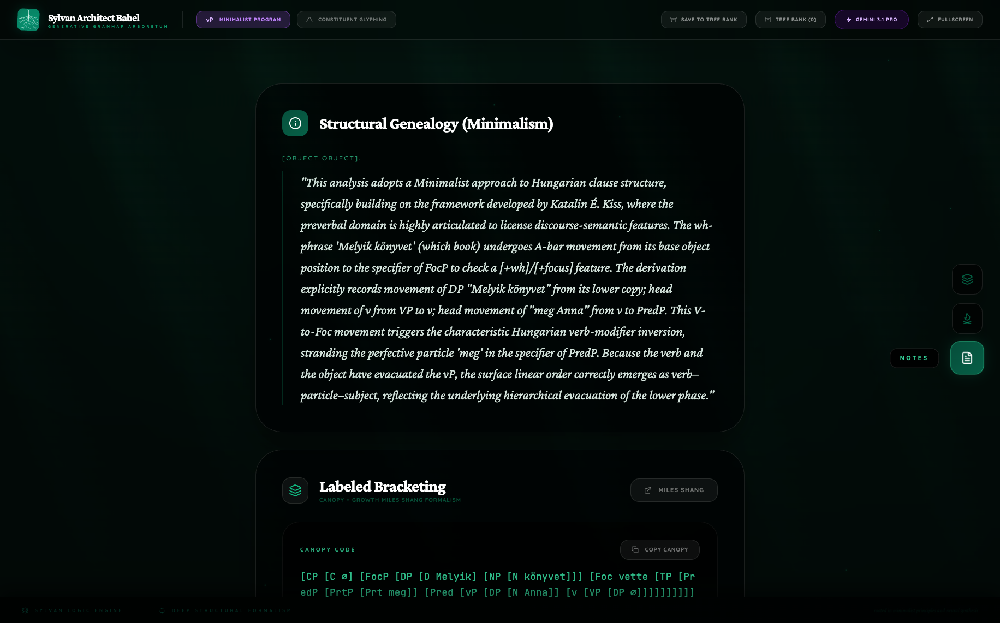 | 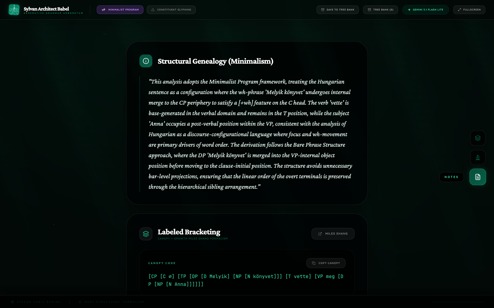 |

The Notes make the divergence even sharper. Pro explicitly names the Hungarian focus tradition and connects the derivation to V-to-Foc movement and stranded particles. Flash Lite instead narrates a more generic Minimalist fronting account. The difference is exactly the kind of difference Babel was built to expose.

### 5.4 Bengali and Hindi in native script

**Figure 5. Bengali wh-question in Minimalism**

| Pro | Flash Lite |
| --- | --- |
| 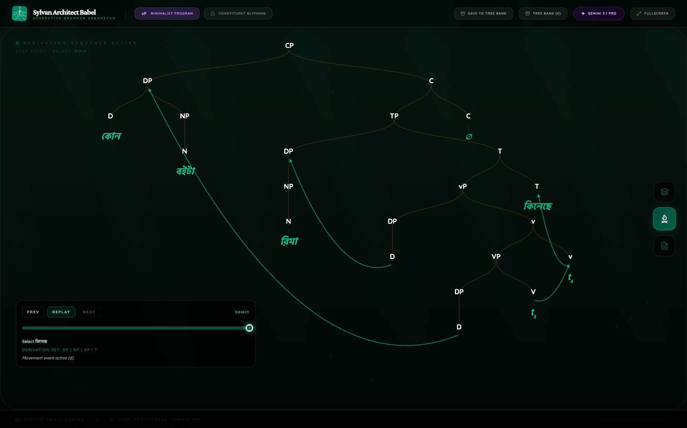 | 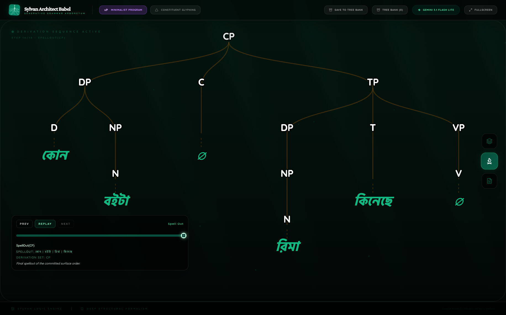 |

The Bengali sentence is analyzed in the same forced-commitment regime as the rest of the benchmark, and it still yields a clear theoretical divergence. Pro chooses a movement-rich analysis of Bengali wh-fronting, complete with head movement and overt chain structure. Flash Lite gives a much sparser CP/TP representation with little or no overt derivational elaboration. That is interesting linguistically because Bengali is often discussed as a language where wh-in-situ is central; Babel makes the model’s stronger fronting commitment visible rather than hiding it.

**Figure 6. Hindi X-bar analysis in native script**

| Pro Growth | Flash Lite Notes |
| --- | --- |
| 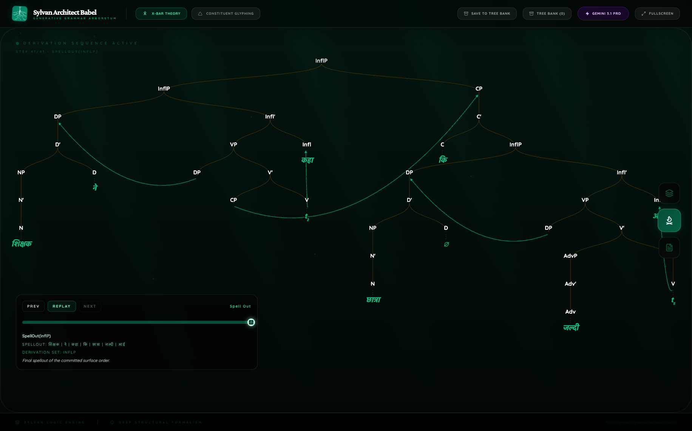 | 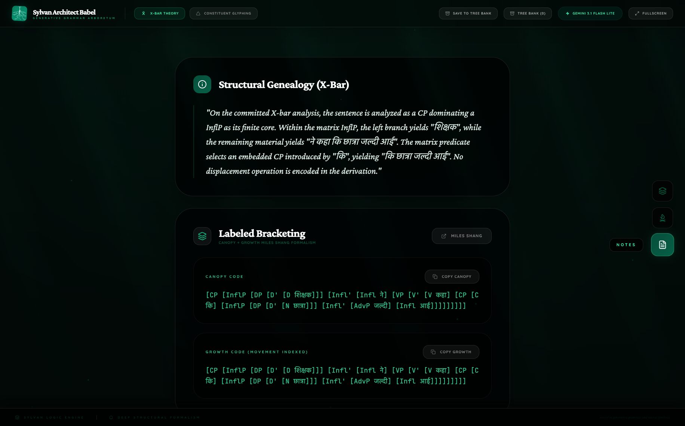 |

The Hindi pair makes the same point in a second way: the route difference survives when the sentence is presented directly in Devanagari rather than in transliteration. The contrast therefore belongs to syntax, not to romanization convenience. Pro still externalizes the richer theory; Flash Lite still externalizes the thinner one.

### 5.5 Full benchmark atlas

The benchmark is not only summarized here; it is embedded here. The full sentence-by-sentence atlas follows as part of the paper itself, with all 100 canopy trees included on the research site. A standalone atlas route remains available for direct browsing, but the complete inventory is part of the paper rather than an auxiliary download.

This atlas makes the strongest claim of the paper concrete. The benchmark does not merely report that a model "handled" a sentence. It shows what the model was willing to make public: a tree. The Pro route and the Flash Lite route are therefore inspected here as paired public syntactic theories, not just as outputs from two different inference budgets.

Each entry contains:

- both canopy trees for the same sentence-type;
- a compact syntactic reading of what the two routes actually committed to;
- an interpretability reading of why the routes may have chosen those analyses.

Flash Lite should be read with one methodological fact in mind: it receives more structural help from Babel than Pro does. When the smaller route still externalizes a thinner theory under that assistance, the gap is informative rather than unfair.

### Minimalism Atlas

### Arabic wh-question

Sentence: `أي كتاب اشترت ليلى ؟`

| Pro | Flash Lite |
| --- | --- |
| 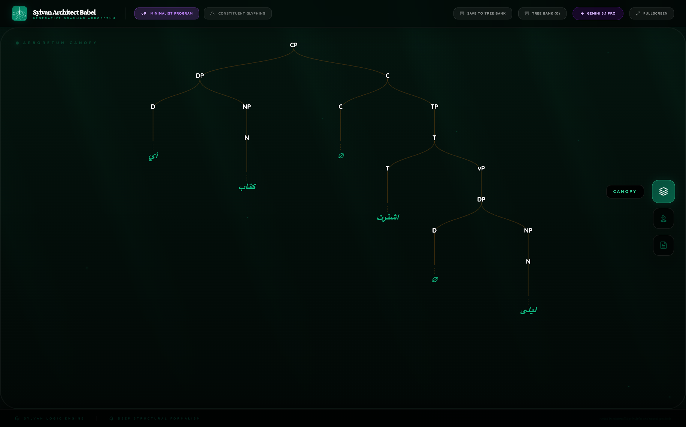 |  |

Metrics: Pro 3 movement / 25 steps; Flash Lite 1 movement / 16 steps.

**Syntactic reading.** Pro treats the fronted wh-DP as part of a fuller left-edge derivation, not just as a clause-initial dependency. Flash Lite still acknowledges the operator relation, but the chain is shorter and the derivation budget is lower, giving the analysis the feel of a lean CP dependency rather than a richly unfolded A'-chain.

**Interpretability check.** Both routes are reacting to the conspicuous clause-initial wh-phrase, but Pro appears more willing to spend structure on the idea that Arabic wh-fronting belongs to a visibly articulated clause edge. Flash Lite appears to regularize toward the cheapest tree that still preserves interrogative structure.

### Bulgarian wh-question

Sentence: `Коя книга прочете Мария?`

| Pro | Flash Lite |
| --- | --- |
| 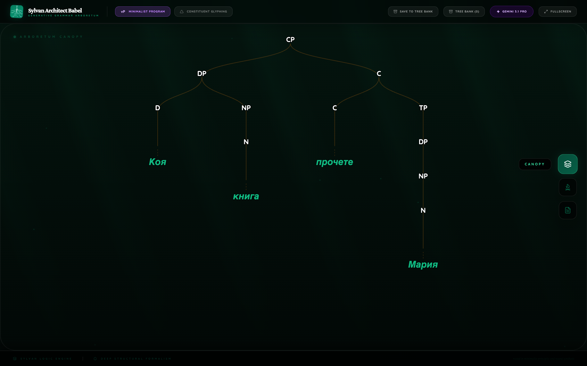 | 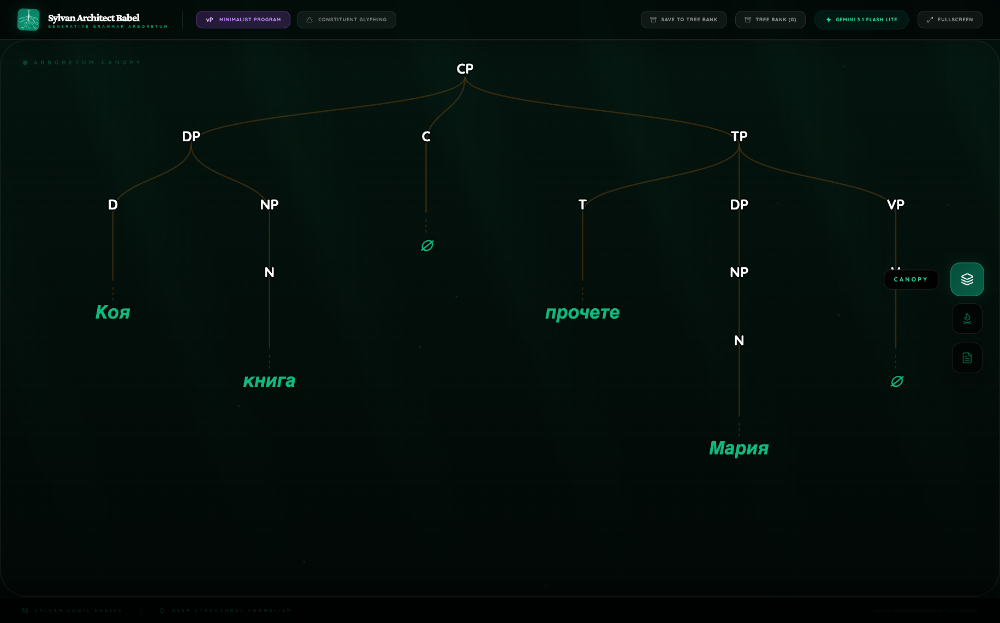 |

Metrics: Pro 3 movement / 26 steps; Flash Lite 2 movement / 17 steps.

**Syntactic reading.** Both routes analyze Bulgarian as overt wh-fronting, but Pro makes the derivation more explicit by retaining a larger amount of movement structure around the fronted object and the finite verbal spine. Flash Lite converges on the same broad operator dependency while leaving less of the intermediate derivational machinery visible.

**Interpretability check.** Bulgarian is a case where the surface cue is extremely strong: the wh-phrase is already at the left edge. The interesting difference is therefore not whether fronting exists, but whether the model thinks the sentence warrants a richer path to that fronted position. Pro says yes; Flash Lite says "yes, but minimally."

### Bengali wh-question

Sentence: `কোন বইটা রিমা কিনেছে ?`

| Pro | Flash Lite |
| --- | --- |
| 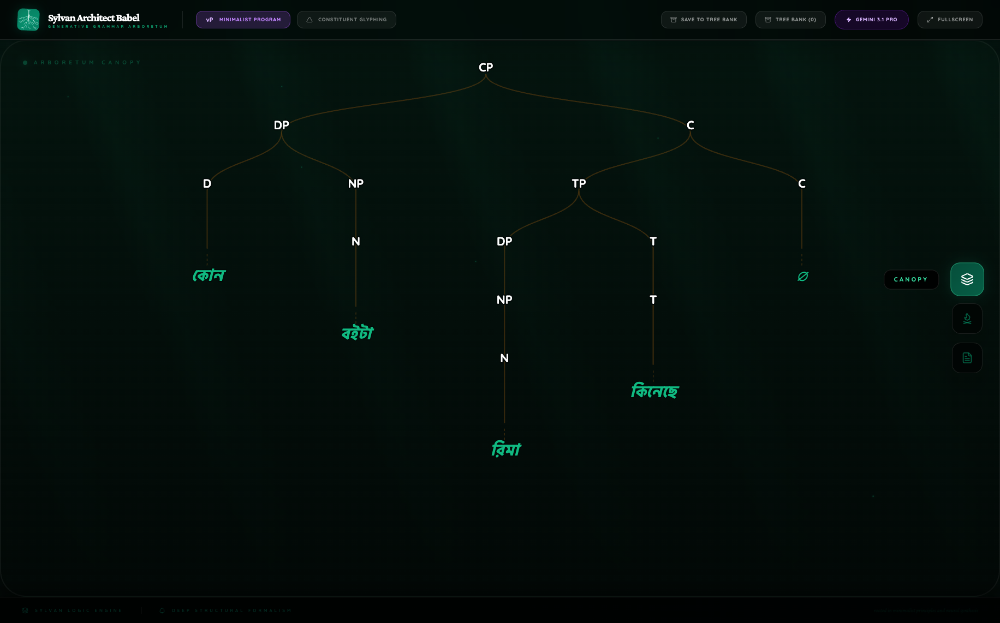 | 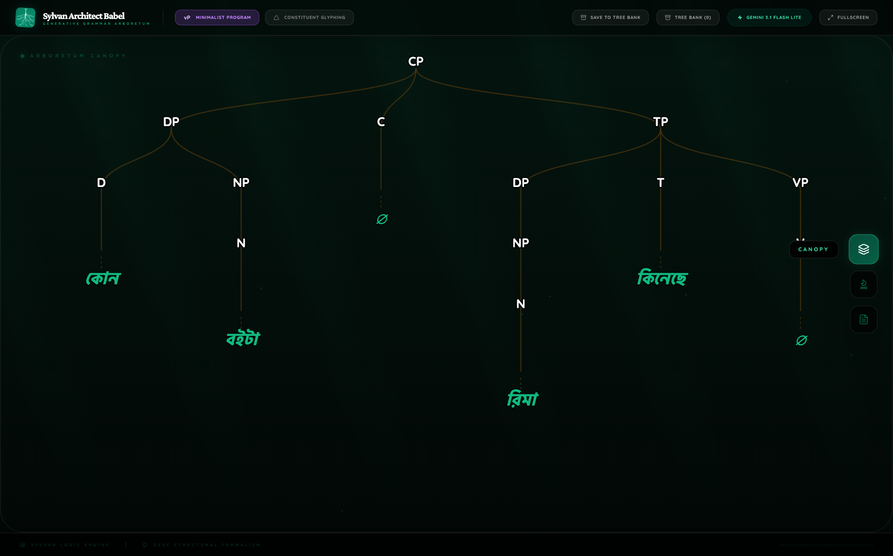 |

Metrics: Pro 4 movement / 27 steps; Flash Lite 0 movement / 16 steps.

**Syntactic reading.** This is one of the most revealing Minimalist pairs. Pro chooses a movement-rich analysis of the Bengali wh-clause, making the operator dependency structurally overt. Flash Lite, by contrast, gives a serviceable clause skeleton without committing to overt wh-movement at all. The resulting contrast is not between success and failure, but between a strong public theory and a strategically quiet one.

**Interpretability check.** Bengali is typologically interesting precisely because wh-interpretation does not force the same overt derivation in every analysis tradition. Pro appears to be pulled toward an explicit operator-chain reading by the sentence's initial wh constituent, while Flash Lite seems to avoid committing beyond the minimal interrogative frame.

### Czech wh-question

Sentence: `Kterou knihu koupil Marek?`

| Pro | Flash Lite |
| --- | --- |
| 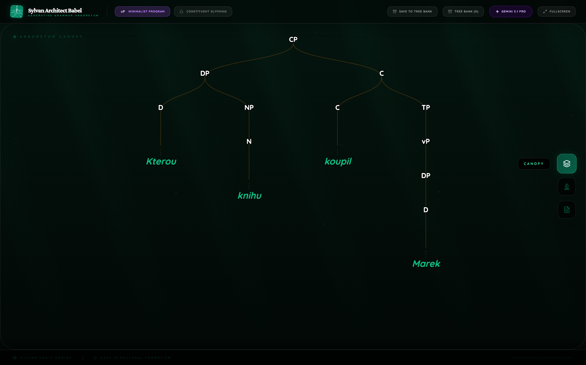 | 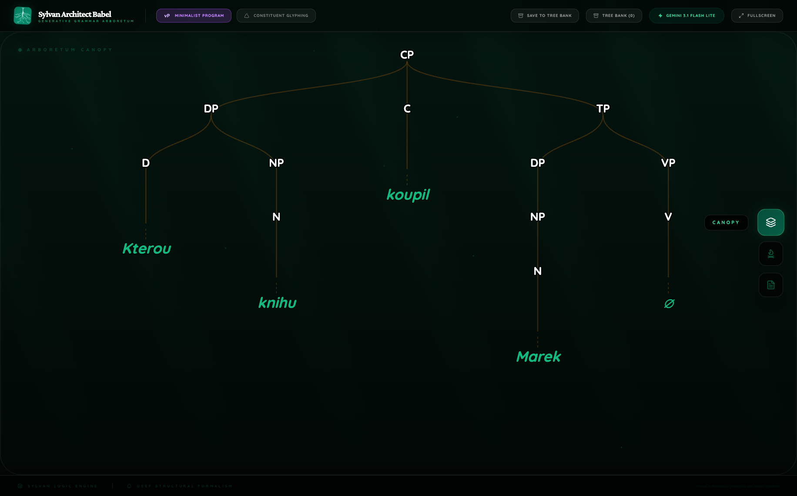 |

Metrics: Pro 4 movement / 23 steps; Flash Lite 2 movement / 18 steps.

**Syntactic reading.** Pro builds Czech as a visibly fronted object question with more overt derivational depth, while Flash Lite gives a slimmer but still recognizably movement-based analysis. The pair is useful because it shows partial convergence: both routes are prepared to encode movement, but Pro still pushes further.

**Interpretability check.** The object wh-phrase and verb-second-like feel of the clause create a strong invitation to externalize A'-movement. Flash Lite follows that cue, but Pro appears more confident that the sentence licenses a fully articulated chain rather than just a fronted dependency.

### German wh-question

Sentence: `Welches Foto hat Maria gesehen?`

| Pro | Flash Lite |
| --- | --- |
| 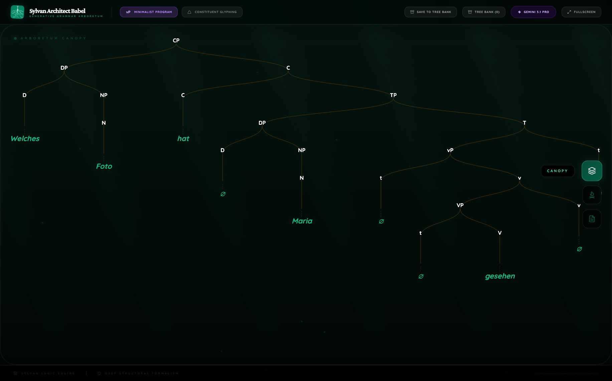 | 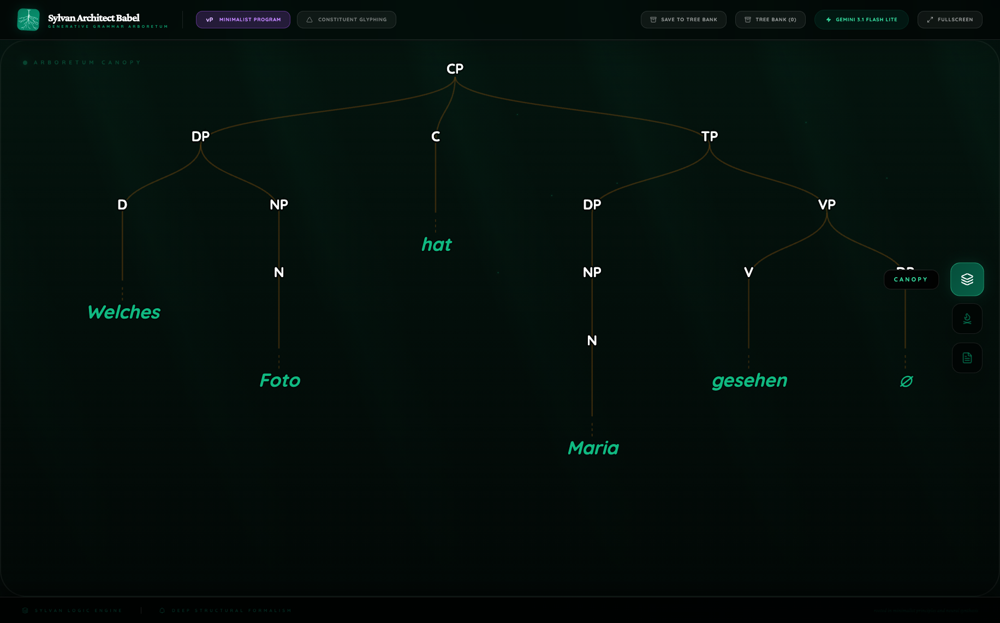 |

Metrics: Pro 3 movement / 25 steps; Flash Lite 1 movement / 15 steps.

**Syntactic reading.** Pro gives German wh-question syntax a fuller clause-edge treatment, combining object fronting with a more visibly derived finite spine. Flash Lite preserves the fronted object relation but is much less interested in exposing the derivational pathway that delivers the V2-like surface.

**Interpretability check.** German interrogatives strongly cue both clause-edge movement and finite-head activity. Pro reads the surface as evidence for both commitments; Flash Lite appears to preserve the operator relation while economizing on the rest.

### German yes-no-question

Sentence: `Hat der Fahrer den Wagen verkauft?`

| Pro | Flash Lite |
| --- | --- |
| 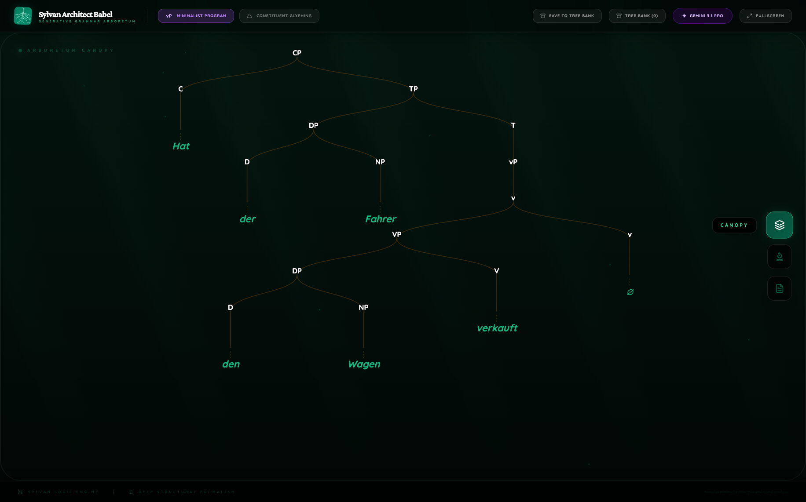 | 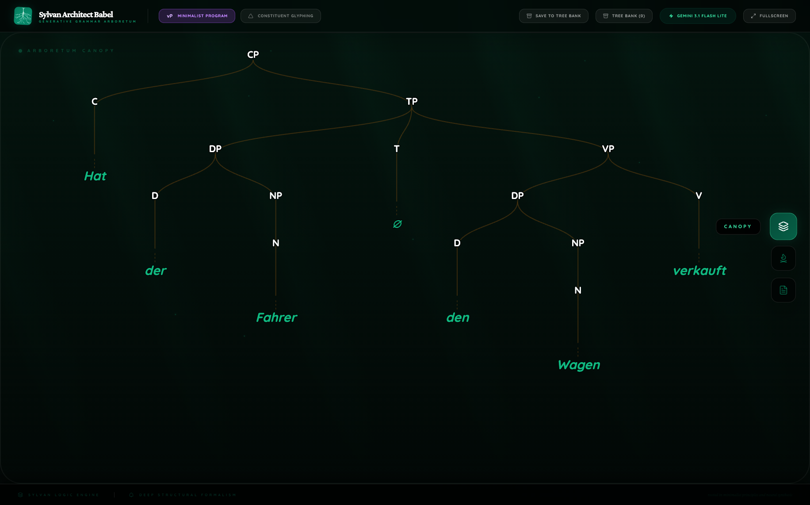 |

Metrics: Pro 2 movement / 20 steps; Flash Lite 1 movement / 17 steps.

**Syntactic reading.** Both routes recognize the finite-first interrogative pattern, but Pro gives the clause a slightly richer head-movement story. Flash Lite's analysis is not wrongheaded; it is simply thinner, reducing the question to a minimally sufficient finite-fronting configuration.

**Interpretability check.** Because the diagnostic evidence is concentrated in the sentence-initial finite auxiliary, this case does not force much phrasal elaboration. The pair therefore reads like a good control: both routes see the same grammatical signal, but Pro is still more willing to expose the mechanism.

### Greek wh-question

Sentence: `Ποιο βιβλίο διάβασε η Μαρία;`

| Pro | Flash Lite |
| --- | --- |
| 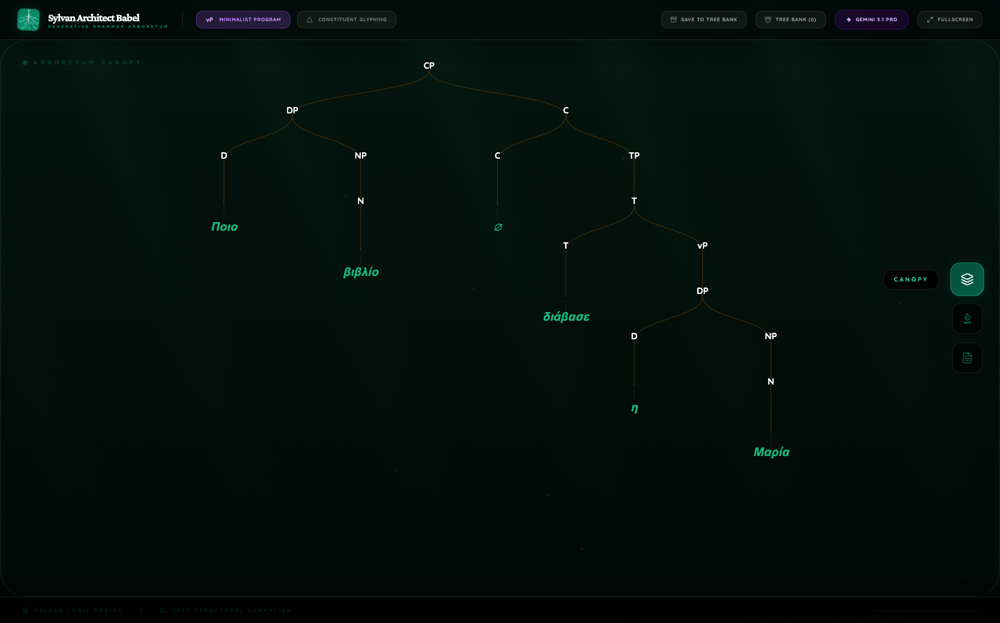 | 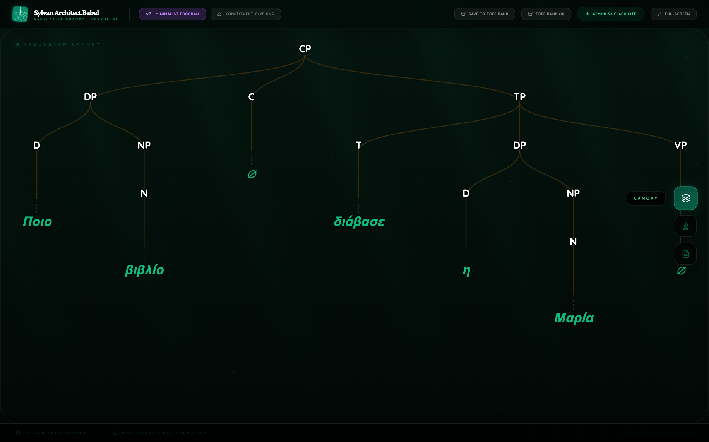 |

Metrics: Pro 3 movement / 24 steps; Flash Lite 2 movement / 19 steps.

**Syntactic reading.** Greek produces another partial convergence pair. Both routes treat the sentence as an overt wh-question, but Pro adds one more layer of derivational commitment around the fronted object and the clause edge. Flash Lite remains recognizably movement-based, though more compact.

**Interpretability check.** This is exactly the kind of sentence where a strong model can afford to be explicit: the wh-object is overtly fronted and the verbal complex sits in a finite interrogative environment. Pro appears to spend that opportunity on a denser public derivation; Flash Lite keeps the same general story but strips it down.

### English long-distance wh

Sentence: `Which article do you think Clara said Mateo published?`

| Pro | Flash Lite |
| --- | --- |
| 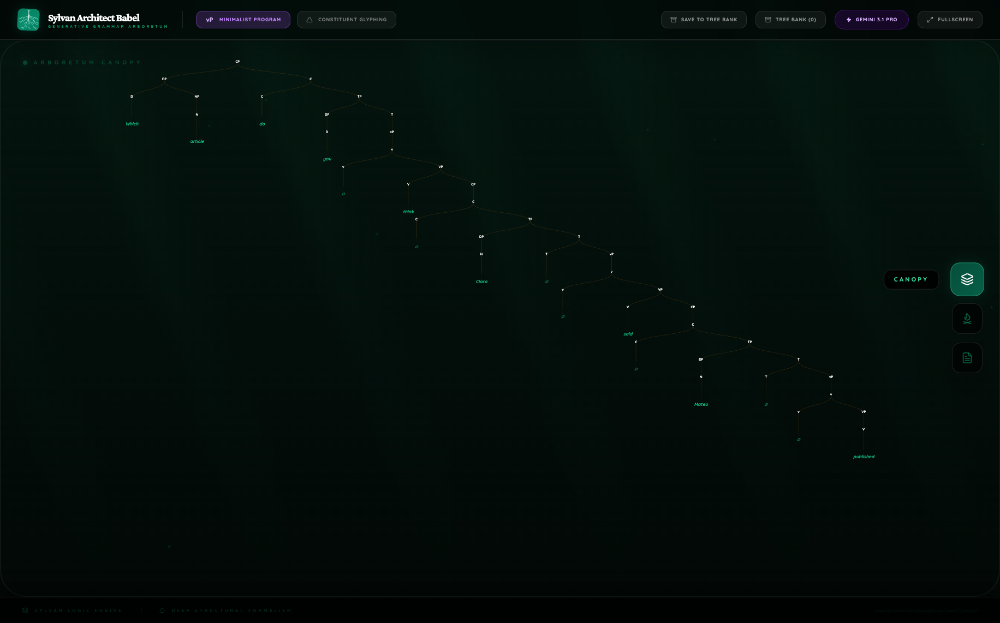 | 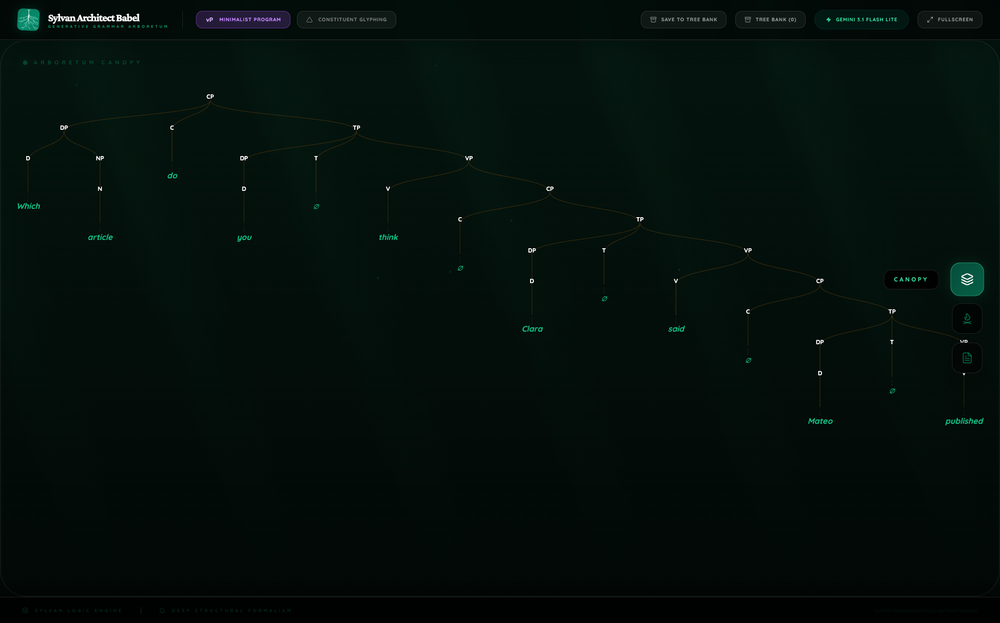 |

Metrics: Pro 7 movement / 57 steps; Flash Lite 1 movement / 46 steps.

**Syntactic reading.** This is the single strongest Minimalist contrast in the entire benchmark. Pro externalizes a real successive-cyclic long-distance wh derivation, with multiple clause-edge dependencies rather than one abstract sentence-level link. Flash Lite still recovers the fact of long-distance dependency, but it largely suppresses the internal movement history.

**Interpretability check.** The sentence practically invites a theory choice: either expose intermediate movement or compress the dependency into a top-level relation. Pro chooses to reveal the stack of clauses as a sequence of operator positions. Flash Lite appears to recognize the dependency while declining to spend public complexity on every link in the chain.

### English passive

Sentence: `The letters were delivered yesterday.`

| Pro | Flash Lite |
| --- | --- |
| 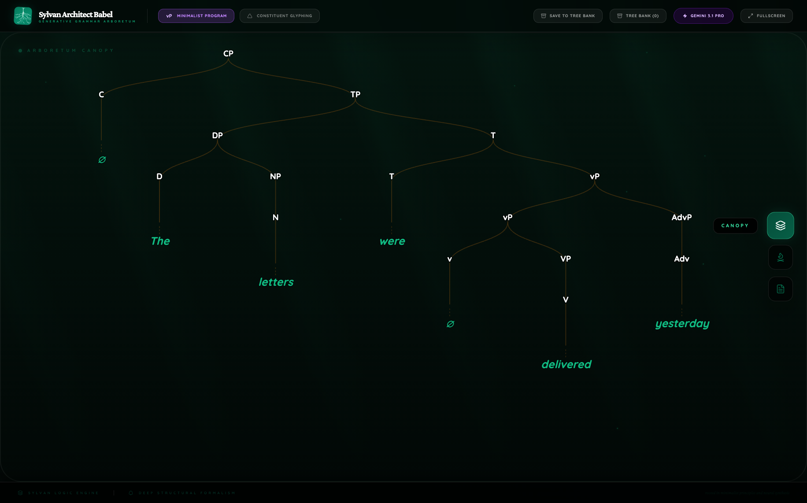 | 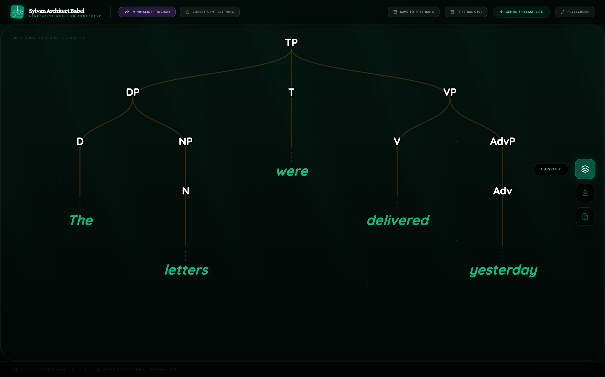 |

Metrics: Pro 1 movement / 20 steps; Flash Lite 0 movement / 11 steps.

**Syntactic reading.** Pro treats the passive as something derivationally worth encoding, preserving at least one overt movement commitment associated with the promoted theme. Flash Lite instead treats the sentence as a simpler passive shell, preserving the result but not publicizing the derivational mechanics.

**Interpretability check.** English passives create weaker overt evidence than long-distance wh questions do: the key facts are distributed across morphology, argument order, and the passive auxiliary. Pro still chooses to make promotion visible; Flash Lite appears to read the sentence as one where passive interpretation can be left more implicit.

### Spanish wh-question

Sentence: `¿Qué cuadro pintó Elena?`

| Pro | Flash Lite |
| --- | --- |
| 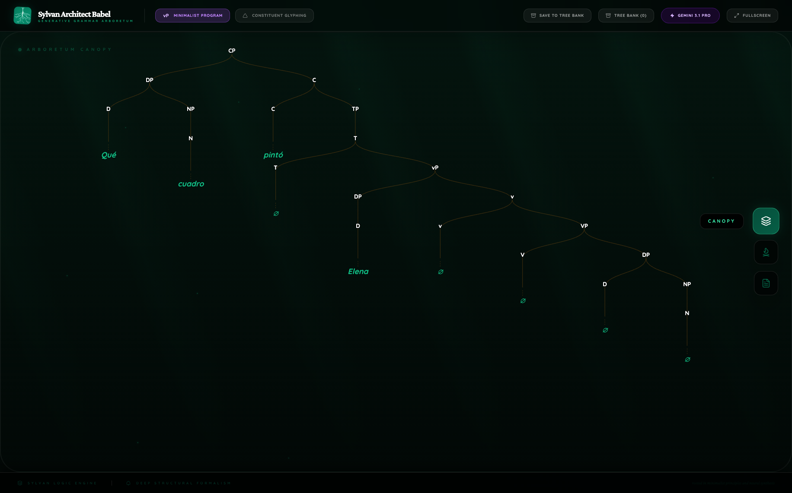 | 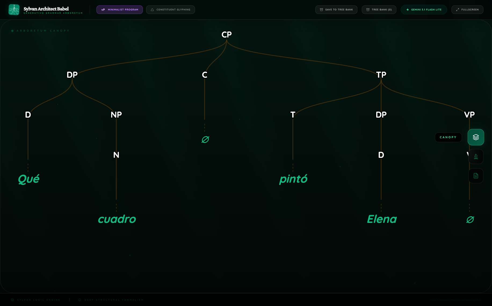 |

Metrics: Pro 4 movement / 26 steps; Flash Lite 1 movement / 16 steps.

**Syntactic reading.** Pro treats the Spanish object question as a visibly derived clause-edge configuration, while Flash Lite reduces it to a thinner interrogative dependency. The crucial contrast is not whether the wh-question is understood, but whether the object fronting is given a fully public derivational history.

**Interpretability check.** Clause-initial `qué` and postverbal subject order provide strong evidence for an articulated interrogative structure. Pro seems to read both cues as worth externalizing; Flash Lite isolates the operator dependency and economizes on the rest.

### Finnish wh-question

Sentence: `Minkä kirjan Anna osti?`

| Pro | Flash Lite |
| --- | --- |
| 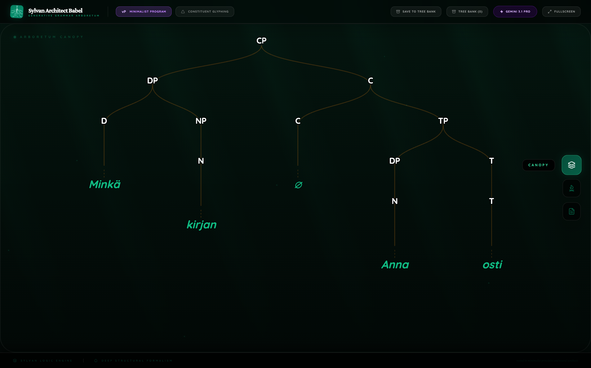 | 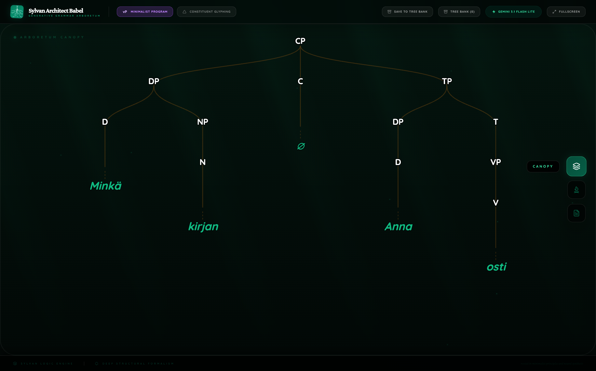 |

Metrics: Pro 4 movement / 24 steps; Flash Lite 1 movement / 18 steps.

**Syntactic reading.** Pro gives the Finnish wh-object a more visibly derived path to the left edge, whereas Flash Lite largely settles for a lighter object-question structure. The difference matters because Finnish case morphology and word order flexibility could in principle support a rich public derivation; only Pro consistently acts on that opportunity here.

**Interpretability check.** The case-marked object and fronted interrogative form make the dependency easy to detect. The real interpretability question is whether the model uses morphology as a reason to commit to more derivational structure. Pro seems to do so; Flash Lite seems not to.

### French wh-question

Sentence: `Quel roman a choisi Élise ?`

| Pro | Flash Lite |
| --- | --- |
| 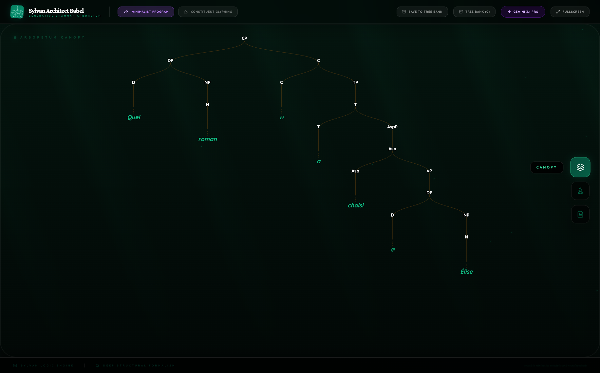 | 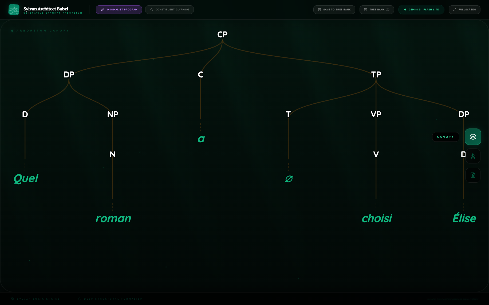 |

Metrics: Pro 3 movement / 28 steps; Flash Lite 1 movement / 22 steps.

**Syntactic reading.** Pro gives French wh-fronting a clearly derived left-peripheral analysis, while Flash Lite preserves the interrogative profile with much less overt movement. The pair is a useful reminder that even in relatively familiar Romance material, Pro routinely chooses to expose more of the public theory.

**Interpretability check.** Fronted `quel` plus auxiliary support make the interrogative status unambiguous. Pro reads those cues as grounds for a more explicit operator derivation; Flash Lite again opts for a compressed but serviceable tree.

### Irish wh-question

Sentence: `Cén leabhar a cheannaigh Máire?`

| Pro | Flash Lite |
| --- | --- |
| 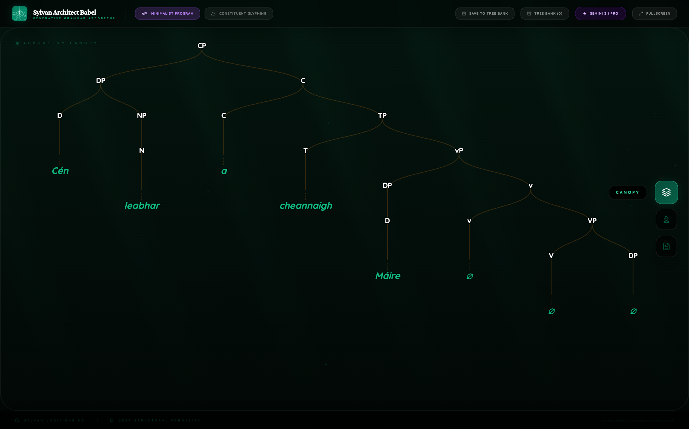 | 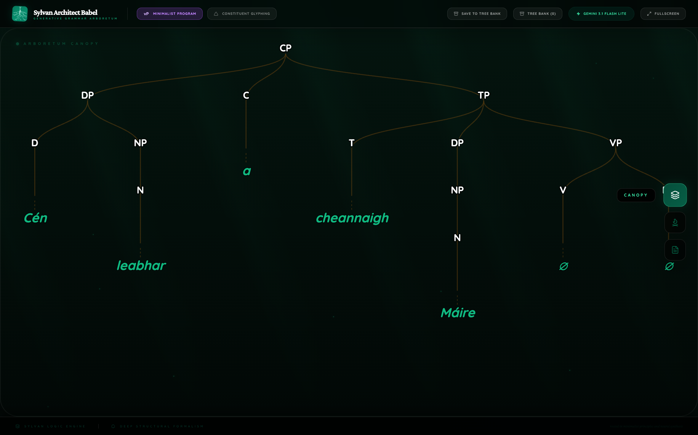 |

Metrics: Pro 3 movement / 21 steps; Flash Lite 2 movement / 17 steps.

**Syntactic reading.** Both routes read Irish as an overt wh configuration, but Pro gives the clause a slightly richer operator and finite-head story. Flash Lite is not silent here; it still marks a movement-based dependency. The difference is one of depth, not category.

**Interpretability check.** Irish gives the model strong signals through the wh-phrase and clause-initial verbal material. This is another case where Flash Lite does pick up the key dependency, but Pro appears more willing to commit to the finer-grained left-edge structure.

### Hebrew wh-question

Sentence: `איזה ספר קנתה נועה?`

| Pro | Flash Lite |
| --- | --- |
| 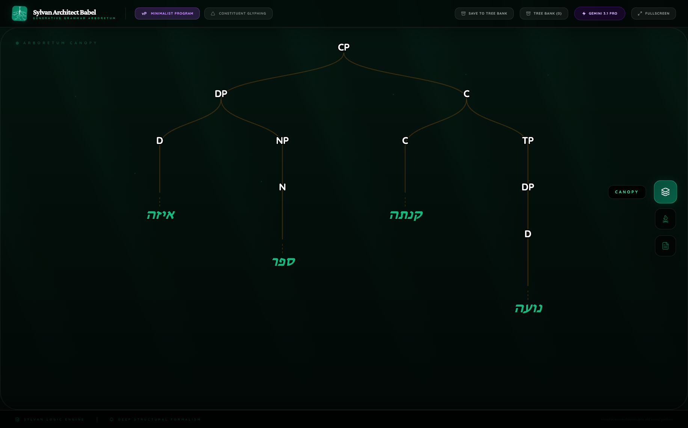 | 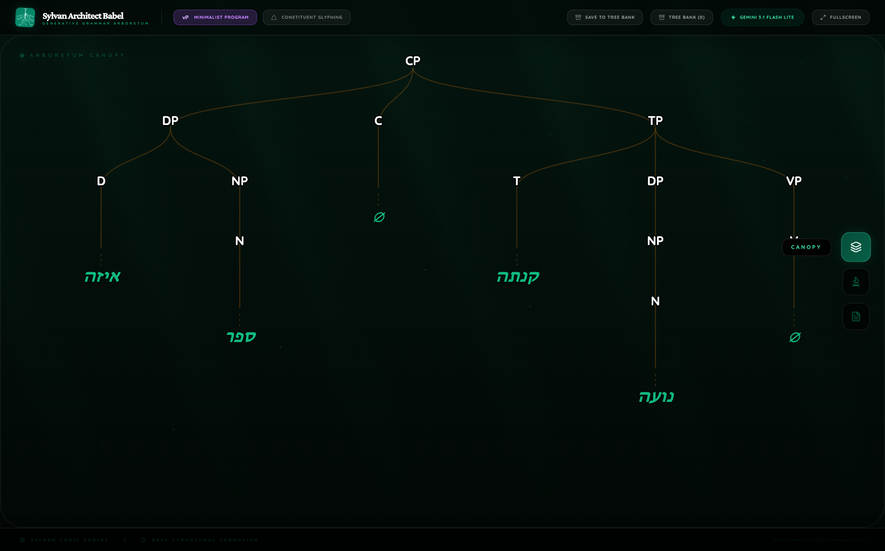 |

Metrics: Pro 5 movement / 27 steps; Flash Lite 2 movement / 17 steps.

**Syntactic reading.** Pro treats the Hebrew question as one of the richer Minimalist wh cases in the batch, with multiple visible derivational commitments around the fronted object and finite spine. Flash Lite still captures the question as movement-sensitive, but with far less overt chain structure.

**Interpretability check.** Hebrew word order and finite morphology make the clause look strongly edge-oriented. Pro seems to convert that into a denser public analysis, while Flash Lite prefers to preserve only the most obvious interrogative dependency.

### Hindi wh-question

Sentence: `कौन सी किताब मीरा ने खरीदी ?`

| Pro | Flash Lite |
| --- | --- |
| 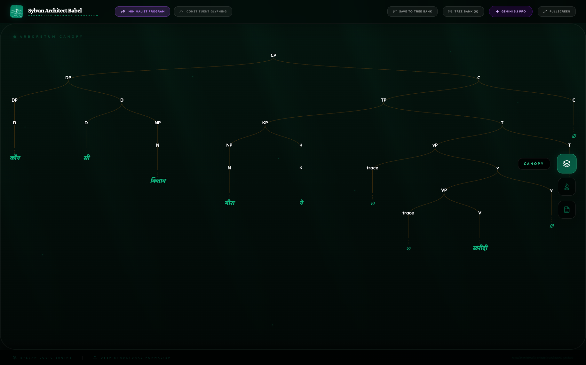 | 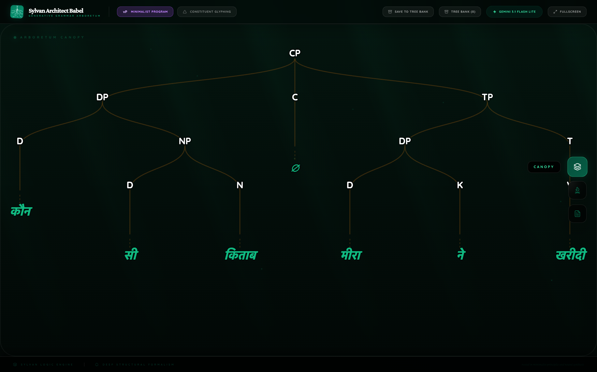 |

Metrics: Pro 2 movement / 28 steps; Flash Lite 1 movement / 17 steps.

**Syntactic reading.** Pro and Flash Lite both detect the interrogative object dependency, but Pro still gives it more derivational space. The sentence is important because native-script Hindi supports explicitly structured Minimalist analysis.

**Interpretability check.** The clause begins with an overt wh phrase and also carries clear argument-order signals. That combination seems sufficient for both routes to choose a movement-sensitive analysis, but only Pro spends enough structure to make the derivation feel fully public.

### Hindi yes-no-question

Sentence: `क्या रवि ने चिट्ठी लिखी ?`

| Pro | Flash Lite |
| --- | --- |
| 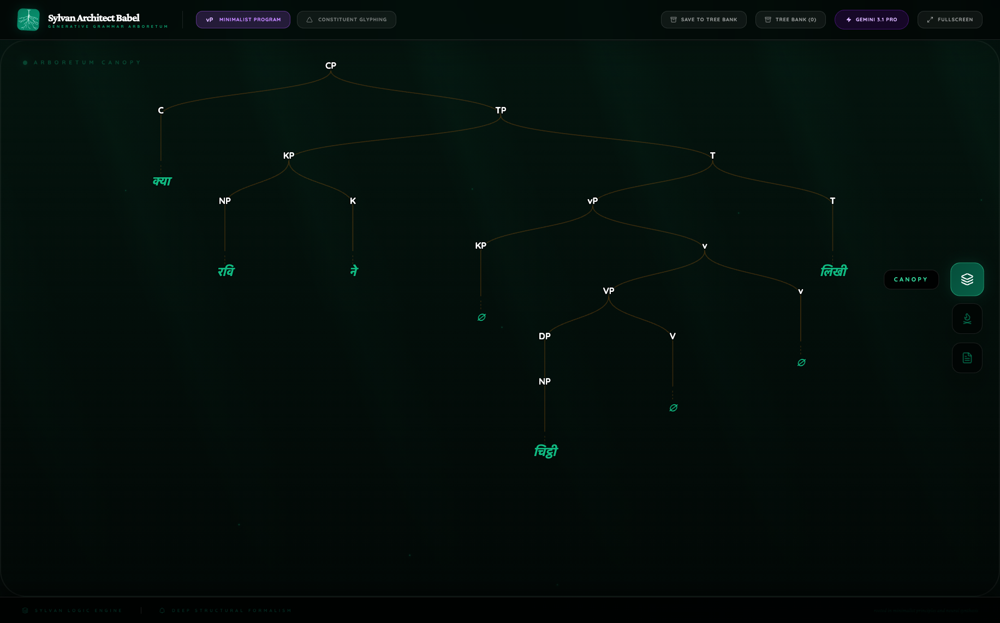 | 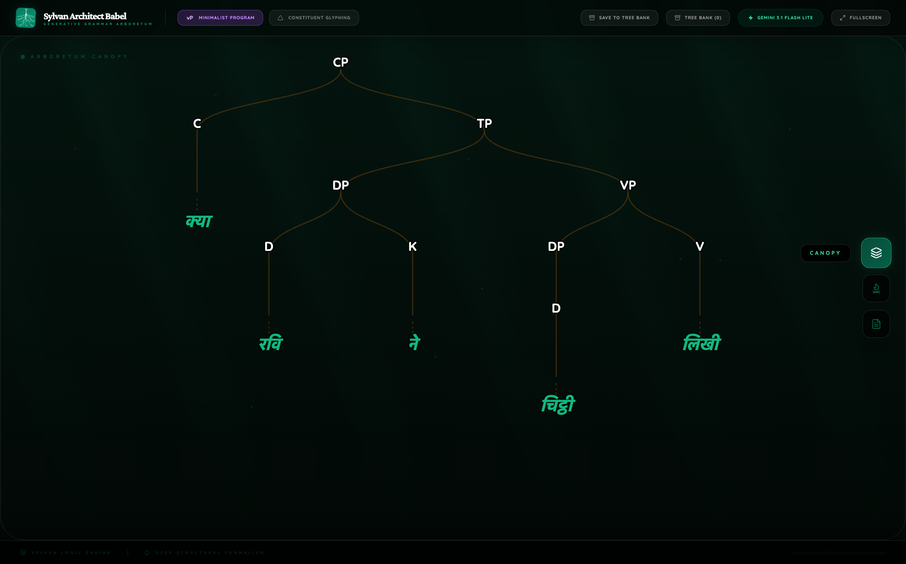 |

Metrics: Pro 3 movement / 20 steps; Flash Lite 0 movement / 11 steps.

**Syntactic reading.** Pro gives the yes-no particle and finite structure a visibly interrogative derivation, while Flash Lite reduces the clause to a simpler declarative-plus-question shell. This is a valuable contrast because yes-no questions often tempt models to underspecify syntax if there is no overt wh-operator.

**Interpretability check.** The initial particle `क्या` is doing heavy interpretive work here. Pro treats it as an invitation to encode a full interrogative structure. Flash Lite seems content to let the particle carry most of the burden by itself.

### Hungarian focus-inversion

Sentence: `Melyik könyvet vette meg Anna?`

| Pro | Flash Lite |
| --- | --- |
|  | 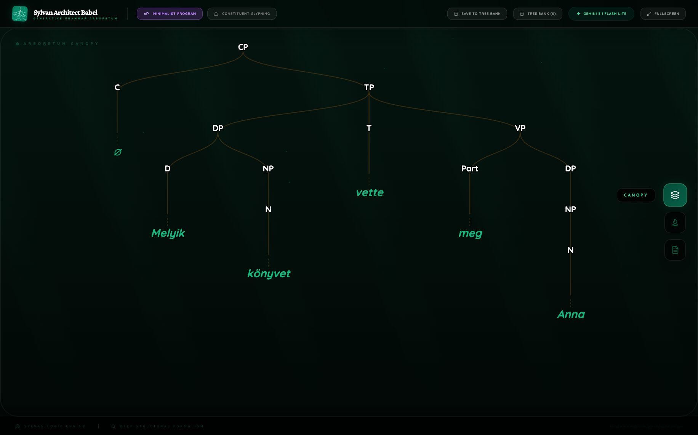 |

Metrics: Pro 5 movement / 31 steps; Flash Lite 1 movement / 16 steps.

**Syntactic reading.** Hungarian is one of the decisive wins for Pro in the entire benchmark. Pro gives a visibly cartographic analysis with a dedicated focus field and overt treatment of the particle-verb relation. Flash Lite preserves the basic fronting fact but declines to expose the richer architecture that makes Hungarian clause structure theoretically distinctive.

**Interpretability check.** The word order itself is a trap for shallow analysis: a fronted object and stranded `meg` are exactly the sort of cues that distinguish a generic fronting tree from a genuine focus-field analysis. Pro reads those cues like a syntactician. Flash Lite mostly reads them like a competent parser.

### Italian wh-question

Sentence: `Quale sonata ha eseguito Marta?`

| Pro | Flash Lite |
| --- | --- |
| 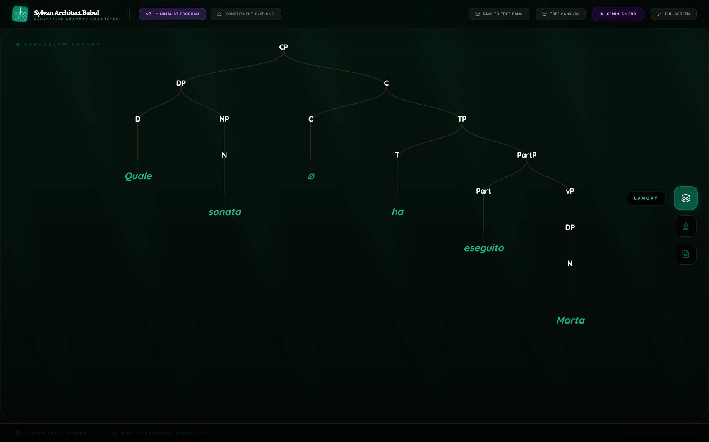 | 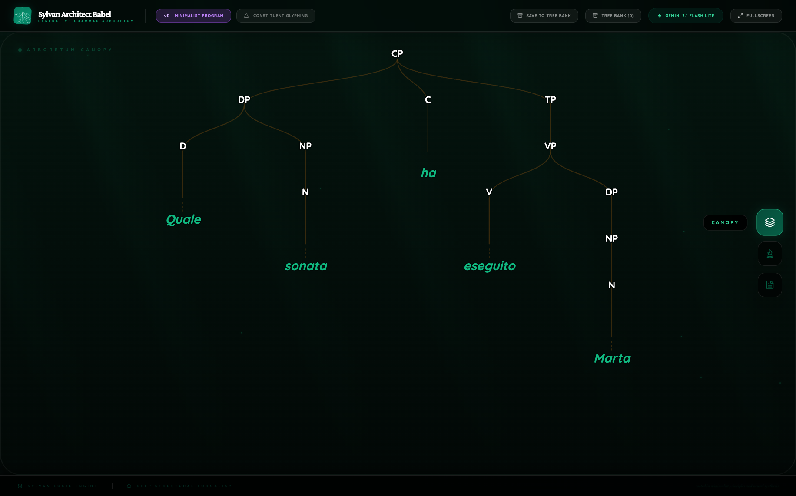 |

Metrics: Pro 3 movement / 23 steps; Flash Lite 0 movement / 14 steps.

**Syntactic reading.** Pro externalizes a proper operator derivation for the Italian object question, while Flash Lite settles for a visibly interrogative but movement-light representation. The pair again shows that Romance wh-fronting is not enough, on its own, to force Flash Lite into a rich public chain.

**Interpretability check.** The sentence provides classic Romance interrogative cues: clause-initial wh, auxiliary support, and a postverbal subject. Pro interprets those cues structurally. Flash Lite appears to treat them as sufficient for recognition but not for full exposure.

### Dutch wh-question

Sentence: `Welke student heeft Emma gezien?`

| Pro | Flash Lite |
| --- | --- |
| 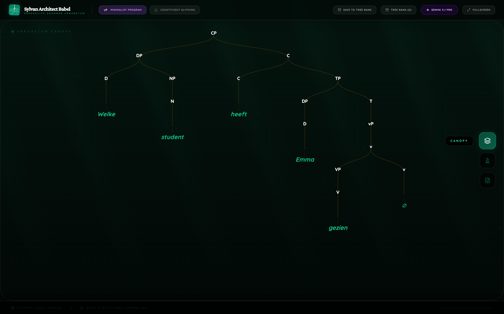 | 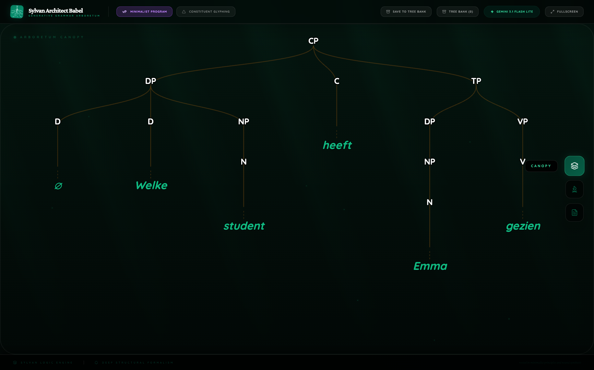 |

Metrics: Pro 3 movement / 23 steps; Flash Lite 2 movement / 21 steps.

**Syntactic reading.** Dutch wh in Minimalism is a convergence case. Flash Lite does not collapse the analysis; it retains a movement-sensitive reading with two visible events. Pro still does more, but the gap is smaller than in many other languages, suggesting that Dutch overt fronting plus finite-head behavior is a pattern the smaller route can already track reasonably well.

**Interpretability check.** This pair suggests that some clause-edge configurations are simply easier for both routes to stabilize. Dutch may be one of them: the surface form itself strongly advertises operator movement and finite structure, reducing the room for interpretive hesitation.

### Polish wh-question

Sentence: `Którą gazetę kupił Marek?`

| Pro | Flash Lite |
| --- | --- |
| 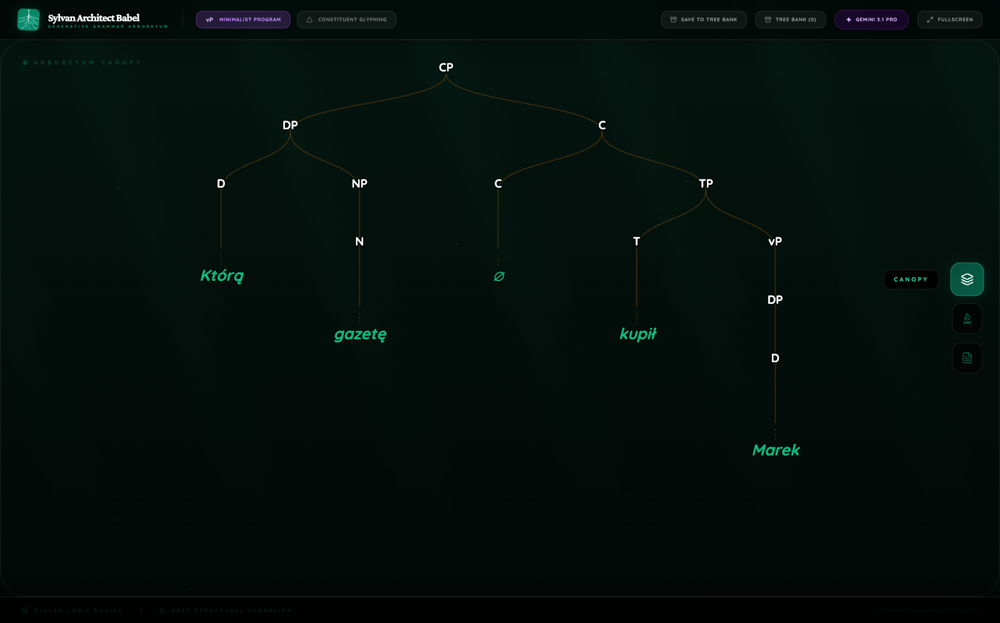 | 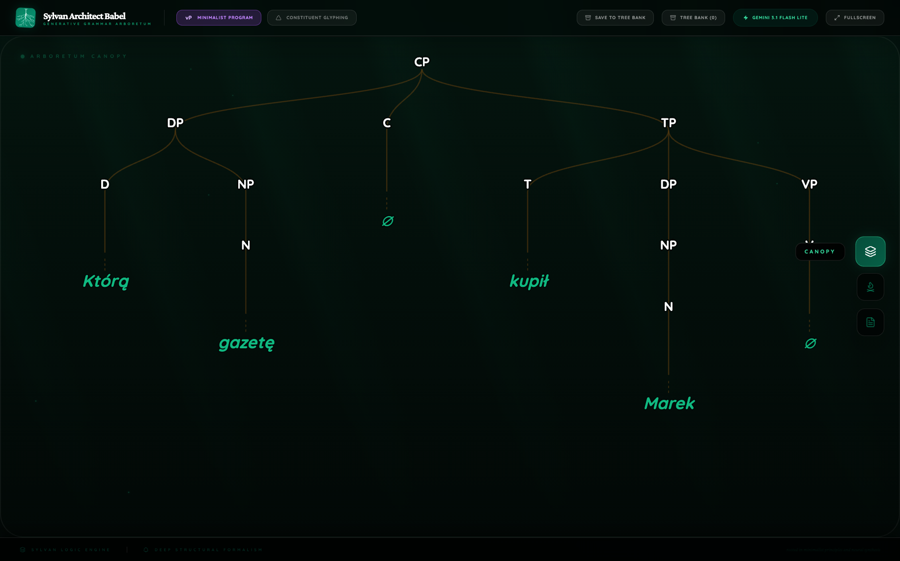 |

Metrics: Pro 3 movement / 21 steps; Flash Lite 2 movement / 17 steps.

**Syntactic reading.** Like Czech and Dutch, Polish produces a partial convergence pair. Both routes build a visible object-question analysis, but Pro preserves more derivational depth. This makes Polish a useful middle case between the dramatic divergence items and the nearly identical ones.

**Interpretability check.** Rich morphology and an overt fronted object make the clause easy to recognize as a wh-question. The remaining difference comes down to how much derivational detail the route thinks is worth making public.

### Portuguese wh-question

Sentence: `Que relatório revisou Sofia?`

| Pro | Flash Lite |
| --- | --- |
| 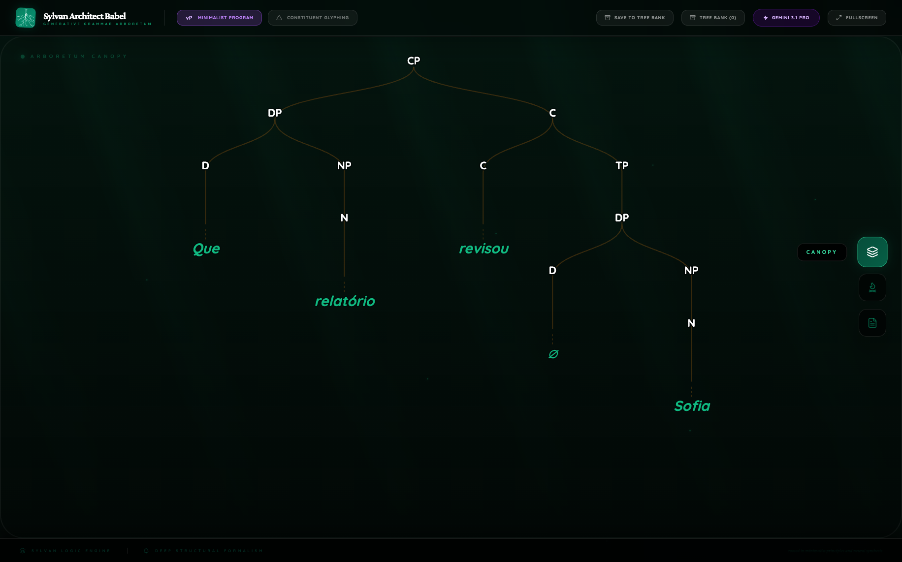 | 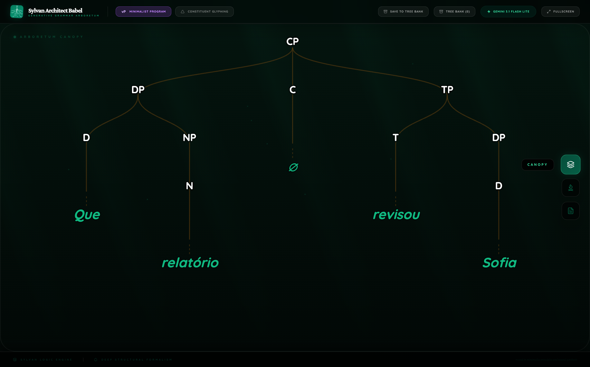 |

Metrics: Pro 5 movement / 27 steps; Flash Lite 1 movement / 16 steps.

**Syntactic reading.** Pro pushes Portuguese toward a very explicit left-edge derivation with substantially more overt movement than Flash Lite. Flash Lite still recognizes the interrogative profile, but the public theory is much thinner.

**Interpretability check.** This is the kind of Romance wh question where Pro seems to treat the syntax as an opportunity to expose real structure rather than merely recover meaning. Flash Lite is more conservative, preferring not to overcommit beyond the visible operator relation.

### Romanian wh-question

Sentence: `Ce film a văzut Irina?`

| Pro | Flash Lite |
| --- | --- |
| 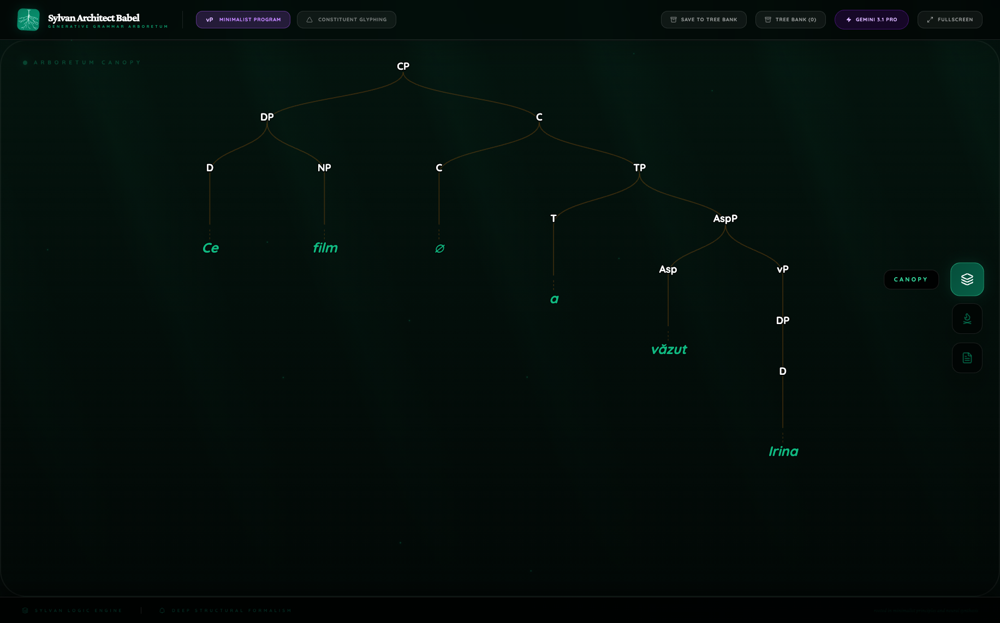 | 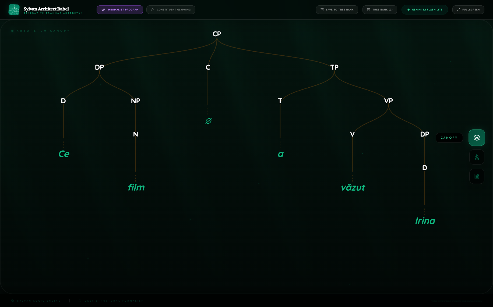 |

Metrics: Pro 3 movement / 22 steps; Flash Lite 0 movement / 13 steps.

**Syntactic reading.** Romanian shows another clear split: Pro makes the wh dependency public as a movement-bearing derivation, while Flash Lite returns a thinner interrogative shell. Since the fronted object is overt and the clause type is unambiguous, the difference again lies in willingness to expose theory, not in basic recognition.

**Interpretability check.** Pro appears to use the left-edge wh phrase as evidence for a full derivational commitment. Flash Lite seems to use it as enough evidence for the right sentence type, but not enough to warrant a more elaborate public chain.

### Russian wh-question

Sentence: `Какую книгу купила Маша?`

| Pro | Flash Lite |
| --- | --- |
| 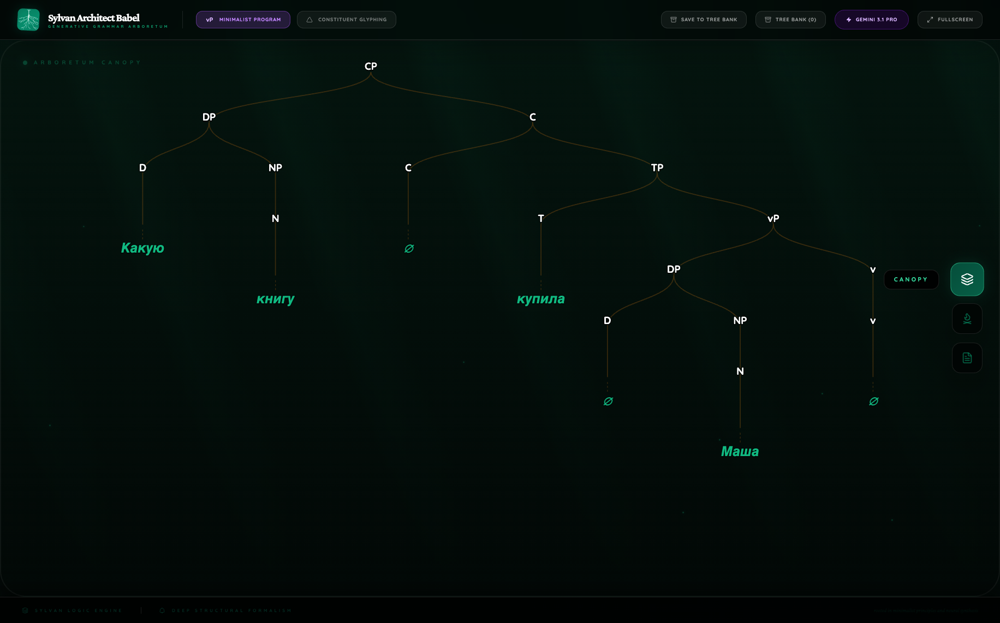 | 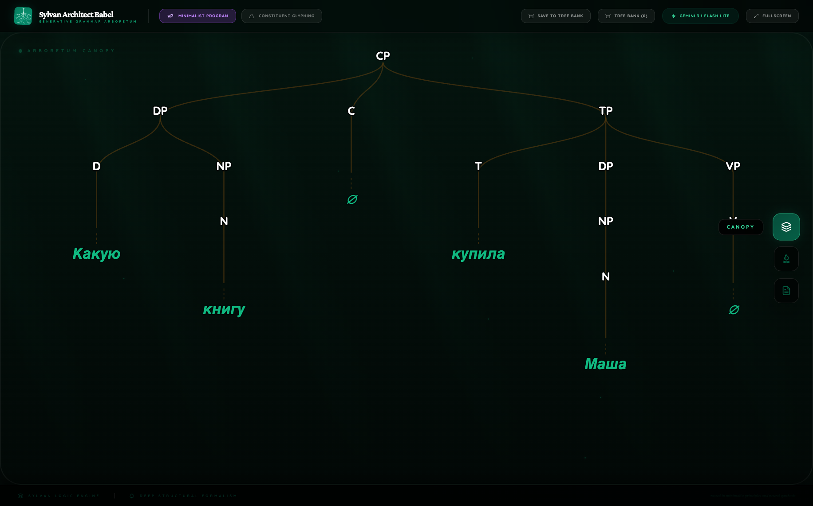 |

Metrics: Pro 2 movement / 22 steps; Flash Lite 2 movement / 17 steps.

**Syntactic reading.** Russian is one of the rare exact movement-count matches in the Minimalist half. Both routes treat the fronted object question as genuinely movement-bearing. Pro still carries more total derivational structure, but this is a real convergence case rather than a dramatic divergence pair.

**Interpretability check.** The convergence suggests that some combinations of overt wh-fronting and case-rich morphology strongly anchor both routes to the same public theory. Russian appears to be one of the languages where Flash Lite can already behave like a smaller version of Pro rather than like a qualitatively different theorist.

### Serbian wh-question

Sentence: `Коју књигу је Ана купила?`

| Pro | Flash Lite |
| --- | --- |
| 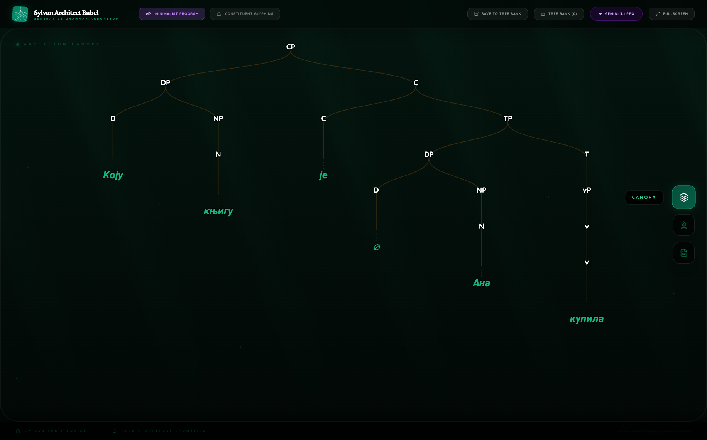 | 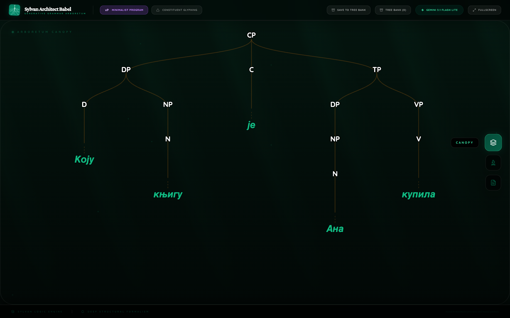 |

Metrics: Pro 4 movement / 26 steps; Flash Lite 2 movement / 17 steps.

**Syntactic reading.** Serbian behaves like a more movement-rich cousin of the Russian pair: both routes detect the operator dependency, but Pro externalizes a larger chain and a denser clause structure. Flash Lite is not blind to the syntax; it is simply less explicit about it.

**Interpretability check.** The sentence's overt fronting and auxiliary structure supply rich evidence for a derivational analysis. Pro reads that evidence aggressively. Flash Lite preserves the clause type and the operator relation while keeping the public tree lean.

### Turkish wh-question

Sentence: `Hangi kitabı Ayşe okudu?`

| Pro | Flash Lite |
| --- | --- |
| 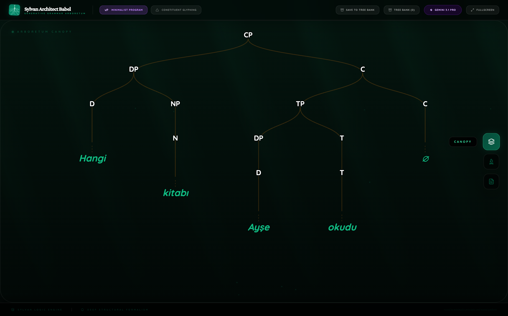 | 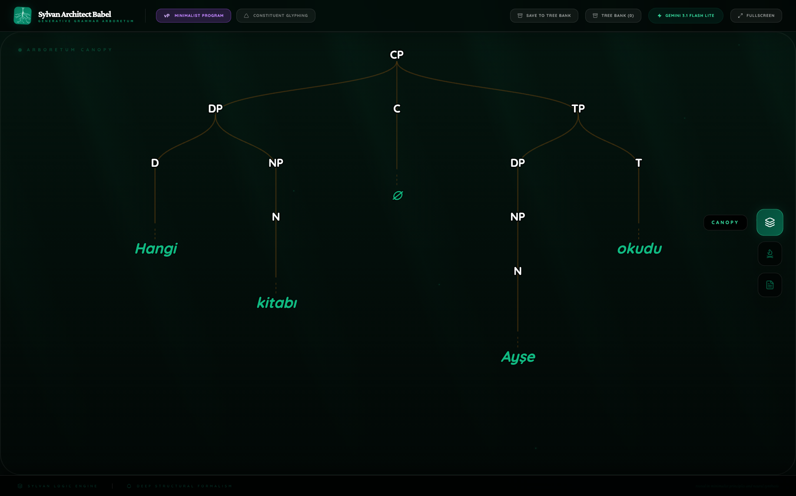 |

Metrics: Pro 2 movement / 22 steps; Flash Lite 1 movement / 15 steps.

**Syntactic reading.** Turkish does not produce a maximal split, but it still shows the same directional pattern: Pro keeps more of the derivation public than Flash Lite. The sentence is especially interesting because Turkish permits analyses that do not always require elaborate overt movement, so any public movement commitment is already theoretically meaningful.

**Interpretability check.** The fronted wh-object provides enough evidence for both routes to encode some dependency. Pro seems more willing to resolve that evidence into an explicit operator path, whereas Flash Lite leaves more of the grammatical story implicit.

### X-bar Atlas

### Arabic embedded clause

Sentence: `قالت مريم إن بول سيغادر غداً.`

| Pro | Flash Lite |
| --- | --- |
| 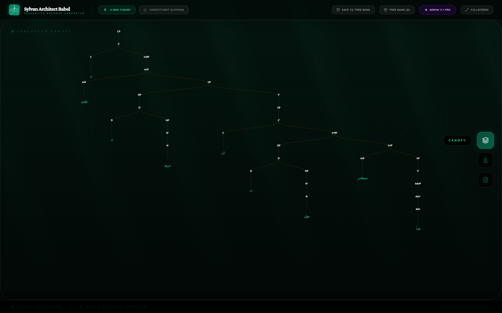 |  |

Metrics: Pro 3 movement / 41 steps; Flash Lite 0 movement / 25 steps.

**Syntactic reading.** Pro gives the Arabic embedding configuration a visibly articulated matrix-plus-embedded clause structure with overt derivational activity, while Flash Lite settles for a flatter CP shell. Both recognize embedding; only Pro insists on making the clause interaction visibly dynamic.

**Interpretability check.** The complementizer and the two-clause architecture create a strong invitation to model the sentence as a hierarchical interaction rather than a flat reportive shell. Pro accepts that invitation. Flash Lite treats the complementizer as enough evidence for embedding, but not enough to spend movement budget on it.

### Bengali embedded clause

Sentence: `শিক্ষক বললেন যে ছাত্রী বইটি পড়েছে।`

| Pro | Flash Lite |
| --- | --- |
| 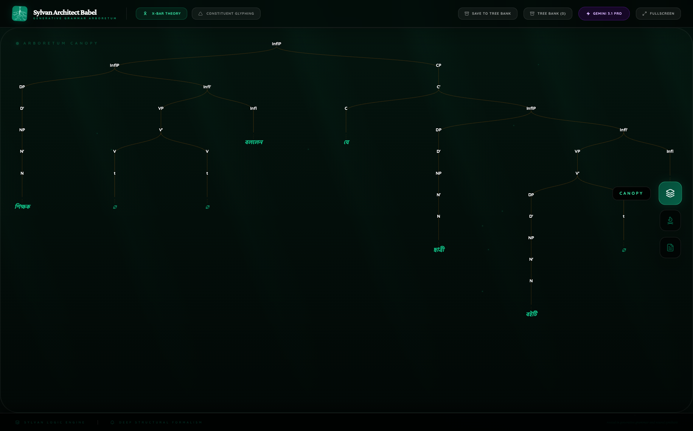 | 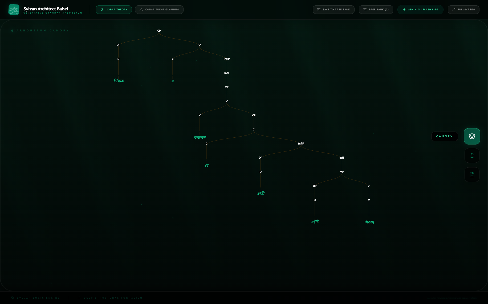 |

Metrics: Pro 3 movement / 39 steps; Flash Lite 0 movement / 23 steps.

**Syntactic reading.** Pro turns Bengali embedding into a visibly multi-layered clause architecture, whereas Flash Lite gives a much lighter declarative-plus-complement structure. The pair matters because it shows that native-script Bengali supports not only Minimalist wh analysis but also X-bar embedding analysis at full resolution.

**Interpretability check.** The overt complementizer strongly marks subordination, but the routes disagree about how much syntactic machinery that fact should trigger. Pro treats subordination as a cue for articulated structure; Flash Lite treats it as a sufficient label for a clause shell.

### German embedded perfect

Sentence: `Der Lehrer sagte, dass die Schülerin das Buch gelesen hat.`

| Pro | Flash Lite |
| --- | --- |
| 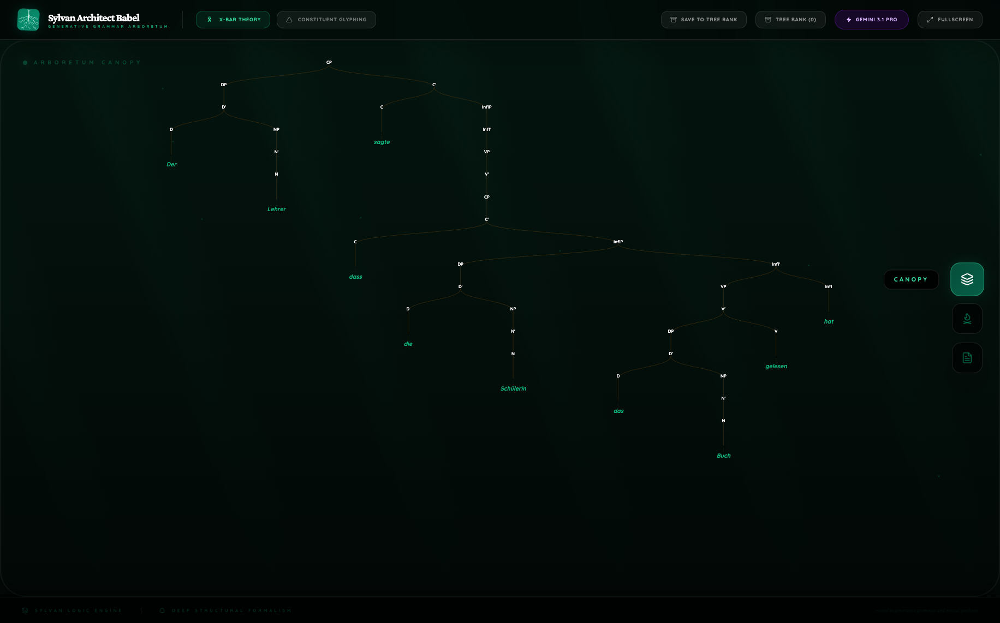 | 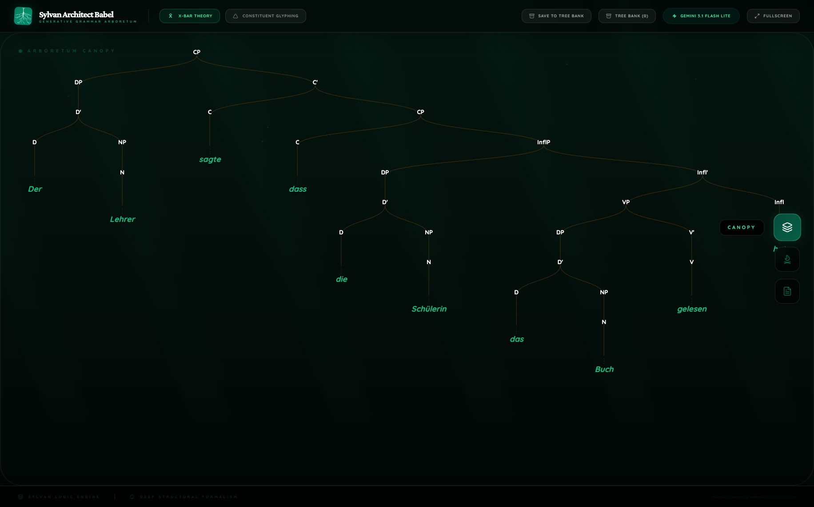 |

Metrics: Pro 5 movement / 51 steps; Flash Lite 0 movement / 27 steps.

**Syntactic reading.** This is one of the strongest X-bar contrasts in the benchmark. Pro does not merely draw a complement clause; it treats the German embedded perfect as a multi-head, clause-internal derivation worth exposing. Flash Lite instead gives a serviceable embedded declarative with very little public movement.

**Interpretability check.** German subordinate perfect clauses offer several signals at once: complementizer, clause-final verb complex, and embedded argument structure. Pro appears to read these cumulative signals as evidence for a genuinely articulated derivation. Flash Lite recognizes the clause type but declines to externalize the internal mechanics.

### German wh-question

Sentence: `Welches Gemälde hat Lara gekauft?`

| Pro | Flash Lite |
| --- | --- |
| 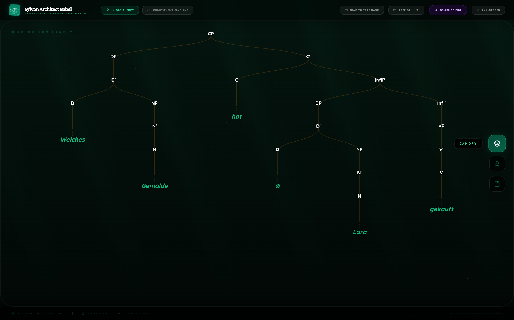 | 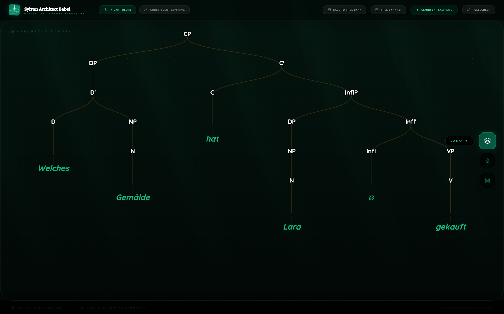 |

Metrics: Pro 2 movement / 27 steps; Flash Lite 2 movement / 20 steps.

**Syntactic reading.** German X-bar wh is one of the clearest convergence cases in the atlas. Both routes expose a visibly movement-bearing interrogative tree, and both keep the clause edge alive as part of the public analysis. Pro still gives a denser derivational spine, but the theoretical difference is relatively small.

**Interpretability check.** When a sentence strongly advertises both object wh-fronting and finite-head behavior, Flash Lite can look surprisingly close to Pro. This is one of the cases where the smaller model seems to lock onto a stable template rather than backing off into a shallow shell.

### Greek wh-question

Sentence: `Ποιο βιβλίο διάβασε η Μαρία;`

| Pro | Flash Lite |
| --- | --- |
| 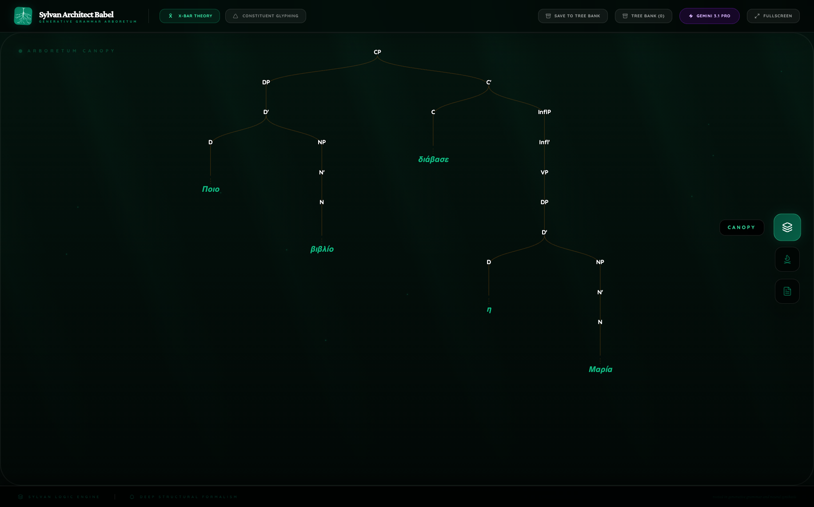 | 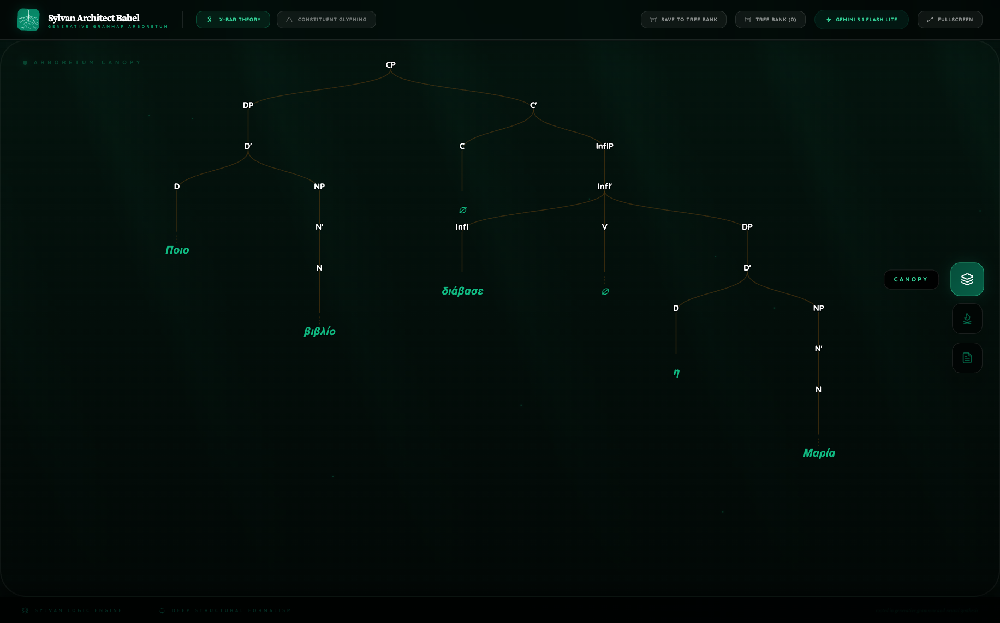 |

Metrics: Pro 3 movement / 28 steps; Flash Lite 2 movement / 28 steps.

**Syntactic reading.** Greek X-bar wh is another convergence item. The derivation counts are almost identical, suggesting that both routes are willing to make broadly the same public commitment about the wh-object and finite clause edge. This is important because it shows that Babel is not built to exaggerate route differences where they do not exist.

**Interpretability check.** The sentence gives both routes a clean, legible interrogative configuration. When the evidence is this overt, Flash Lite can sometimes approximate Pro not just in outcome but in public structural density.

### English raising-like clause

Sentence: `It seems that the guests have departed.`

| Pro | Flash Lite |
| --- | --- |
| 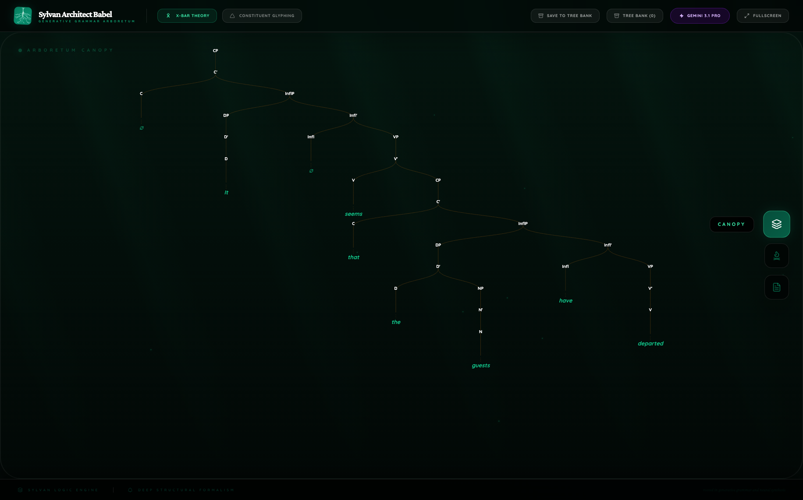 | 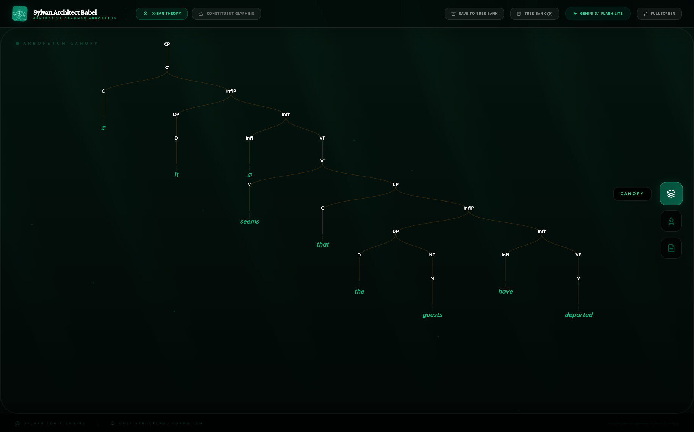 |

Metrics: Pro 1 movement / 32 steps; Flash Lite 0 movement / 23 steps.

**Syntactic reading.** Pro treats the English raising-like clause as something syntactically worth distinguishing from a bare declarative shell, whereas Flash Lite leaves the structure flatter. The gap is not dramatic in movement terms, but it is conceptually interesting because raising-like predicates often reveal whether a model is prepared to say more than surface order forces it to say.

**Interpretability check.** The expletive-plus-embedded-clause pattern is exactly the sort of construction where a model can either publicize deeper structure or stay conservative. Pro makes one public commitment beyond the shell. Flash Lite largely declines that invitation.

### English relative clause

Sentence: `The editor who praised the article resigned.`

| Pro | Flash Lite |
| --- | --- |
| 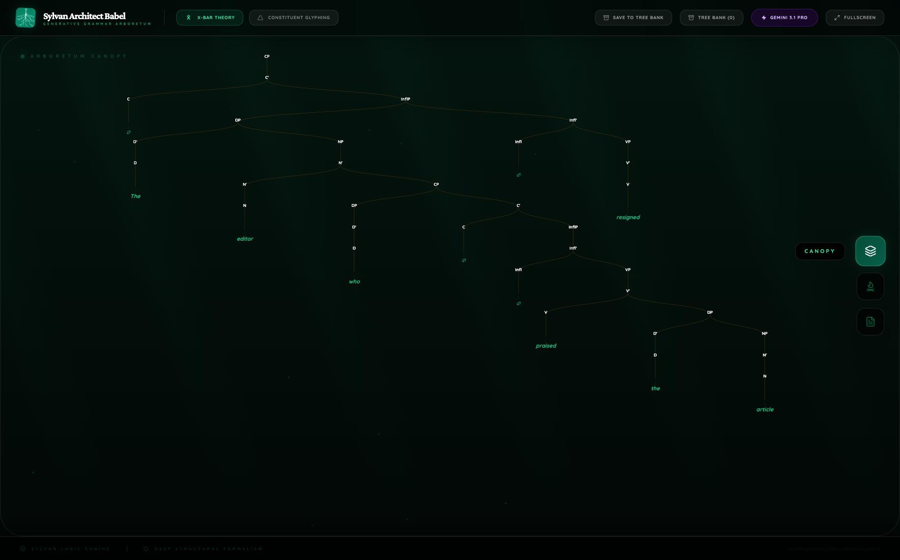 | 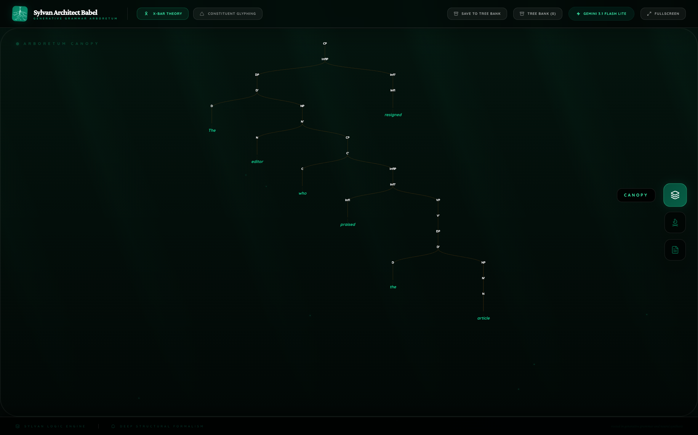 |

Metrics: Pro 1 movement / 39 steps; Flash Lite 0 movement / 34 steps.

**Syntactic reading.** Even with only a small movement-count difference, the pair is telling. Pro still treats relativization as a dependency worth making public, while Flash Lite mostly trusts the clause shell to carry the analysis. This keeps the relative clause legible but less theoretically committed.

**Interpretability check.** Relative clauses are easy for models to recognize and easy to flatten. Pro chooses not to flatten completely. Flash Lite appears to prioritize stability over explicit relativization history.

### Spanish complement clause

Sentence: `El médico dijo que la paciente llegó temprano.`

| Pro | Flash Lite |
| --- | --- |
|  | 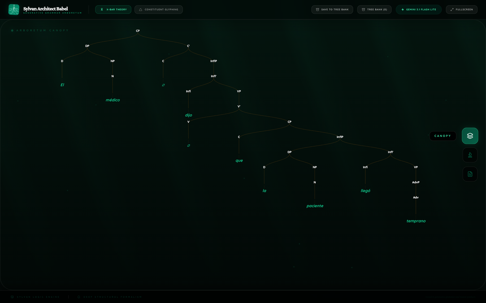 |

Metrics: Pro 4 movement / 38 steps; Flash Lite 0 movement / 26 steps.

**Syntactic reading.** Pro turns Spanish embedding into a visibly layered matrix-plus-embedded derivation, whereas Flash Lite keeps the complement clause present but shallow. This is one of the pairs where the larger route looks much more like a model willing to expose a clause architecture rather than simply label one.

**Interpretability check.** The complementizer and two finite domains give the model clear evidence that there are two clause systems to coordinate. Pro treats that as a reason to publicize clause interaction. Flash Lite seems to treat it as enough to stack one clause under another and stop there.

### Spanish yes-no-question

Sentence: `¿Ha comprado Ana el libro?`

| Pro | Flash Lite |
| --- | --- |
| 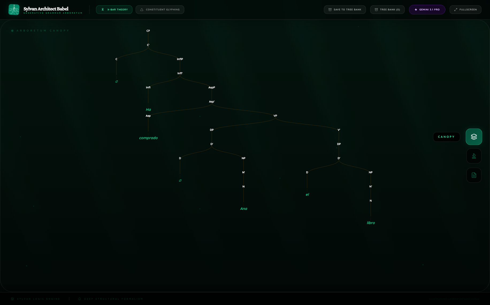 | 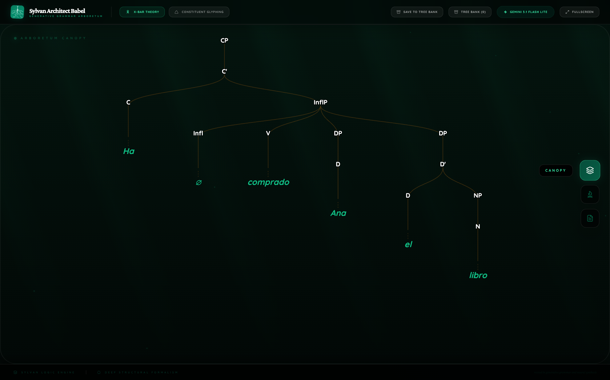 |

Metrics: Pro 1 movement / 34 steps; Flash Lite 1 movement / 17 steps.

**Syntactic reading.** Both routes converge on a finite-fronting yes-no analysis, but Pro makes the path to that surface noticeably more explicit. This is the right kind of difference for a benchmark like Babel: agreement about the broad theory, disagreement about how much of it deserves public derivational form.

**Interpretability check.** Sentence-initial auxiliary placement is a highly legible cue. Flash Lite follows it correctly. Pro follows it and then spends extra derivational budget on displaying the mechanics behind it.

### French embedded clause

Sentence: `Marie a dit que Paul viendra.`

| Pro | Flash Lite |
| --- | --- |
| 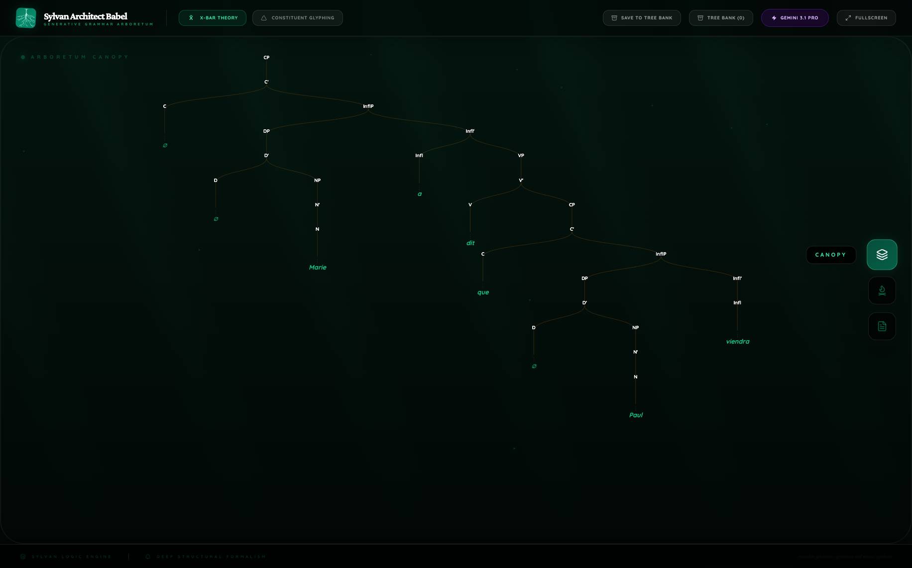 | 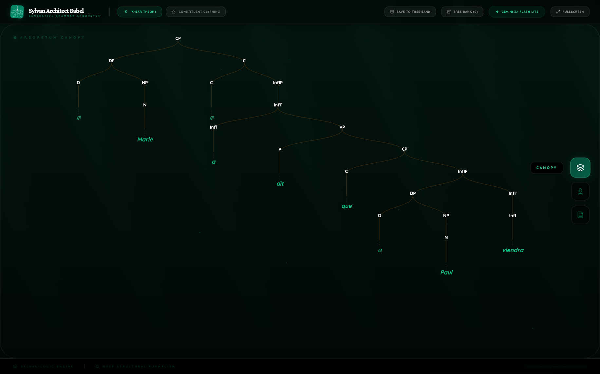 |

Metrics: Pro 3 movement / 40 steps; Flash Lite 0 movement / 24 steps.

**Syntactic reading.** Pro exposes the French embedded clause as a visibly interacting matrix and complement domain; Flash Lite preserves the same broad embedding relation while declining to make the derivation as explicit. The result is a recognizable difference in theoretical boldness.

**Interpretability check.** This is the kind of canonical `say + que` sentence that a smaller model can parse safely without much public elaboration. Pro seems less interested in safety and more interested in telling the whole structural story.

### French passive

Sentence: `Le rapport a été publié hier.`

| Pro | Flash Lite |
| --- | --- |
|  | 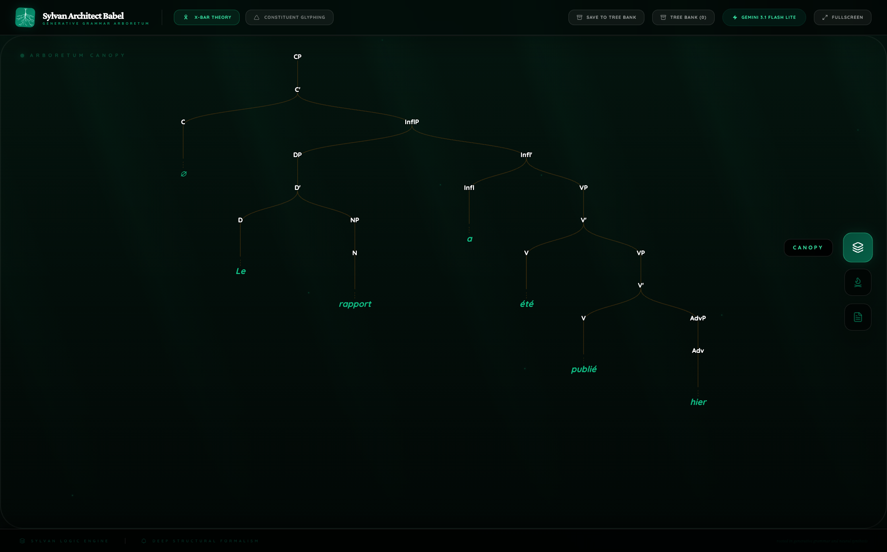 |

Metrics: Pro 1 movement / 27 steps; Flash Lite 0 movement / 20 steps.

**Syntactic reading.** Pro keeps passive promotion at least minimally visible in the public X-bar tree, whereas Flash Lite treats the passive more as a surface shell. This is not a dramatic divergence, but it is a consistent one: Pro is more willing to say where the derived subject came from.

**Interpretability check.** Passive morphology plus auxiliary support offer enough evidence for both routes to identify the construction. The difference is whether that evidence is translated into explicit derivational history. Pro says yes; Flash Lite mostly says the passive label is enough.

### Irish embedded complement

Sentence: `Gheall sé go bhfillfeadh sé ar an bhaile.`

| Pro | Flash Lite |
| --- | --- |
| 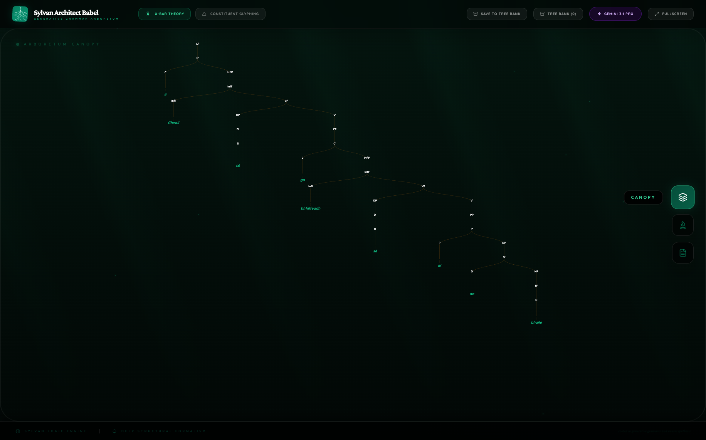 | 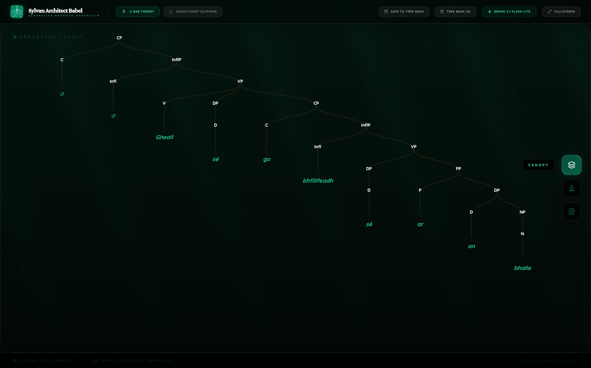 |

Metrics: Pro 2 movement / 36 steps; Flash Lite 0 movement / 22 steps.

**Syntactic reading.** The Irish embedded complement pair is one of the most interesting clause-edge comparisons in the atlas. Pro gives the sentence a visibly articulated matrix/embedded structure with overt finite-head commitments, while Flash Lite offers a thinner embedded shell. The sentence still works on both routes, but only one route insists on showing how.

**Interpretability check.** Irish gives the model rich surface evidence through complementizer morphology, verb-initial structure, and inflected embedded material. Pro seems to treat those facts as structural evidence rather than just recognitional cues. Flash Lite mostly stops at recognition.

### Irish VSO declarative

Sentence: `Chonaic Seán an madra.`

| Pro | Flash Lite |
| --- | --- |
| 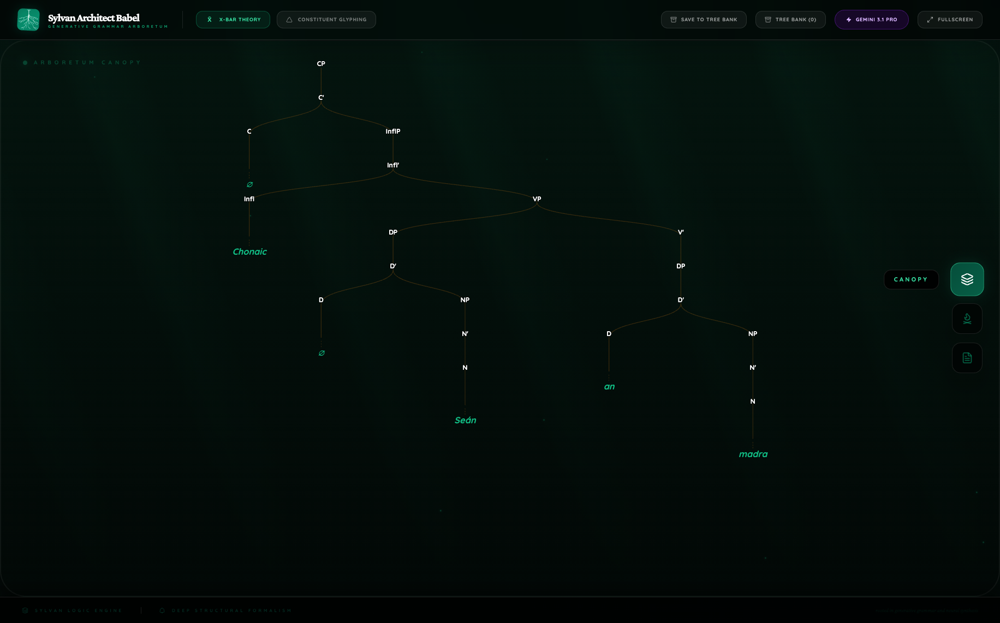 | 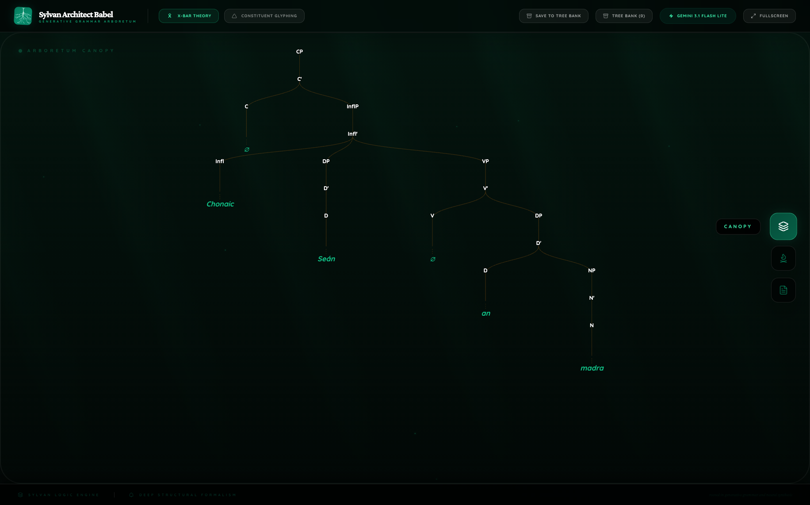 |

Metrics: Pro 1 movement / 23 steps; Flash Lite 1 movement / 23 steps.

**Syntactic reading.** This is a near-perfect convergence case. Both routes treat the Irish VSO clause as movement-bearing and allocate the same number of derivational steps. It is one of the best examples in the benchmark of the smaller route genuinely tracking the same overt theory as the larger one.

**Interpretability check.** VSO order is a powerful cue that something more than a default SVO shell is required. Both routes take that cue seriously here, which suggests that some typologically distinctive orders are strong enough to force convergence even under a smaller assisted model.

### Hebrew embedded clause

Sentence: `דנה אמרה שיואב יגיע מחר.`

| Pro | Flash Lite |
| --- | --- |
| 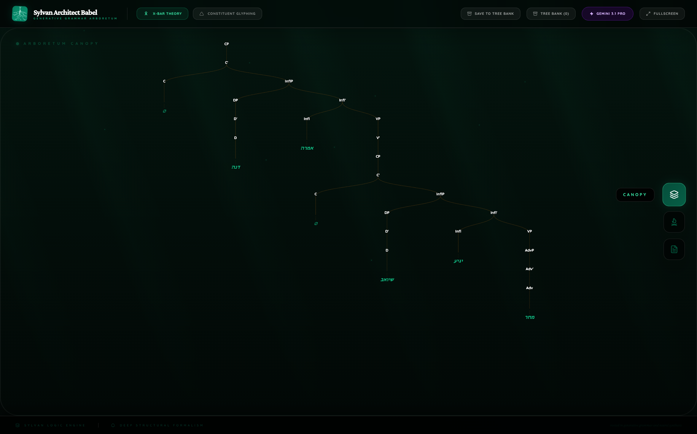 | 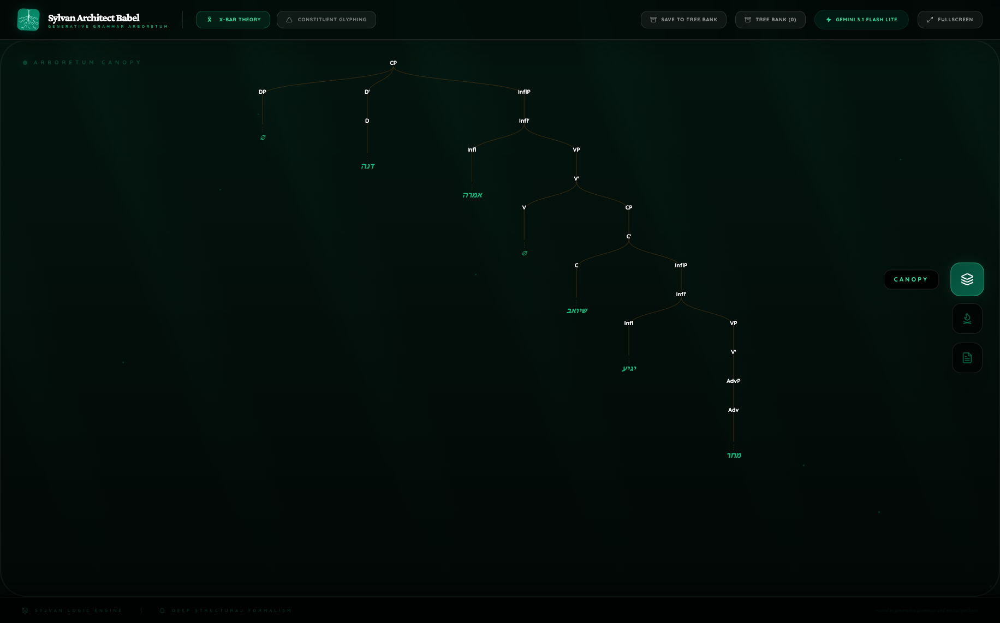 |

Metrics: Pro 4 movement / 46 steps; Flash Lite 0 movement / 22 steps.

**Syntactic reading.** Pro gives Hebrew embedding a strongly articulated clause structure, complete with overt derivational commitments that Flash Lite does not surface. The smaller route keeps the sentence perfectly intelligible, but the public syntax is much less ambitious.

**Interpretability check.** Hebrew complement clauses supply a clean clause-boundary signal. Pro uses that signal to externalize a full structural relation between the domains. Flash Lite labels the embedding but does not capitalize on it as a source of richer theory.

### Hindi embedded clause

Sentence: `शिक्षक ने कहा कि छात्रा जल्दी आई।`

| Pro | Flash Lite |
| --- | --- |
| 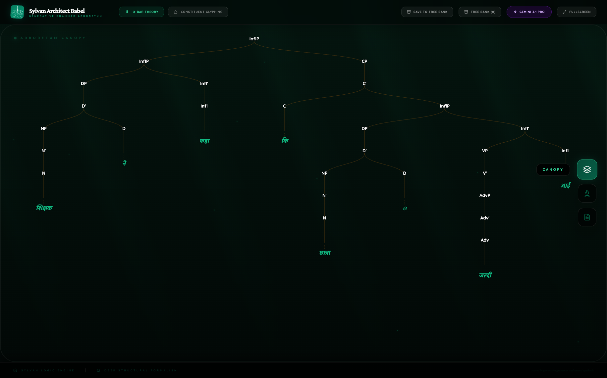 | 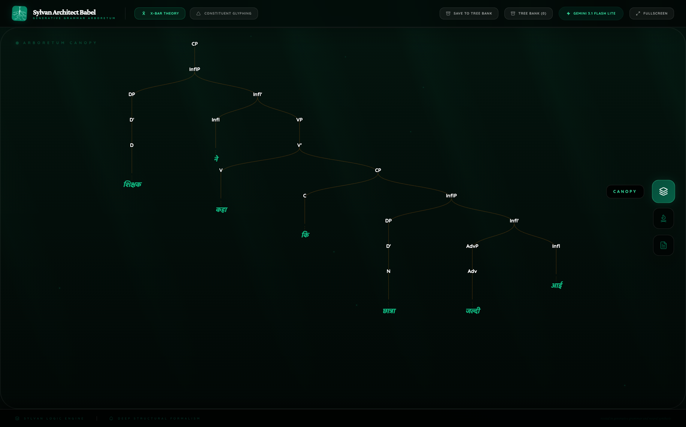 |

Metrics: Pro 5 movement / 41 steps; Flash Lite 0 movement / 22 steps.

**Syntactic reading.** Hindi embedded clauses in native script are a major showcase item for the benchmark. Pro not only survives the script; it turns the sentence into a movement-bearing X-bar derivation with overt clause interaction. Flash Lite produces a good embedded shell but does not reveal the same internal machinery.

**Interpretability check.** The key interpretability point is that the route difference cannot be blamed on script failure. Both models handle the Devanagari sentence. The difference is what they are willing to make public once they have understood it.

### Italian embedded subjunctive

Sentence: `Gianni pensa che Lucia parta domani.`

| Pro | Flash Lite |
| --- | --- |
|  | 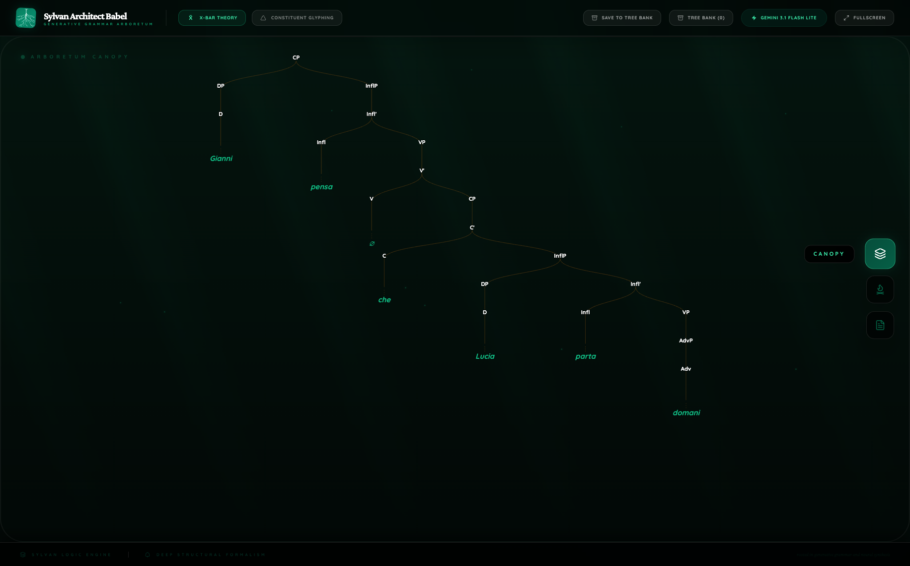 |

Metrics: Pro 2 movement / 37 steps; Flash Lite 0 movement / 21 steps.

**Syntactic reading.** Pro treats Italian subjunctive embedding as a structurally meaningful distinction, while Flash Lite mostly reduces it to a generic complement clause. The difference is subtle but important: only Pro makes mood-sensitive clause architecture visibly worth theorizing about.

**Interpretability check.** The complementizer and the non-indicative embedded verb form provide evidence that the clause is not just any embedded declarative. Pro seems more responsive to that evidence as a trigger for a richer public tree.

### Dutch embedded declarative

Sentence: `Milan zegt dat Sara morgen belt.`

| Pro | Flash Lite |
| --- | --- |
| 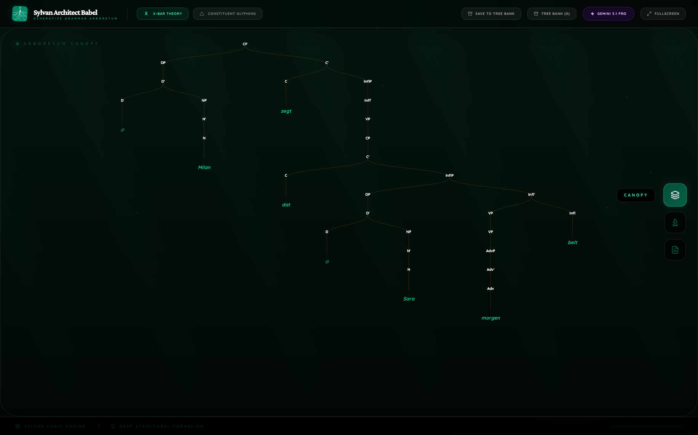 | 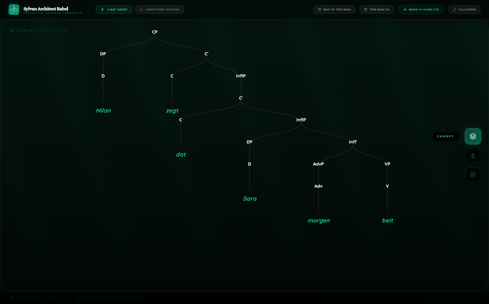 |

Metrics: Pro 7 movement / 48 steps; Flash Lite 0 movement / 17 steps.

**Syntactic reading.** Dutch embedding is the standout X-bar divergence item in the entire atlas. Pro transforms the sentence into a visibly articulated theory of matrix and embedded clausal interaction, complete with multiple movement commitments. Flash Lite reduces the same sentence to a much shallower clause shell. This is not a small difference in ornamentation; it is a difference in what the model thinks the sentence structurally is.

**Interpretability check.** Complementizer `dat`, embedded finite order, and matrix-reportive structure together create an unusually strong cue that the sentence is more than one flat proposition. Pro responds like a model willing to externalize a theory of clausal architecture. Flash Lite responds like a model aiming for the safest successful representation.

### Dutch relative clause

Sentence: `De man die Emma zag lachte.`

| Pro | Flash Lite |
| --- | --- |
| 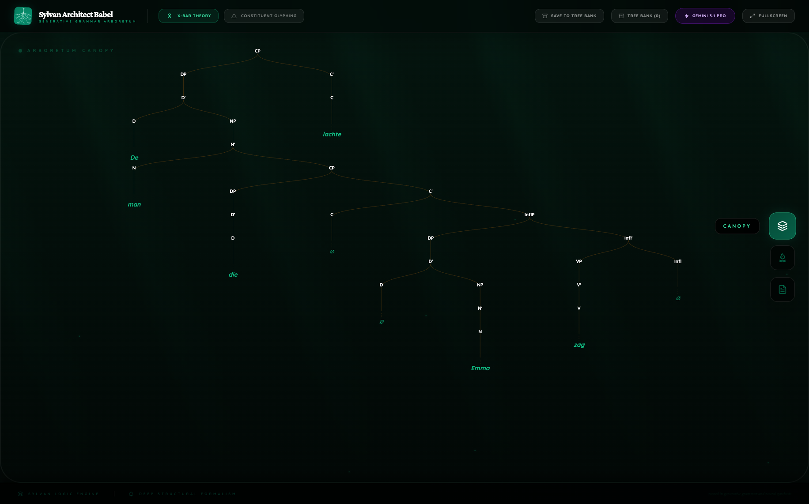 | 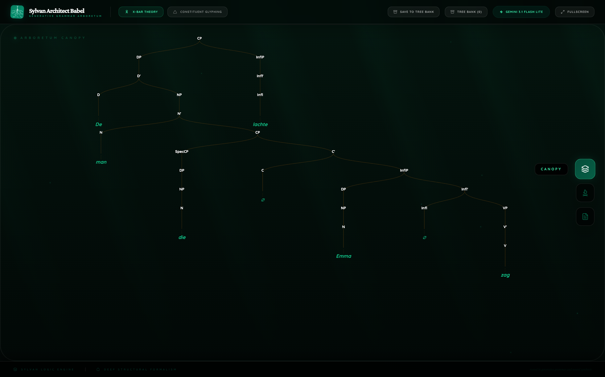 |

Metrics: Pro 4 movement / 44 steps; Flash Lite 0 movement / 27 steps.

**Syntactic reading.** Pro handles the Dutch relative as a visibly derived dependency, while Flash Lite mostly treats the relative clause as an attached shell. This creates a clean contrast between a model that publicizes the relativization relation and one that is content merely to host it.

**Interpretability check.** Relative clauses are ideal for Babel because they are easy to recognize but easy to underanalyze. Pro refuses underanalysis here. Flash Lite appears to do exactly enough to preserve the attachment without advertising much more.

### Polish embedded clause

Sentence: `Nauczyciel powiedział, że uczennica przeczytała książkę.`

| Pro | Flash Lite |
| --- | --- |
|  | 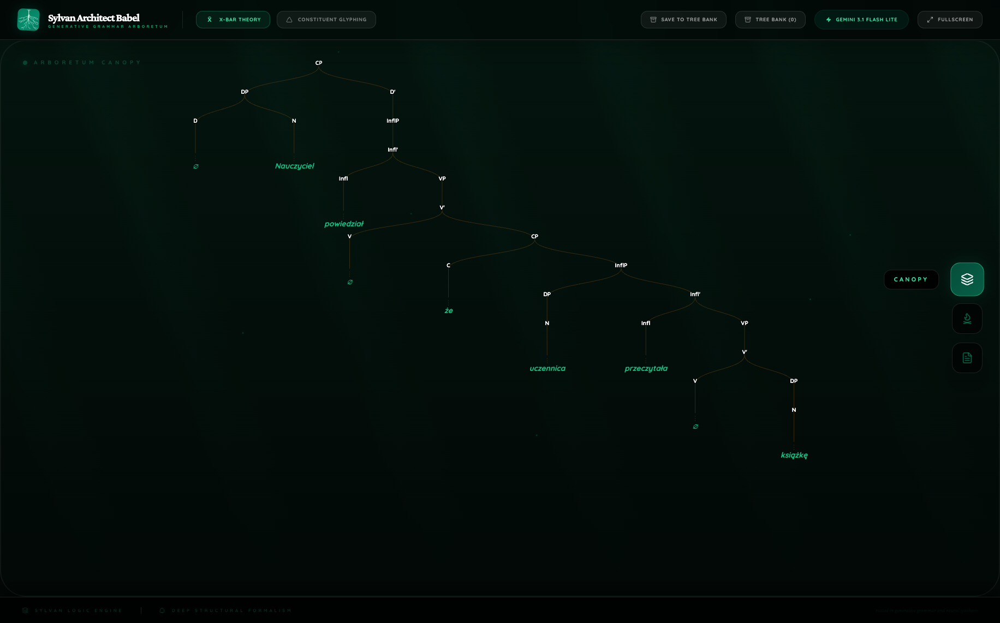 |

Metrics: Pro 2 movement / 39 steps; Flash Lite 0 movement / 26 steps.

**Syntactic reading.** Pro gives Polish embedding an articulated X-bar derivation, while Flash Lite preserves a thinner complement configuration. The sentence is useful because it shows the same Pro-versus-Flash pattern outside the more often discussed Germanic and Romance examples.

**Interpretability check.** The complementizer and rich inflection are enough to signal a clear embedding relation. Pro seems to translate that relation into public structure. Flash Lite seems to stop after identifying the hierarchy.

### Portuguese wh-question

Sentence: `Que poema escreveu Sofia?`

| Pro | Flash Lite |
| --- | --- |
| 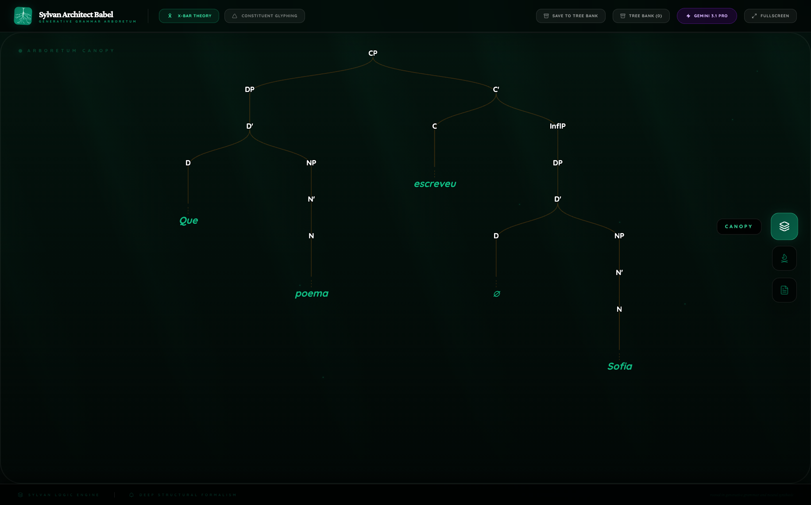 | 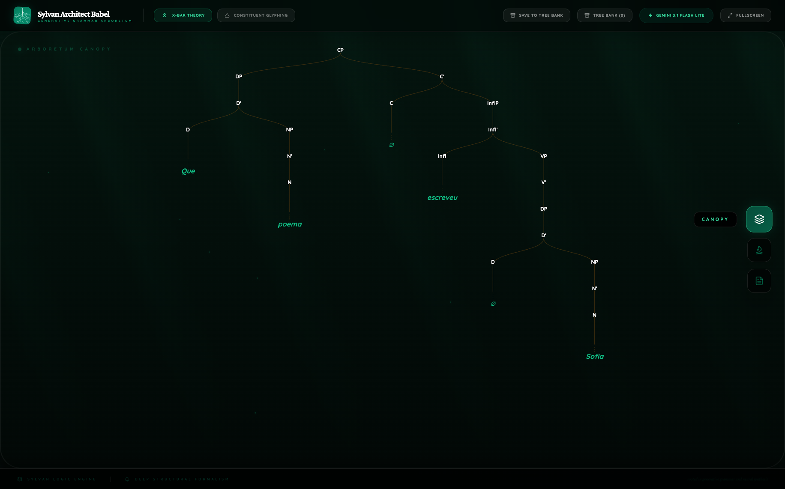 |

Metrics: Pro 4 movement / 32 steps; Flash Lite 2 movement / 24 steps.

**Syntactic reading.** Portuguese X-bar wh is another pair where Flash Lite remains structurally serious, but Pro still goes further. Both routes recognize the clause-edge dependency; Pro simply exposes more of the route by which the object reaches that position.

**Interpretability check.** This is a good example of a case where the smaller route benefits from the assisted path without collapsing the analysis altogether. Flash Lite still looks like a syntactic model here. Pro just looks like the more theory-forward one.

### Romanian embedded question

Sentence: `Profesorul a întrebat dacă studenții au venit.`

| Pro | Flash Lite |
| --- | --- |
| 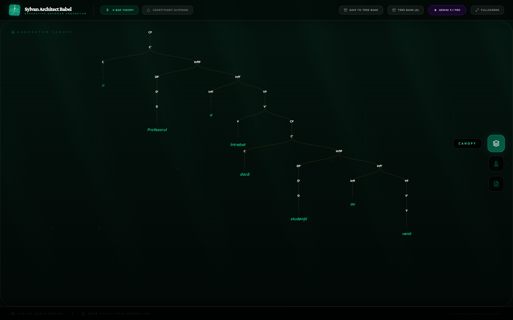 | 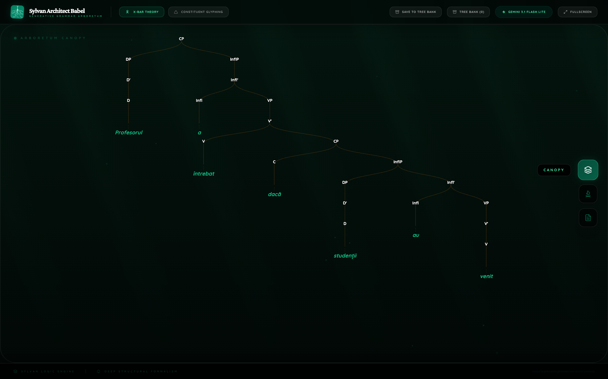 |

Metrics: Pro 4 movement / 41 steps; Flash Lite 0 movement / 22 steps.

**Syntactic reading.** Pro treats the embedded question as a real interrogative clause architecture nested under a matrix predicate of asking, whereas Flash Lite produces a lighter shell. This is exactly the kind of sentence where Babel's forced-commitment setup is powerful: the model cannot merely detect an embedded question; it has to say what the structure is.

**Interpretability check.** Embedded interrogatives strongly cue a complex left edge, but only if the model decides that the cue is worth publicizing. Pro does. Flash Lite mostly labels the embedded question and moves on.

### Romanian passive

Sentence: `A fost închisă ușa de vânt.`

| Pro | Flash Lite |
| --- | --- |
| 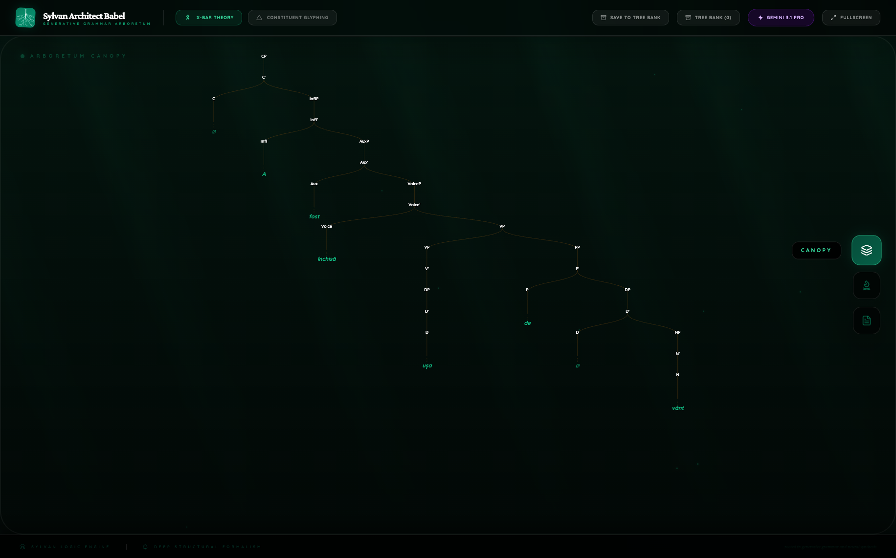 | 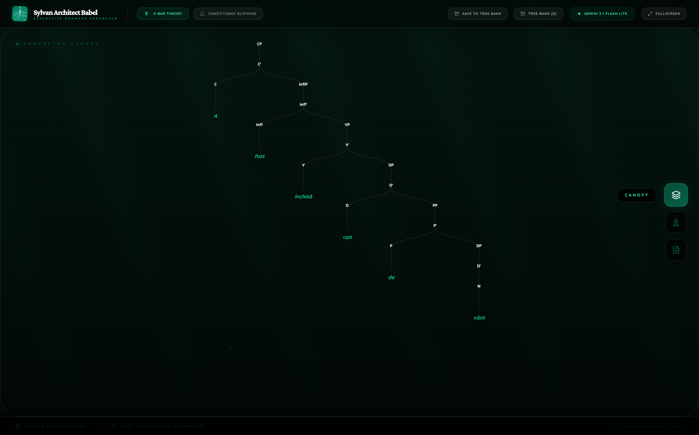 |

Metrics: Pro 2 movement / 34 steps; Flash Lite 0 movement / 19 steps.

**Syntactic reading.** Pro preserves passive derivation as public structure in the Romanian X-bar tree, while Flash Lite largely treats the passive as a state to be labeled rather than a process to be exposed. This pair is less dramatic than Dutch embedding, but it follows the same logic.

**Interpretability check.** Passive morphology and auxiliary support provide indirect evidence rather than clause-edge spectacle. Pro still chooses to make the underlying structural consequence visible. Flash Lite generally does not.

### Russian embedded clause

Sentence: `Учитель сказал, что ученица прочитала книгу.`

| Pro | Flash Lite |
| --- | --- |
| 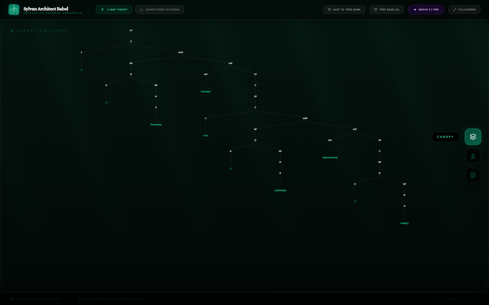 | 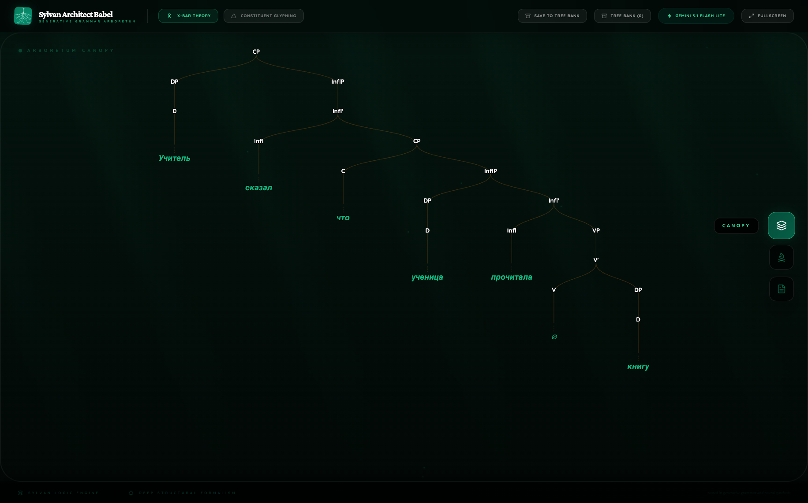 |

Metrics: Pro 4 movement / 47 steps; Flash Lite 0 movement / 22 steps.

**Syntactic reading.** Pro gives Russian embedding one of the densest X-bar treatments in the benchmark, while Flash Lite remains close to the default embedded-clause template. The result is a good example of how much hidden syntactic choice becomes visible once the model is forced to show its tree.

**Interpretability check.** The Russian sentence is structurally clear but not extravagantly marked. Pro nonetheless treats the matrix and embedded domains as worthy of explicit architecture. Flash Lite seems to reserve that level of public commitment for only a smaller subset of cases.

### Serbian embedded clause

Sentence: `Професор је рекао да су студенти дошли рано.`

| Pro | Flash Lite |
| --- | --- |
| 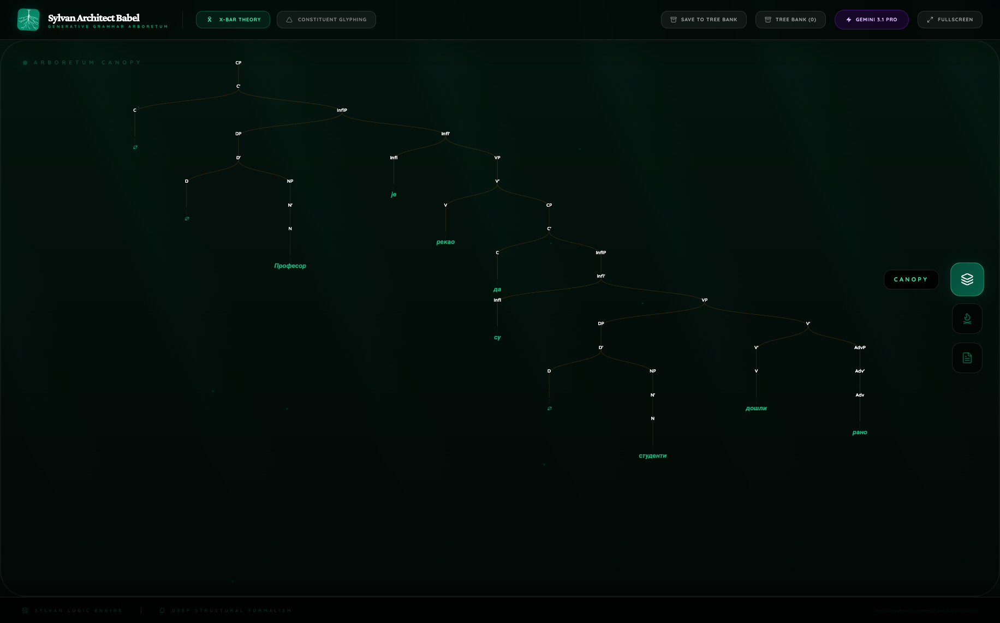 | 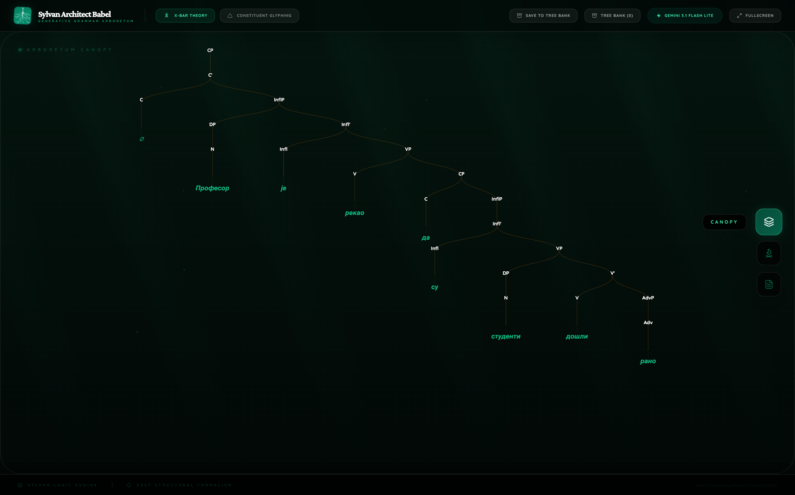 |

Metrics: Pro 1 movement / 37 steps; Flash Lite 0 movement / 23 steps.

**Syntactic reading.** The Serbian embedded clause produces a milder but still real gap. Pro marks at least one derivational commitment beyond the shell, while Flash Lite keeps the structure flatter. This is a useful reminder that Pro's advantage does not always require spectacular movement counts; sometimes it appears as a persistent willingness to expose one more structural claim.

**Interpretability check.** The sentence gives the model a standard embedding configuration without especially dramatic surface cues. In exactly such ordinary cases, Pro still tends to theorize more openly than Flash Lite.

### Turkish embedded clause

Sentence: `Doktor hastanın erken geldiğini söyledi.`

| Pro | Flash Lite |
| --- | --- |
| 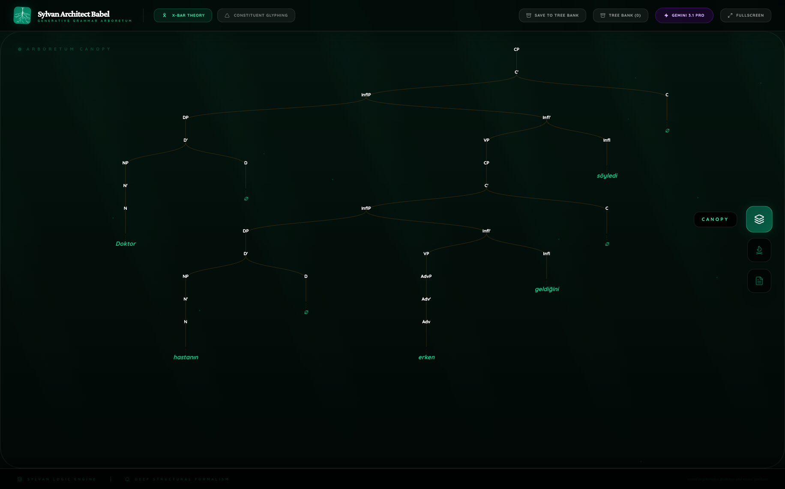 | 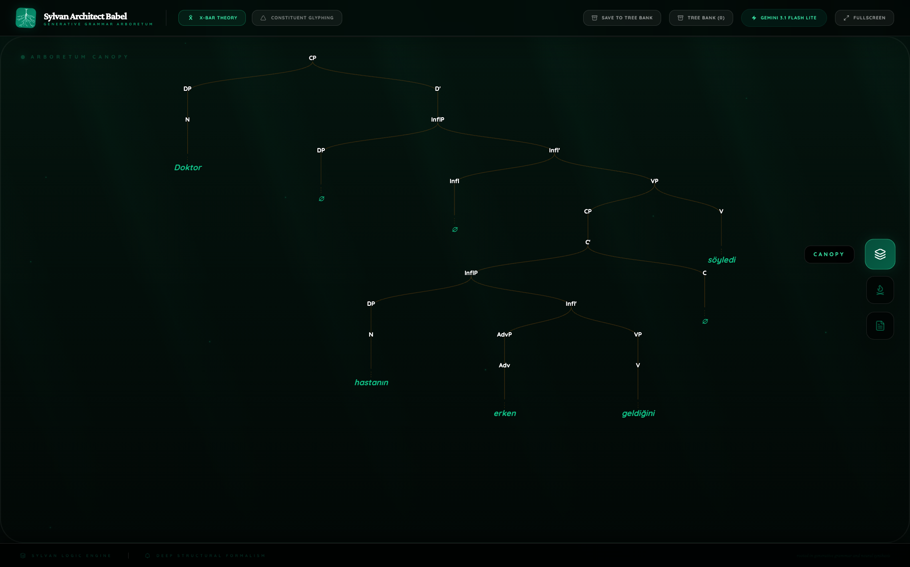 |

Metrics: Pro 2 movement / 36 steps; Flash Lite 0 movement / 24 steps.

**Syntactic reading.** Pro handles Turkish embedding as a visibly structured clause relation rather than merely a nominalized or packaged complement, whereas Flash Lite gives a thinner clause shell. The pair is particularly interesting because Turkish embedding often makes strong demands on how the model handles subordination and nonfinite-looking structure.

**Interpretability check.** Turkish complement morphology and clause-final organization supply real structural evidence, but they are the sort of evidence that a smaller route can partially ignore while still sounding right. Pro appears more willing to cash that evidence out as a public derivational theory.

## 6. Why This Matters for AI Interpretability

The main interpretability result is simple.

Babel does not ask whether the model silently contains syntactic knowledge. It asks whether the model will externalize a syntactic theory under pressure.

That pressure reveals several things at once:

- whether the model can keep one theory stable across tree, replay, and Notes;
- whether it compresses dependencies into shallow structures or exposes intermediate steps;
- whether it treats different frameworks as genuinely different analyses;
- whether multilingual and native-script inputs remain compatible with explicit structure.

This is why the benchmark feels different from standard acceptability evaluation. In a string-first benchmark, a model can succeed while remaining theoretically silent. In Babel, theoretical silence becomes visible.

The result is a public object that can be inspected like a linguistics figure:

- a phrase marker
- a movement record
- a derivation movie
- a prose interpretation

That combination is what makes Babel interesting as an interpretability instrument. It also makes a stricter question possible: not only what tree the model outputs, but what local evidence appears to have led it there. The appendix atlas therefore treats every paired case twice: first as a syntactic object, and then as an interpretability object.

## 7. Why This Matters for Syntax Research

The more ambitious implication is methodological.

If a system can reliably generate:

- sentence
- tree
- movement chain
- derivation steps
- surface order
- explanatory Notes

then it is no longer only a syntax visualizer. It is the beginning of a derivational syntax corpus generator.

That possibility is unusual because most public resources store only the endpoint of the analysis. They do not store a replayable derivation with overt movement chains and framework-specific prose explanations for each sentence. Babel does not solve that research problem completely yet, but this 100-case run shows that the object itself is now stable enough to treat seriously.

## 8. Limitations

Two limitations matter.

First, this benchmark measures explicit commitment, not gold theoretical truth. A model can produce a coherent tree that many syntacticians would still reject. That is a feature of the benchmark rather than a bug: the point is to expose the theory the model chooses.

Second, Babel still unfolds the replay from the committed analysis rather than requiring the model to author every fine-grained replay step itself. The benchmark therefore measures the model’s tree and movement theory more directly than it measures raw step-by-step derivation authorship.

## 9. Conclusion

This 100-case run establishes Sylvan Architect Babel as the first serious environment for benchmarking public syntactic theory in language models.

The important result is not only that Gemini 3.1 Pro and Gemini 3.1 Flash Lite can return trees across 22 languages. It is that Babel forces those models to make their syntactic commitments public. Once that happens, the benchmark changes:

- from hidden preference to visible theory,
- from “does the model know syntax?” to “what syntax does it actually choose?”,
- from end-state parsing to inspectable derivational commitment.

On this batch, Pro behaves like the stronger explicit syntax model. It is slower, but far more willing to expose derivational structure, especially in long-distance wh, embedding, and focus-sensitive clause architecture. Flash Lite is faster and generally more conservative, often returning a shallower public theory of the same sentence.

That is a meaningful scientific result in its own right. It also points in two directions at once. For researchers, Babel becomes a way of observing what syntactic theory a model is actually willing to make public. For students, the same forced public theory becomes something they can inspect, replay, and learn from sentence by sentence. And it suggests a larger future direction: Babel is not only a benchmark of syntactic behavior. It is the beginning of a framework for collecting structured derivational theory data at scale. If language models are going to be taken seriously as public generators of linguistic theory, then they should be benchmarked at the level where linguistic theory actually lives: overt phrase structure, movement, derivation, explanation, and multilingual coverage under forced commitment. On that standard, this 100-tree batch is not a curiosity. It is a serious pre-launch demonstration of a new benchmark object. The next obvious step is comparative expansion across other frontier families as well, including GPT and Claude, so that forced-commitment syntax can become a model-comparison regime rather than a single-provider showcase. Babel does not ask models whether they know syntax. Babel makes them show it.
